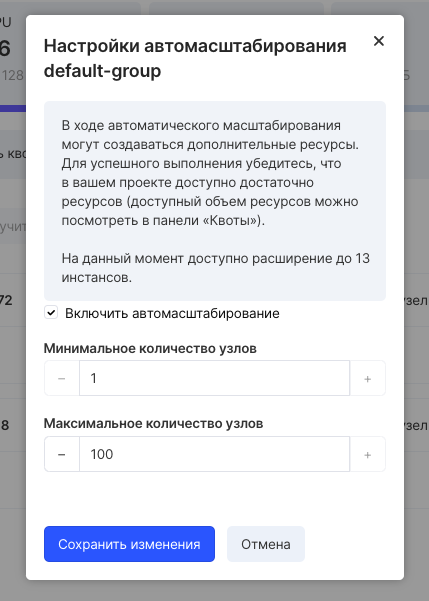

VK CS services have the ability to enable cluster autoscaling. Automatic scaling is used when planning dynamic load on the cluster.

In case of increased load on the server, the cluster will automatically increase the number of nodes, and if there is no load, it will automatically reduce their number.

When creating a cluster
-----------------------

To enable the autoscaling option in the New Cluster Wizard, select the appropriate checkbox and select the minimum and maximum number of nodes.

In the wizard, you can also add a Group node by clicking Add Node Group:

For each group of nodes, you can select an automatic scaling option.

On the created cluster
----------------------

If the cluster was created without the autoscaling option, but there was a need to activate it, this operation can be performed on the already created cluster by the "Configure autoscaling" option in the context menu of the selected cluster in the "Containers" service of the VK CS Panel:

Then you should select the autoscale options.

In the autoscale settings window, you can see in advance how many instances the cluster can be expanded to.