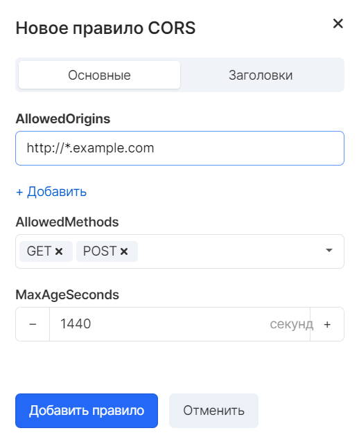
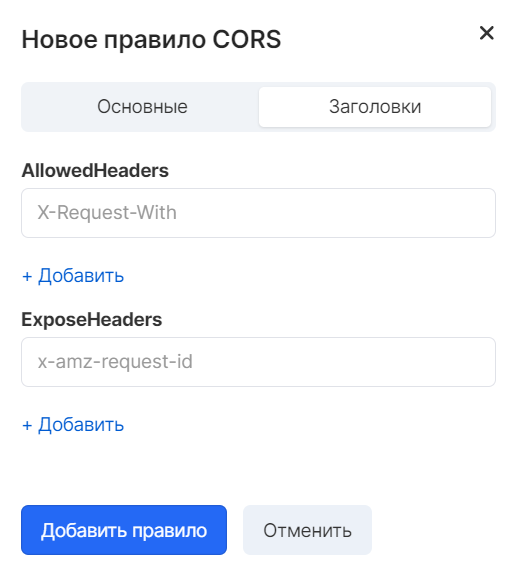

general information
-------------------

CORS (Cross-Origin Resource Sharing) is a cross-origin resource sharing technology that allows you to determine how client web applications loaded in one domain interact with resources in another domain.

In other words, it is a mechanism that uses additional HTTP headers to enable a user agent to obtain permissions to access selected resources from a server at a source (domain) other than what the site is currently using.

CORS supports cross-domain requests and data transfer between the browser and web servers over a secure connection. Modern browsers use CORS in API containers such as XMLHttpRequest or Fetch to mitigate the inherent risks of requests from other sources.

Usage scenarios
---------------

Use cases for CORS are listed below.

*   **Scenario # 1** . For example, personal resources host a website in a bucket called website. Users download the site's endpoint URL. It now becomes necessary to use JavaScript on the web pages stored in this bucket to send authenticated GET and PUT requests for the same bucket using the service API endpoint for the bucket. Typically, the browser prevents JavaScript code that allows such requests from being executed, but using CORS technology, you can configure the bucket to allow cross-origin requests from the website.
*   **Scenario # 2** . For example, you need to place a web font from the service bucket on your resources. Browsers make sure to do CORS checking (pre-check) for loading web fonts, so you need to configure the bucket hosting the web font on its resources to allow requests from any source.

Creating a CORS Rule
--------------------

The "Object Storage" service supports the technology of cross-domain requests for resources in a bucket. You can create a rule on the CORS tab of the open bucket.

Where:

*   AllowedOrigins - The website from which cross-domain bucket requests are allowed. Can contain at most one \* character
*   AllowedMethods - HTTP method allowed for cross-domain request. It is allowed to use several methods in one rule
*   MaxAgeSeconds - time in seconds during which the browser saves the result of a request to an object in the cache using the options method
*   AllowedHeaders - the allowed header in the request to the object. You can use a single \* character in the header name to define a template. Object Storage maps the headers passed in Access-Control-Request-Headers to the AllowedHeaders set and responds to options with a list of allowed ones
*   ExposeHeaders is a header allowed to be displayed in a JavaScript application in a browser. In a request to an object, a JavaScript client can only operate on headers defined in the ExposeHeaders elements

If necessary, you can add multiple parameter values in the Rule Designer.