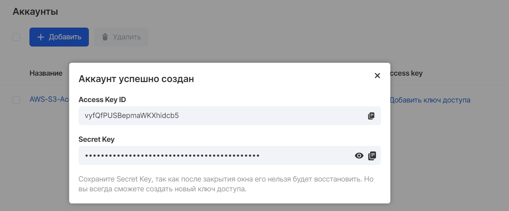

When registering on the VK CS platform and activating an account, the user gets full access to the Object Storage service.

Before uploading an object to storage, you should create a bucket to place it.

**Note**

There is no charge for creating a bucket. You are charged only for storing objects in the bucket and for moving objects to and from the bucket. For more information on storage costs and operations, please visit the [website](https://mcs.mail.ru/pricing/) .

There are several types of buckets, differing in both the purpose and the amount of payment for the objects placed in them:

*   **Hotbox** - designed to store and quickly distribute a large number of files for media services, online media, sites with multi-user content and mobile applications
*   **Icebox** - cloud storage of rarely used data: backups, logs, media content, scientific, statistical data, as well as working archives
*   **Backup** - placement of backups of instances created both automatically and manually. A bucket of this type is not subject to self-creation or deletion, but is managed by a backup service

You can create a bucket both in the VK CS Panel and using the S3 CLI.

Attention

No more than 25 buckets can be created in one project. There is no limit on the volume of the bucket, but the number of objects placed in it cannot exceed 1,000,000,000.

Creation via VK CS Panel
----------------------

To create you should:

1.  Go to the "Buckets" tab of the Object Storage service in the VK CS panel.
2.  Press the "Add" button:
3.  Select the type of bucket to create and enter a DNS-compatible name:

**Attention**

The bucket name must meet the following conditions:

*   Be unique across the entire VK CS platform
*   Contain between 4 and 63 characters
*   Do not contain uppercase characters (uppercase)
*   Start with a lowercase character (lowercase) or numbers

Not recommended in name:

*   Formatting similar to IP address (i.e. 192.168.5.4)
*   Using the underscore (_) character, because it is not DNS-compatible and such a bucket cannot be bound to a DNS name
*   Start with characters xn--

It is recommended to avoid using personal information such as project number or user account in the bucket name.

Once a bucket is created, its name cannot be changed.

Creation via S3 CLI
-------------------

**Create an authorized account**

Before creating a bucket, you need to create a user who will be granted access to control operations in the S3 CLI.

To do this, on the "Accounts" tab of the "Object storage" service, create an account by clicking the "Add account" button,


Specify any desired name and save the resulting API keys:



**Log in to S3 CLI**

Launch AWS S3 Configuration

```
 aws configure
```

Use the following data in the configurator:

*   Access Key ID: the key received when creating an account
*   Secret Key: the key received when creating an account
*   Default region name: ru-msk
*   Default output format: json

**Create bucket**

Bucket is created using the command

```
 aws s3 mb s3: // <unique_packet_name> --endpoint-url <endpoint-url>
```

Where endpoint-url:

1.  [https://hb.bizmrg.com](https://hb.bizmrg.com) - for the Hotbox storage class
2.  [https://ib.bizmrg.com](https://ib.bizmrg.com) - for Icebox storage class

The following output will appear as a result of the correct execution of the command:

```
 make_bucket: <created bucket name>
```

A bucket with the appropriate storage type will be created. You can change its type in the VK CS panel.