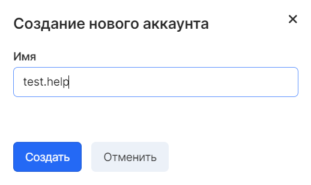

Description
-----------

Access to the resources of the "Object Storage" service when using the VK CS Panel is carried out without hindrance, if you have a registered and active account and VK CS project.

However, if you need to access resources through tools such as S3 CLI, S3 API, as well as any other software, you must create an additional account in the service and use the account key for access. This mechanism allows you to delimit access for the most comfortable and safe work with the service.

**Note**

The number of created accounts is not limited and their names should not be unique

Create an account
-----------------

To create an account, go to the "Accounts" tab of the "Object Storage" service and click the "Add account" button. In the window that appears, enter the account name and confirm the entry:

**Attention**

The account name must start with a letter or number, it can only consist of Latin letters, numbers and symbols: period (.), Dash (-), underscore (_).

When you create an account, you will be provided with data that you want to save. After closing the window, it will be impossible to restore the Secret Key, but if you lose it, you can create a new account:

