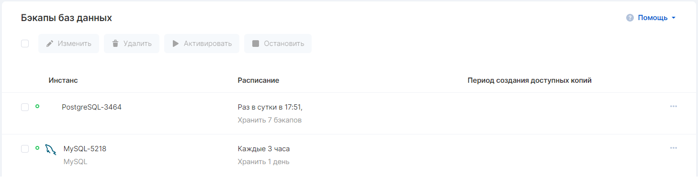
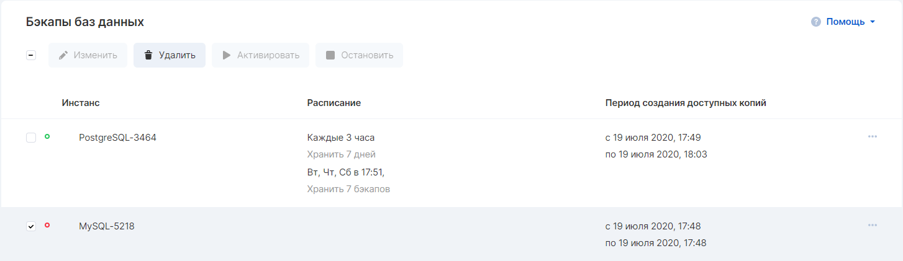

When creating a database, a backup plan is created in the VK CS panel, which can be managed in the ["Backups"](https://mcs.mail.ru/app/services/databases/backups/) section of the control panel.

The current status of the plan can be seen by hovering the mouse over the colored status indicator.

### Setting up a plan

1.  Go to the "Databases" → "Backups" section.
2.  Select the plan you want and click "Change".
3.  In the window that appears, you can configure the frequency of the backup. It is possible to combine several schedules, for example, once a day on selected days and every three hours with a different copy storage interval.
4.  Click the "Save" button to apply the changes.

### Stop plan

If for some reason you need to stop creating backups, select the desired plan and click on the "Stop" button. The creation of backups will be paused until the plan is activated manually.

### Note

Changing the backup schedule activates the plan

### Deleting a plan

In case the original instance is deleted, it is possible to delete the backup plan for the instance as well. Select the required plan with a tick and click on the "Delete" button.

**Attention**

Deleting a backup plan will delete all restore points