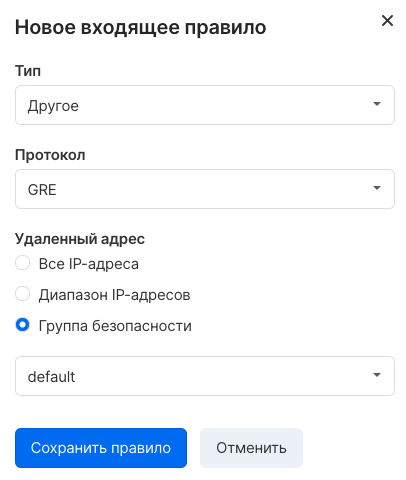
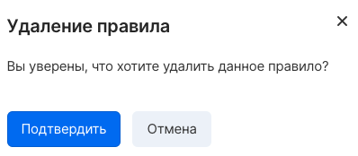

A security group rule is a set of parameters that determine the conditions for traffic flow. Rules are combined into groups, which in turn are applied to instance ports.

To manage the rules of a security group, you need to click on the group name on the Firewall Settings page of the Virtual Networks page of your [VK CS personal account](https://mcs.mail.ru/app/services/infra/firewall/) .

Adding a rule
-------------

To add a new rule, select "Add Rule" in the "Inbound traffic" or "Outbound traffic" section.

You can select a preset traffic type (SSH, HTTP, HTTPS, etc.) or detailed protocol and port settings:

In the "Remote address" section, you need to configure the address for which the selected traffic type will be allowed. It is supported to specify the network address in the CIDR format or select a security group - in the second case, traffic from instances that are members of the selected group will be allowed.

Removing rules
--------------

To delete a rule, you need to click on the trash can icon in the line with the desired rule:

Then confirm the deletion:

OpenStack CLI Rule Management
-----------------------------

Security group rules are managed using the OpenStack client:

Viewing security groups in a project:

```
 openstack security group list
```

View the list of group rules:

```
 openstack security group rule list --long <group ID>
```

Getting information about a security group:

```
 openstack security group show <group ID>
```

Rule creation:

```
 openstack security group rule create <arguments> <security group ID>
```

Available arguments for the create rule command:

*   \--remote-ip - specifies the address from which connections can be made (in CIDR format)
*   \--remote-group - specifies the group whose instances can be the source of traffic
*   \--dst-port - destination port, required for TCP and UDP protocols
*   \--protocol - protocol, it is possible to specify the name, number or permission of all protocols (any)
*   \--description - arbitrary description
*   \--icmp-type - ICMP type
*   \--icmp-code - ICMP code
*   \--ingress - apply the rule for incoming traffic
*   \--egress - apply the rule for outgoing traffic
*   \--ethertype - EtherType value (IPv4, IPv6)

Removing a rule:

```
 openstack security group rule delete <rule ID>
```

Viewing detailed information for a rule:

```
 openstack security group rule show <rule ID>
```