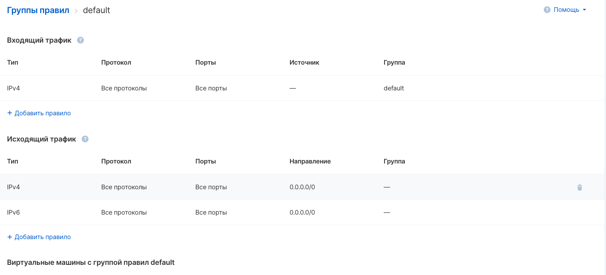

A security group is a set of configurable allowing traffic flow rules that can be assigned to instance ports.

**Important limitation**

GRE traffic is available only on ext-net networks.

Creating a security group
-------------------------

You can create a security group on the "Firewall Settings" page of the "Virtual Networks" section [in your VK CS account](https://mcs.mail.ru/app/services/infra/shares/) using the "Add" button:

Viewing the list of rules
-------------------------

To view the current list of rules in a security group, open the desired security group in the group list on the Firewall Settings page. A window for viewing and editing group rules will appear:

Assigning a rule group to an instance
-------------------------------------

To apply a rule set to a virtual machine, the security group containing the rule set must be applied to the virtual machine.

To assign a group to an instance, go to the group settings and select "Add a virtual machine" in the " Virtual machines with rule group " section. In the menu that appears, select the instances to which the group will be added:

Removing a security group
-------------------------

Removing security groups is done through the "Delete" option in the group context menu on the "Firewall settings" page.

**Attention**

A group cannot be deleted as long as there are ports that use this group. Also, the "default" security group cannot be removed.

Operations in OpenStack CLI
---------------------------

To create a security group in the OpenStack client, run the command:

```
 openstack security group create --description <group description> <new group name>
```

Change description, group name:

```
 openstack security group set --description <description> --name <name> <group ID>
```

Add a group to an instance:

```
 openstack server add security group <instance ID> <security group ID>
```

Unlink a group from an instance:

```
 openstack server remove security group <instance ID> <security group ID>
```

View security group rules:

```
 openstack security group rule list --long <security group ID>
```

Delete group:

```
 openstack security group delete <group ID>
```