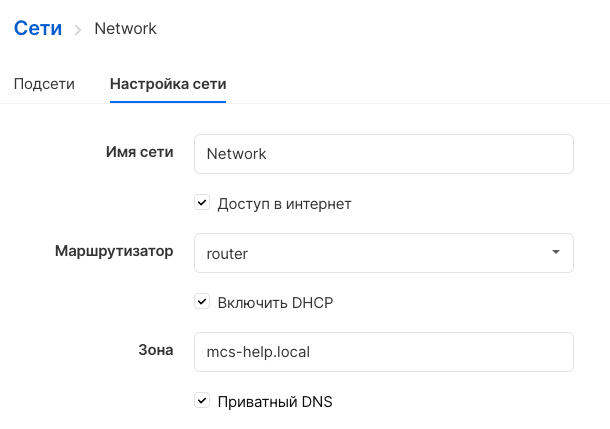
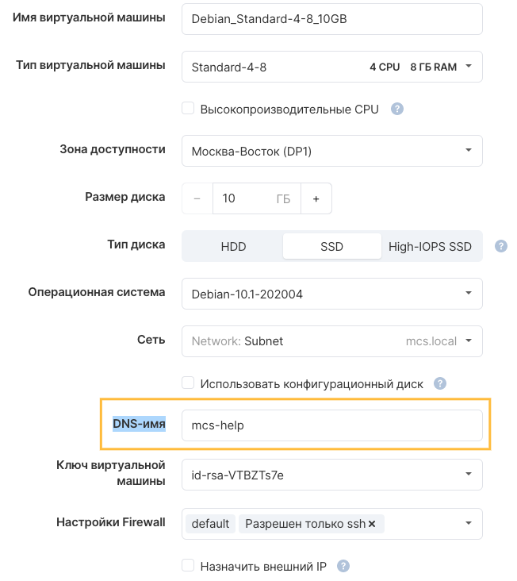
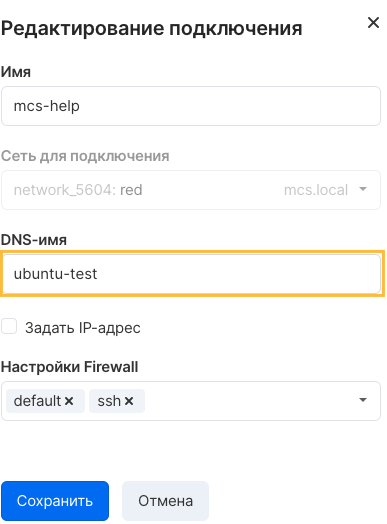

Private DNS in VK CS is a functionality of a DNS server that operates in project networks and allows accessing instances by DNS names.

The service supports configuring the private zone and port names of virtual machines. The DNS server responds with the same addresses as the DHCP ports on the network. For private DNS to work, a DHCP server must be enabled on the network.

**Note**

Currently, the private DNS forwarding servers are 8.8.8.8, 8.8.4.4, changing these addresses is not supported.

Enabling Private DNS
--------------------

You can enable the service for a specific network in the "Networks" section of the "Cloud Computing" service [in your VK CS account](https://mcs.mail.ru/app/services/server/networks/) . On the page of the required network, on the "Network Settings" tab, select the "Private DNS" option and enter the zone name:

**Attention**

The maximum length for a zone name is 253 characters. Consists of blocks like "[a-z0-9 -] + \\." The maximum block length is 63 characters. The block cannot start and end with "-".

DNS name setting
----------------

When creating a virtual machine on a private network, it is possible to enter a DNS name:

 It is also possible to change the name in the connection settings on the instance page by selecting the "Edit connection" option in the port context menu:

**Attention**

The maximum name length is 63 characters. Only numbers, small latin letters and dash "-" are allowed.

OpenStack CLI
-------------

To edit the DNS name of a VM in the OpenStack client:

Get a list of ports for an instance:

```
 openstack port list --server <server ID>
```

Specify DNS name for port:

```
 openstack port set --dns-name <DNS name> <port ID>
```