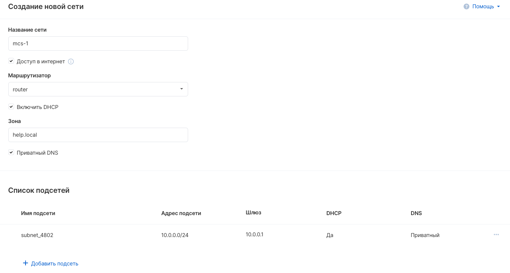
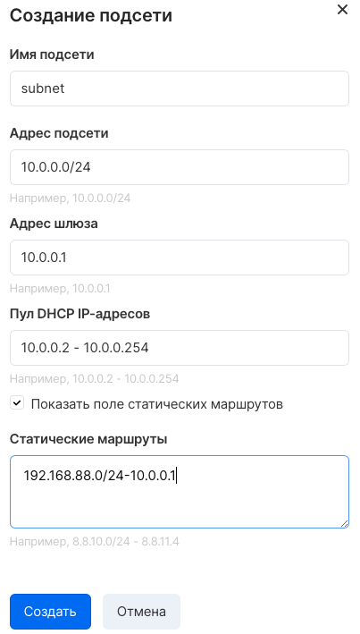

The VK CS platform allows you to create and configure private networks in the project, identical to local networks.

By default, only ext-net is available in a new project, this is an external network common to all projects. Ext-net is not a private network.

VK CS control panel
-----------------

Networks management in [VK CS personal account is](https://mcs.mail.ru/app/services/server/networks/) carried out on the "Networks" page of the "Virtual Networks" service.

To create a network, click "Create" in the top menu of the page. A window for configuring the parameters of a new network will appear:



The following parameters must be configured:

<table style="width: 100%;"><tbody><tr><td style="width: 19.1593%;">Network name</td><td style="width: 80.7522%;">Entering an arbitrary name for the created network.</td></tr><tr><td style="width: 19.1593%;">Access to the Internet</td><td style="width: 80.7522%;">Connecting the network to the router. Without setting this parameter, VPN, SNAT, routing between networks will not work. The network will be unavailable for deploying PaaS entities.</td></tr><tr><td style="width: 19.1593%;">Router</td><td style="width: 80.7522%;">Selecting a router for network connection.</td></tr><tr><td style="width: 19.1593%;">Enable DHCP</td><td style="width: 80.7522%;">Selecting an item enables the DHCP server on the network.</td></tr><tr><td style="width: 19.1593%;">Zone</td><td style="width: 80.7522%;">Entering a private DNS zone.</td></tr><tr><td style="width: 19.1593%;">Private DNS</td><td style="width: 80.7522%;">Setting the item enables the private DNS service.</td></tr></tbody></table>

Then you need to configure the parameters of the created subnet:

<table style="width: 100%;"><tbody><tr><td style="width: 23.0531%;">Subnet name</td><td style="width: 76.8584%;">Enter an arbitrary subnet name.</td></tr><tr><td style="width: 23.0531%;">Subnet address</td><td style="width: 76.8584%;">Entering addressing in CIDR format. Cannot be changed after subnetting.</td></tr><tr><td style="width: 23.0531%;">Gateway address</td><td style="width: 76.8584%;">Enter the network gateway address.</td></tr><tr><td style="width: 23.0531%;">DHCP IP pool</td><td style="width: 76.8584%;">Configuring the range of addresses issued to the client via DHCP</td></tr><tr><td style="width: 23.0531%;">Static routes</td><td style="width: 76.8584%;">Entering static routes. Adding static routes to the client's network is required when using VPNaaS.</td></tr></tbody></table>

After completing the settings, click "Add network".

To change the parameters of an existing network, select the "Edit network" option in the context menu on the network list page. It is possible to add new subnets, change the router, enable or disable DHCP / DNS, and change the addressing.

OpenStack CLI
-------------

Project networks can be managed in the OpenStack client:

Network creation:

```
 openstack network create <network name>
```

Subnetting:

```
 openstack subnet create --network <network name> --dns-nameserver <DNS address> --gateway <gateway address> --subnet-range <subnet address> <name>
```

Creating a router:

```
 openstack router create <name>
```

Connecting the router to an external network:

```
 openstack router set --external-gateway ext-net <router ID>
```

Subnetting to the router:

```
 openstack router add subnet <router ID> <subnet ID>
```

Getting a list of networks:

```
 openstack network list
```