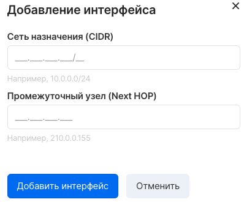

In VK CS, routers manage the connectivity of private networks to the Internet. Each router can be assigned a "white" address in the external (ext-net) network and subnet to which this router is connected.

Instances in private networks access the Internet through the IP address of the router, unless a floating IP is assigned to them.

Management of the project routers is available in the [VK CS personal account](https://mcs.mail.ru/app/services/infra/routers/) .

Create a router
---------------

To create a new router, select the "Add router" option in the top menu of the page, then in the window that appears, configure connections to private networks.

Configuring static routes
-------------------------

It is possible to add static routes to the router. To do this, go to the "Static routes" tab of the router page and select "Add static route", then specify the destination network and intermediate node in the menu:



Viewing a list of routers
-------------------------

To view the list, go to the "Routers" page of the "Virtual Networks" service:

Editing parameters
------------------

To edit the parameters of the router, select "Edit router" in the context menu. A window for editing parameters will open:

You can edit the connectivity of the router with an external network and connect to subnets of private networks.

OpenStack CLI
-------------

Routers can be controlled through the OpenStack client:

Get a list of routers in a project:

```
 openstack router list --long
```

View detailed information about the router:

```
 openstack router show <router ID>
```

Connect (disconnect) the router to the subnet:

```
 openstack router add (remove) subnet <router ID> <subnet ID>
```

Connect the router to an external network:

```
 openstack router set --external-gateway ext-net <router ID>
```

Create router:

```
 openstack router create <name>
```

Change router name:

```
 openstack router set --name <name> <router ID>
```

Add static route:

```
 openstack router set --route destination = <CIDR network> gateway = <IP address of intermediate node>
```

Disable router:

```
 openstack router set --disable <router ID>
```