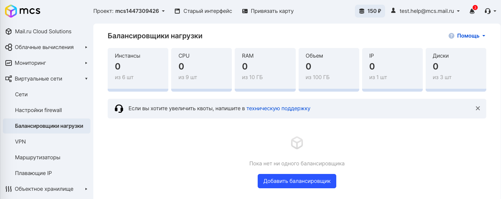
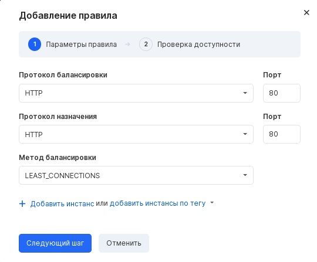
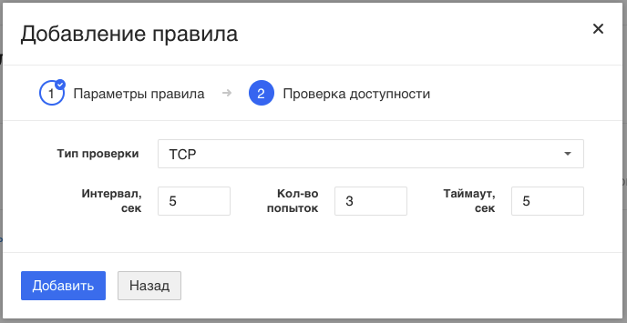

Creating a balancer
-------------------

To add a new balancer, click the "Add balancer" button in the corresponding section of the control panel.

**Attention**

When creating a balancer, be careful when specifying a specific network. It is impossible to change the network after creating the balancer; you will need to create the balancer again.

At the stage of creation, you can add one or more rules. To do this, click the "Add Rule" button:

When choosing HTTPS as the balancing protocol, additional choices appear:

*   certificate or certificate chain
*   private key
*   password

At the stage of creation, you should specify one or several instances or IP addresses for which balancing will be carried out using the "Add instance" or "Add instances by tag" button:

The weight
----------

The weight of a particular instance means the proportion of traffic that will be balanced against it. All weights of all instances specified in the rule are added and recalculated in proportions up to a total of 100%.

For example, if you specify weights for two instances, 20 and 30, then traffic will be balanced for 40% and 60% flows.

If you specify the same weight "5" for four instances, then the traffic will be divided by 25%, respectively. If you specify "5" for five instances, then the traffic will be divided by 20% for each instance.

Availability check
------------------

In the next step, you need to configure the parameters of the intervals for checking availability:

You can configure the following scan parameters:

*   type of TCP or HTTP check;
*   the interval at which the balancer sends checking requests to the servers;
*   connection timeout - the time at which a response is expected from the addressee. If there was no response, the connection is terminated as soon as this time has expired;
*   number of attempts before disconnecting the connection;

A successfully added balancer with a list of rules looks like this:

Clicking on the name of the created balancer will open a window with the ability to view, add and edit rules:

