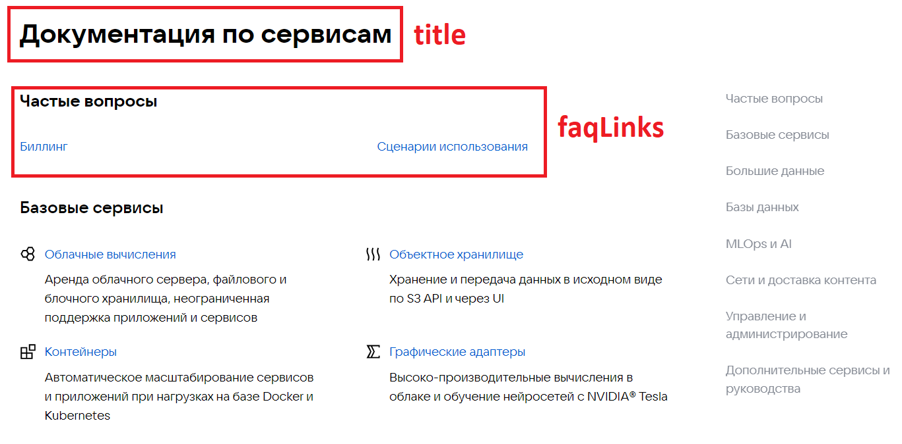
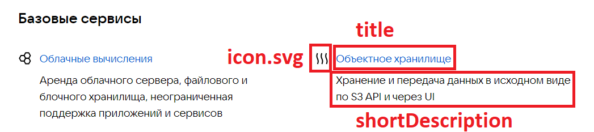
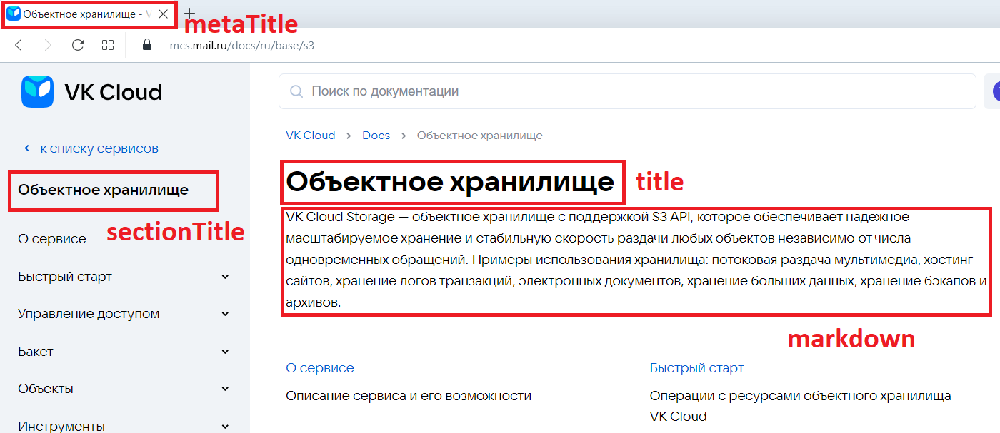
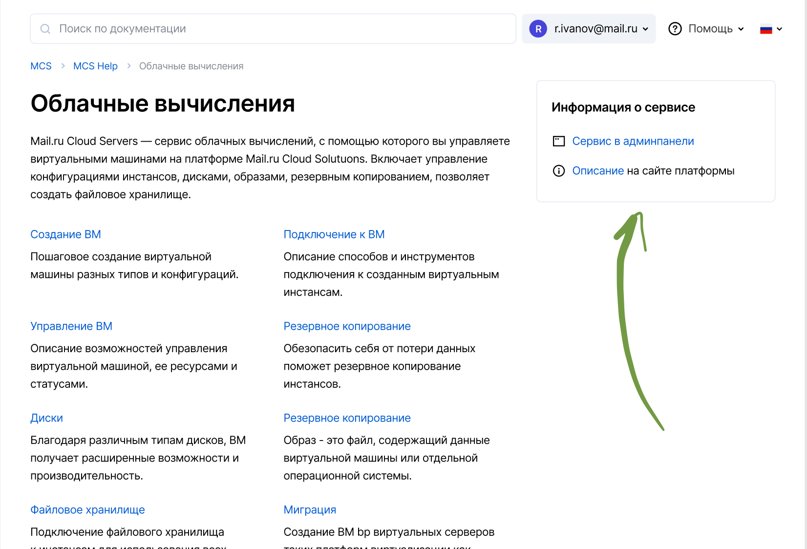
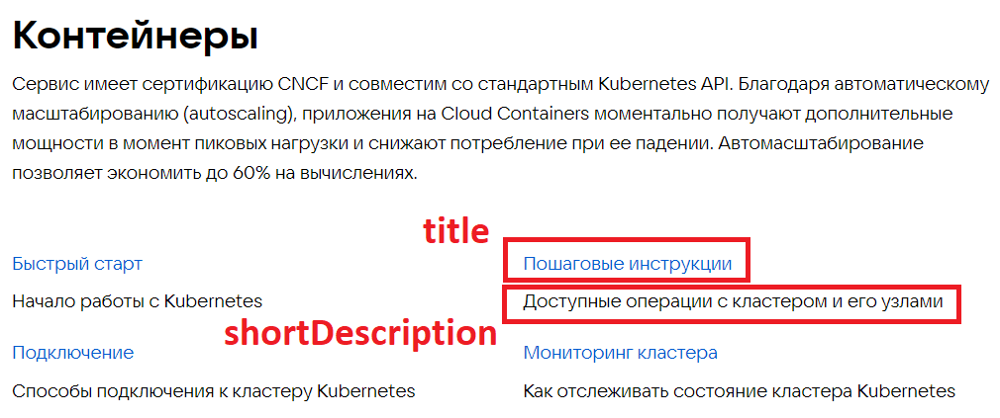
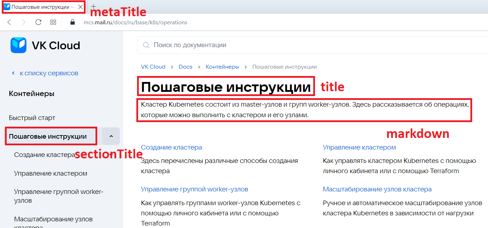
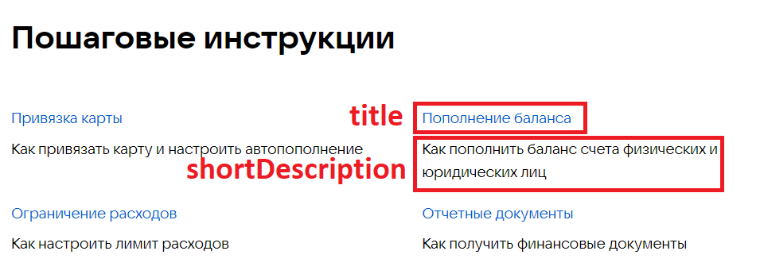
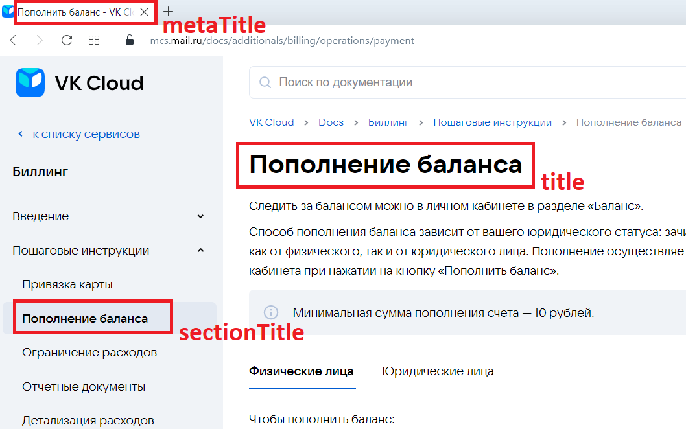
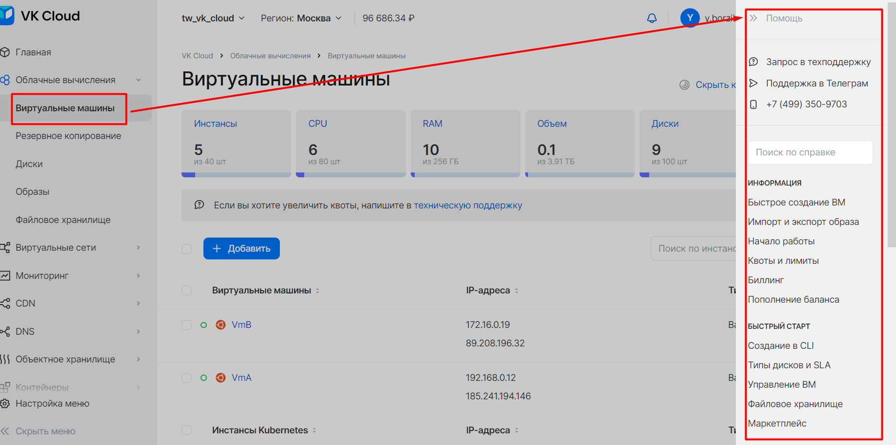
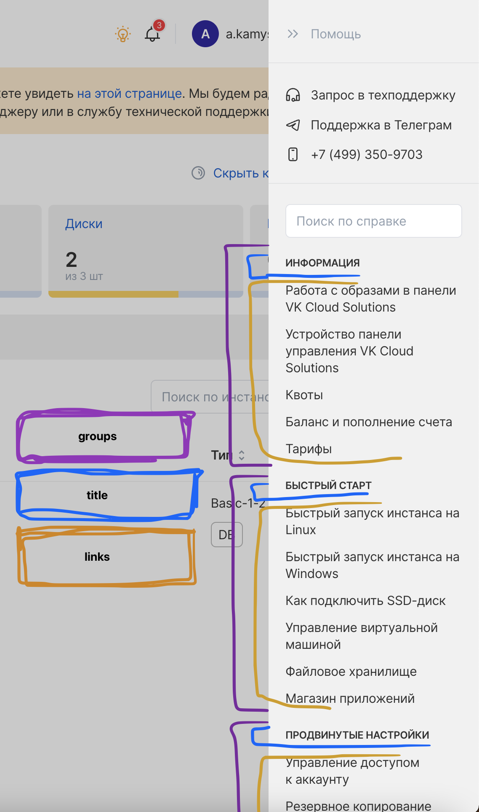

# Как работает документация

## Структура папок

Frontend-часть (движок документации) генерирует html-страницы из файлов в папке `/docs`. На втором уровне расположены папки с языком (см. [Локализация](#локализация)).

Каждому уровню иерархии соответствует отдельная папка с сущностями:

- `имя_папки.meta.json` — настройки статьи / раздела.
- `assets` — необязательная папка с медиафайлами для страницы: видео, изображения, аудио.
- `имя_папки.md` — основное содержимое статьи; не создается для разделов и подразделов.

Отображаемые в ЛК разделы документации (появляются при нажатии кнопки **Помощь** в верхнем правом углу ЛК) строятся на основе JSON-файлов в папке `/externals/sections` (см. [Внешние ссылки](#внешние-ссылки-external-sections)).

Иерархия папок в документации:

```text
раздел-1
    раздел-1.meta.json
    подраздел-1
        подраздел-1.meta.json
        статья-1
            assets
            статья-1.meta.json
            статья-1.md
        статья-2
            статья-2.meta.json
            статья-2.md
    подраздел-2
        подраздел-2.meta.json
        подраздел-2.1
            подраздел-2.1.meta.json
            статья-3
                статья-3.meta.json
                статья-3.md
        ...
    подраздел-N
    ...
раздел-N
...
<название_родительской_папки>.meta.json
```

Итоговая ссылка на страницу имеет вид `sitename/docs/{путь_до_страницы}`, например:

- Путь до страницы в GitLab: https://gitlab.corp.mail.ru/infra/front/tech-writers/docs-public/-/tree/master/docs/ru/ml/cloud-voice/about-cloud-voice
- Путь до страницы на сайте документации: https://cloud.vk.com/docs/ml/cloud-voice/about-cloud-voice
- Путь до страницы с указанием локализации: https://cloud.vk.com/docs/ru/ml/cloud-voice/about-cloud-voice

## Типы страниц

Есть несколько типов страниц, часть из них редактируется через настройки JSON-файлов с метаданными. Описание и примеры этих страниц приведены далее.

Назначение полей с одинаковыми названиями расшифровано в статье один раз. Если назначение не расшифровано в одном примере, то оно есть в другом.

### Главная страница

Главная страница располагается по адресу `{sitename}/{lang_code}`.

Здесь:

- `{sitename}` — наименование сайта.
- `{lang_code}` — код языка. Сейчас используется `ru` и `en`.

Настройки хранятся в файле `{lang_code}.meta.json` соответствующего языка.

Структура JSON-файла:

```json
{
  "title": "Документация", ← заголовок главной страницы, отображается сверху на https://cloud.vk.com/docs
   "faqLinks": [ ← блок с часто задаваемыми вопросами, ссылки до наиболее популярных статей
    "docs/ru/additionals/account/start/registration",
    "docs/ru/additionals/billing",
    "docs/ru/additionals/cases"
  ],
  "serviceGroupLinks": [], ← deprecated
  "additionalUuids": [ "uuid1", "uuid2"], ← список uuid для редиректа на эту страницу; используется при полном удалении страницы из документации (примеры сервисов: IoT, SQS)
  "uuid": "8039e837-cbc5-4f10-8185-59be352f986e" ← уникальный идентификатор страницы, используется для редиректов
}
```

<details>
    <summary>Результат</summary>



</details>

Остальные разделы собираются из соответствующих JSON-настроек папки `ru` или `en`.

### Страница сервиса (разводящая страница)

Страница сервиса — промежуточная, разводящая страница между главной и страницей статьи. Страница сервиса группирует в себе ссылки на страницы статей и других разделов.

Структура JSON-файла:

```json
{
  "title": "Объектное хранилище", ← заголовок страницы, отображаемый вверху
  "pageDescription": "VK Cloud Storage — объектное хранилище с поддержкой S3 API, которое обеспечивает надежное масштабируемое хранение и стабильную скорость раздачи любых объектов независимо от числа одновременных обращений. Примеры использования хранилища: потоковая раздача мультимедиа, хостинг сайтов, хранение логов транзакций, электронных документов, хранение больших данных, хранение бэкапов и архивов.", ← описание страницы для SEO; не отображается
  "shortDescription": "Хранение и передача данных в исходном виде по S3 API и через UI", ← описание, которое отображается на разводящей странице под ссылкой на раздел/подраздел
  "metaTitle": "Объектное хранилище", ← заголовок страницы, отображаемый на вкладке в браузере
  "metaDescription": "VK Cloud Storage — объектное хранилище с поддержкой S3 API, которое обеспечивает надежное масштабируемое хранение и стабильную скорость раздачи любых", ← ключевые предложения, используются только для SEO
  "sectionTitle": "Объектное хранилище", ← заголовок страницы, отображаемый в меню слева
  "markdown": "VK Cloud Storage — объектное хранилище с поддержкой S3 API, которое обеспечивает надежное масштабируемое хранение и стабильную скорость раздачи любых объектов независимо от числа одновременных обращений. Примеры использования хранилища: потоковая раздача мультимедиа, хостинг сайтов, хранение логов транзакций, электронных документов, хранение больших данных, хранение бэкапов и архивов.", ← описание страницы, которое отражается вверху разводящей страницы, между заголовком и списком ссылок; поддерживается синтаксис Markdown и HTML
  "icon": "", ← deprecated; чтобы задать иконку категории, поместите в папку assets файл с названием icon.svg
  "weight": 3, ← порядковый номер страницы в разделе
  "infobarItems": null, ← отдельный блок ссылок справа от текста
  "isBeta": true ← помечает сервис и все вложенные статьи как Beta
  "additionalUuids": ["uuid1", "uuid2"], ← список uuid для редиректа на эту страницу
  "uuid": "b4b73ce5-4e87-4159-b682-67b0fa2c0457"
```

<details>
    <summary>Результат</summary>





</details>

Пример заполнения поля `infobarItems`:

```json

"infobarItems": [
    {
        "text": "Сервис в админпанели", ← текст, который видит пользователь
        "icon": "assets/some_icon.png", ← путь до иконки (обязательно)
        "link": "../billing" ← ссылка на статью в документации
    }
]
```

<details>
    <summary>Результат</summary>



</details>

### Страница раздела / подраздела (разводящая страница)

Раздел / подраздел — страница, входящая в сервис, которая может включать в себя вложенные папки (подразделы или статьи). Количество вложенных друг в друга страниц раздела не ограничено.

Пример страницы разделов [../docs/ru/bigdata](../docs/ru/bigdata), там же есть `.meta.json`.

Структура JSON-файла:

```json
{
  "title": "Пошаговые инструкции",
  "pageDescription": "Кластер Kubernetes состоит из master-узлов и групп worker-узлов. Здесь рассказывается об операциях, которые можно выполнить с кластером и его узлами.",
  "shortDescription": "Доступные операции с кластером и его узлами",
  "metaTitle": "Пошаговые инструкции",
  "metaDescription": "",
  "sectionTitle": "Пошаговые инструкции",
  "markdown": "Кластер Kubernetes состоит из master-узлов и групп worker-узлов. Здесь рассказывается об операциях, которые можно выполнить с кластером и его узлами.",
  "infobarItems": null,
  "weight": 2,
  "isBeta": true ← помечает раздел и все вложенные статьи как Beta
  "additionalUuids": ["uuid1", "uuid2"],
  "uuid": "894f25df-89f5-47ac-84a2-519d541edc6b"
}
```

<details>
    <summary>Результат</summary>





</details>

### Страницы статей

Статья — страница, которая содержит основной контент. Если в папку не вложены другие папки (кроме папки `assets`), то страница считается статьей. Такая папка, кроме `.meta.json`, должна содержать `.md`-файл с разметкой статьи. Если в статье есть какие-то медиафайлы, то можно создать папку `assets` и положить их туда.

Пример статьи [../docs/ru/base/iaas/instructions/vm-volumes](../docs/ru/base/iaas/instructions/vm-volumes).

Структура JSON-файла:

```json
{
  "title": "Пополнение баланса",
  "sectionTitle": "Пополнить баланс",
  "metaTitle": "Пополнить баланс",
  "pageDescription": "Как пополнить баланс счета физических и юридических лиц.",
  "shortDescription": "Как пополнить баланс счета физических и юридических лиц",
  "metaDescription": "Как пополнить баланс счета физических и юридических лиц",
  "markdown": "Как пополнить баланс счета физических и юридических лиц.",
  "disableGithub": true, ← не показывать кнопку "Редактировать на GitHub" для статьи
  "disableDateInformation": true ← не показывать дату обновления статьи
  "weight": 1,
  "isBeta": true ← помечает статью как Beta
  "additionalUuids": ["uuid1", "uuid2"],
  "uuid": "b60fdf73-9045-4ca8-8627-ef5ecfab21ff",
  "createdAt": "2023-05-18T11:25:25.000Z", ← дата создания статьи, добавляется автоматически
  "updatedAt": "2023-07-12T14:16:06.000Z" ← дата обновления статьи, обновляется автоматически
}
```

<details>
    <summary>Результат</summary>





</details>

### Страница поиска

Страница показывает найденные в результате поиска страницы статей и разделов. Доступна по адресу `sitename/docs/{lang_code}/search?{search_params}`.

### Страница обратной связи

Страница содержит контактную информацию технической поддержки и блок с наиболее частыми вопросами (секция `faqLinks`, см. [Главная страница](#главная-страница)).

## Автосоздание редиректов

В документации реализована система автосоздания редиректов. Cистема отслеживает изменение URL-страницы по уникальной строке (uuidv4), которая присваивается каждой странице **автоматически** после мержа ветки в мастер.

Если вы **изменили** название или расположение статьи, то ссылки на нее, в том числе из внешних источников, будут работать.

Если вы **удалили** статью, то при переходе на нее из внешних источников (например, ЛК), отобразится ошибка `404`. Поэтому при удалении статьи нужно добавить ее `uuid` в `additionalUuids` близкой по смыслу статьи:

- новая версия статьи;
- статья, в которую включается контент старой статьи;
- разводящая страница раздела и т.д.

## Внешние ссылки

Механизм внешних ссылок группирует ссылки на статьи документации с возможностью ссылаться на них из внешних источников. В проекте существует папка `externals/sections/`, эту папку можно заполнить для того, чтобы создать набор ссылок, доступных через API.

Пример использования: меню **Помощь** в [личном кабинете VK Cloud](https://cloud.vk.com/app)

<details>
    <summary>Как это выглядит в личном кабинете</summary>



</details>

**Как заполнять папку `sections`**

Структура собирается из соответствующих JSON-настроек папки `/externals/sections`. Контент в папке разделен по языкам аналогично общей структуре.

Каждый JSON-файл — отдельное меню для выбранного раздела в ЛК.

В папке с языком, например, `externals/sections/{lang_code}` можно создать любое количество JSON-файлов. Рекомендуется называть файлы в соответствии с конечным URL страниц, для которых предназначается этот файл. Например, файл `cloud-networks-router.json` содержит ссылки, который будут отображаться в ЛК в разделе **Виртуальные сети** — **Маршрутизаторы**.

Можно использовать один JSON-файл для нескольких разделов — укажите это в параметрах `meta`, `path`

Структура JSON-файла:

```json
{
    "meta": "Инстансы баз данных", ← человекопонятное описание, в каком разделе ЛК должна отображаться данная структура; помогает разработчикам правильно определить настройку
    "path": "/services/databases/list", ← путь в ЛК до раздела (если остались вопросы из значения meta)
    "groups": [ ← группа ссылок; обычно используется одна группа
        {
            "title": "ИНФОРМАЦИЯ", ← название блока
            "links": [ ← ссылки на разделы / подразделы / статьи
                {
                    "link": "docs/ru/additionals/account/start" ← ссылка на раздел / статью; всегда начинается с корня, т.е. с docs; автоматически берет актуальный заголовок страницы из указанного файла
                },
                {
                    "link": "docs/ru/dbs/dbaas/dbaas-start"
                },
                {
                    "link": "docs/ru/dbs/dbaas"
                },
                {
                    "link": "docs/ru/additionals/billing",
                    "hiddenForPartners": true ← скрывает ссылку для партнеров; исторически сложилось, что биллинг прячем от них
                }
            ]
        },
        {
            "title": "БЫСТРЫЙ СТАРТ", ← следующий блок, список параметров аналогичный
            "links": [
                {
                    "link": "docs/ru/dbs/dbaas/dbaas-start/db-connect"
                },
                {
                    "link": "docs/ru/dbs/dbaas/dbaas-start/db-cluster"
                }
            ]
        }
```

<details>
    <summary>Пример использования внешних ссылок</summary>



</details>

<warn>
Stage-стенд для этих ссылок не собирается, проверять вручную!
</warn>

## Пайплайн: линтеры, валидаторы, тесты

При создании запроса на изменение (PR или MR) система автоматически запустит линтеры, валидаторы и тесты для проверки корректности внесенных изменений. Реквест можно влить в мастер, только если проверка пройдена успешно. Если система нашла ошибки в реквесте, исправьте их.

## Локализация

Локализация статей и разводящих страниц на сайте происходит через добавления в папку `/docs` папки с кодом языка — `{lang_code}`. По умолчанию определено два языка:

- `ru` (основной);
- `en`.

Языков может быть любое количество, в каждом языке может быть разная структура статей. Новая языковая версия будет доступна по адресу `sitename.ru/docs/{lang_code}`, например, https://cloud.vk.com/docs/ru/.

Локализация интерфейса сайта документации (например, кнопки) выполняется через изменения в коде проекта.
