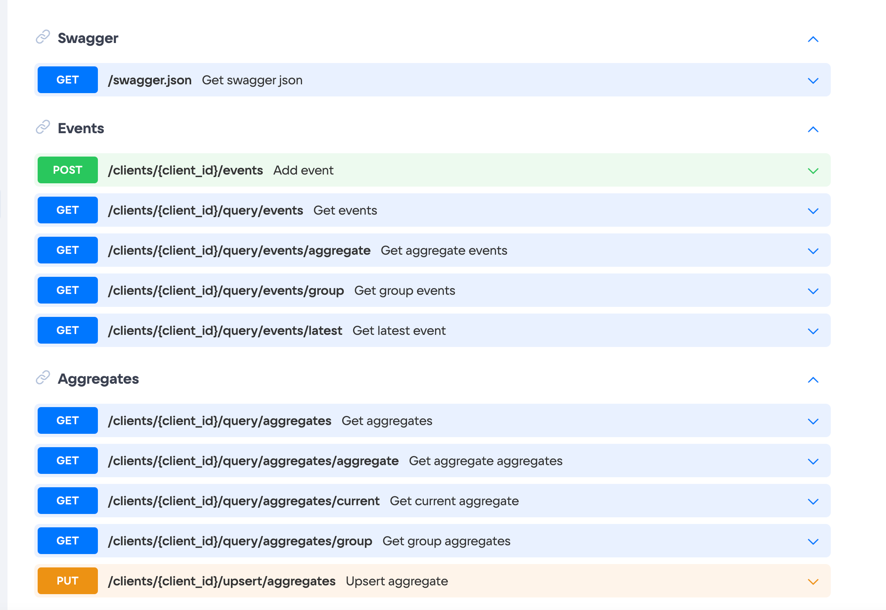

# Синтаксис Extended Markdown

Итоговое отображение элементов есть в статье [О портале документации](https://mcs.mail.ru/docs/ru/additionals/start/about-help).

### Заголовки

```md
# Заголовок уровня 1
## Заголовок уровня 2
### Заголовок уровня 3
#### Заголовок уровня 4
##### Заголовок уровня 5
###### Заголовок уровня 6
```

### Параграфы

```md
Чтобы добавить параграф, добавьте пустую строку между предложениями

Текс станет легче восприниматься для чтения.
```

### Разрыв строки

```md
Текст первой строки.<br> Текст второй строки.
```

**Результат**:

Текст первой строки.<br> Текст второй строки.

### Форматирование текста

```md
Пример **жирного текста**.
Пример *курсивного текста*.
Пример ~~зачеркнутого текста~~.
```

**Результат**:

Пример **жирного текста**.
Пример *курсивного текста*.
Пример ~~зачеркнутого текста~~.

### Цитаты

```md
> Цитируемый однострочный текст.
```

**Результат**:

> Цитируемый однострочный текст.

### Списки

#### Нумерованный список

```md
1. Пункт первый.
2. Пункт второй.
3. Пункт третий.

или

1. Пункт первый.
1. Пункт второй.
1. Пункт третий.
```

**Результат**:

1. Пункт первый.
1. Пункт второй.
1. Пункт третий.

Вложенный нумерованный список:

```md
1. Пункт первый.

    1. Подпункт первый.
    1. Подпункт второй.
    
1. Пункт второй.
```

**Результат**:

1. Пункт первый

    1. Подпункт первый.
    1. Подпункт второй.

1. Пункт второй.

#### Ненумерованный список

```md
- Пункт первый.
- Пункт второй.
- Пункт третий.
```

**Результат**:

- Пункт первый.
- Пункт второй.
- Пункт третий.

Вложенный ненумерованный список:

```md
- Пункт первый

    - Подпункт первый.
    - Подпункт второй.
    
- Пункт второй.
```

**Результат**:

- Пункт первый

  - Подпункт первый.
  - Подпункт второй.

- Пункт второй.

### Изображения

Отдельным блоком:

```md
Текст после изображения.


```

**Результат**:

Текст после изображения.


Встроенное в строку:

```md
Текст с inline-изображением 
```

**Результат**:

Текст с inline-изображением .

### Ссылки

Относительная внутренняя ссылка (для ссылок на страницы внутри документации):

```md
[Видимый текст ссылки](/ru/additionals/start)
```

Внешняя ссылка:

```md
[Видимый текст ссылки](https://github.com/vk-cs/docs-public)
```

Ссылка на файл (будет отмечена иконкой, клик по ссылке приведет к скачиванию):

```md
[Скачать картинку](https://github.com/vk-cs/docs-public/guides/assets/vk_icon_inline.png "download")
```

### Сворачиваемые блоки (шорткаты)

```md
<details>
    <summary>Короткое видимое описание</summary>
       
    Подробный длинный скрытый текст
    Подробный длинный скрытый текст
    Подробный длинный скрытый текст
    Подробный длинный скрытый текст

</details>
```

**Результат**:

<details>
  <summary>Короткое видимое описание</summary>

  Подробный длинный скрытый текст
  Подробный длинный скрытый текст
  Подробный длинный скрытый текст
  Подробный длинный скрытый текст

</details>

### Блоки с кодом

Пример блока кода для языка JavaScript:

`` ```js``<br>
``console.log('Hello World');``<br>
`` ``` ``

**Результат**:

```js
console.log('Hello World');
```

Полный список поддерживаемых языков размещен по [ссылке](https://github.com/react-syntax-highlighter/react-syntax-highlighter/blob/master/AVAILABLE_LANGUAGES_PRISM.MD).

### Таблицы

Для таблицы не рекомендуется делать больше 4 колонок.

```md
| Заголовок 1 | Заголовок 2    | Заголовок 3  | Заголовок 4            |
| :---        | :----:         | ---:         | ---                    |
| Текст слева | Текст в центре | Текст справа | Текст без выравнивания |
| Столбец 1   | Столбец 2      | Столбец 3    | Столбец 4              |
```

**Результат**:

| Заголовок 1   | Заголовок 2      | Заголовок 3    | Заголовок 4 |
| :---        | :----:         | ---:         | --- |
| Текст слева | Текст в центре | Текст справа | Текст без выравнивания |
| Столбец 1     | Столбец 2        | Столбец 3      | Столбец 4 |

## Вкладки (табы)

```md
<tabs>
<tablist>
<tab>Вкладка 1</tab>
<tab>Вкладка 2</tab>
</tablist>
<tabpanel>

Содержимое Вкладки 1. Можно добавить произвольный текст.

</tabpanel>
<tabpanel>

Содержимое Вкладки 2. Можно добавить произвольный текст.

</tabpanel>
</tabs>
```

Порядок содержимого вкладок `<tabpanel>` должен совпадать с порядком вкладок `<tab>`. Содержимое вкладок может включать markdown-разметку.

### Инфоблоки

Поддерживаемые типы инфоблоков:

- `info` — дополнительная информация, которая может быть полезна читателю. Если он ее упустит, ничего страшного не случится.
- `warn` — важная информация, к которой необходимо привлечь внимание читателя. Желательно, чтобы такая вставка содержала не более двух тезисов, а лучше — один. Тезисы обязательно должны быть связаны общей темой.
- `err` — критически важная информация, пропустив которую читатель рискует что-то сломать или потерять деньги. Такая вставка должна содержать всего один тезис, сформулированный кратко.

```md
<info>
Инфоблок с серым цветом фона
</info>
```

```md
<warn>
Инфоблок с желтым цветом фона
</warn>
```

```md
<err>
Инфоблок с красным цветом фона
</err>
```

### Генерация описания API из swagger-файла

Позволяет сгенерировать страницу документацию из swagger-файла. Чаще всего используется для описания методов API.

Входные данные — спецификация в формате JSON.

```md

```

**Результат**:



Больше примеров можно найти в разделе с [описанием API](https://mcs.mail.ru/docs/ru/additionals/api).

### Символы, которые требуется экранировать

```
\	 backslash
`	 backtick (see also escaping backticks in code)
*	 asterisk
_	 underscore
{ }	 curly braces
[ ]	 brackets
< >	 angle brackets
( )	 parentheses
#	 pound sign
+	 plus sign
-	 minus sign (hyphen)
.	 dot
!	 exclamation mark
|	 pipe (see also escaping pipe in tables)
```

### Другие элементы HTML

Возможно встраивать любую html-разметку, но это крайне не приветствуется.
