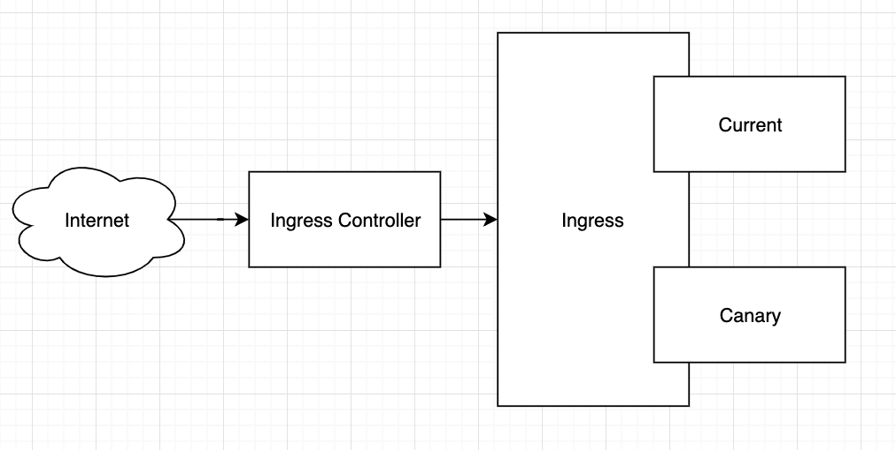
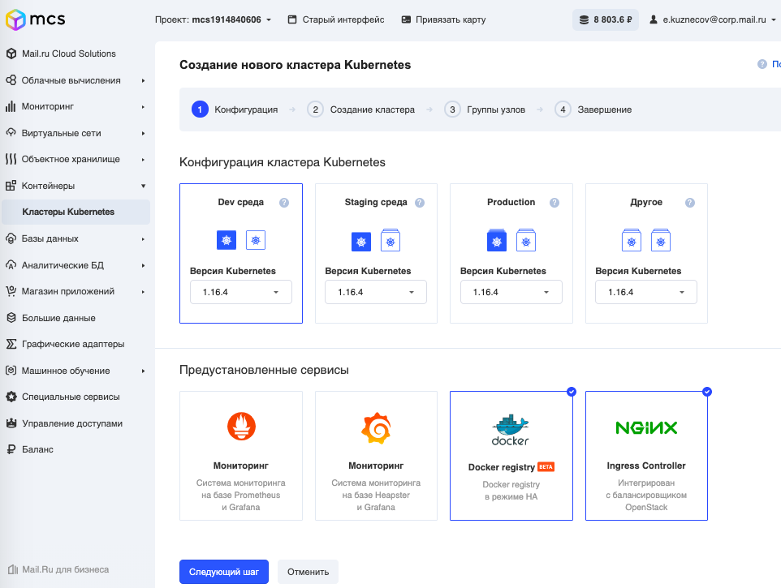
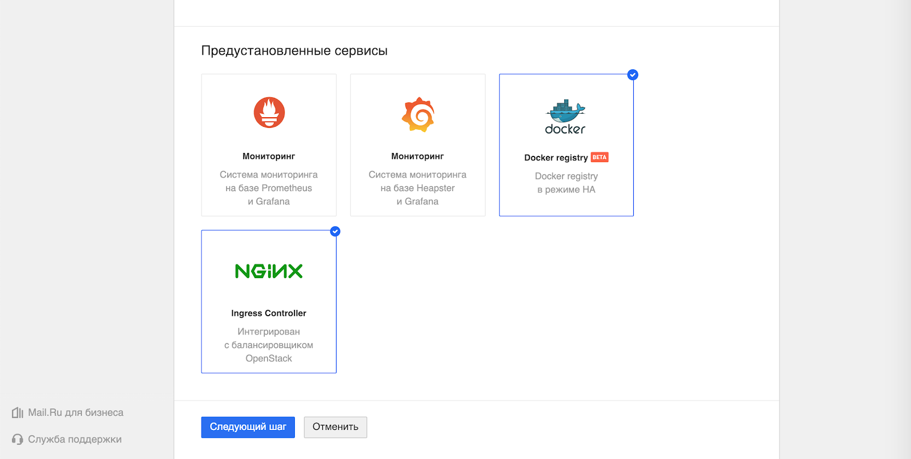
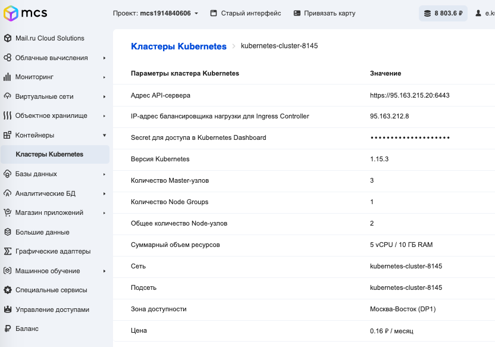
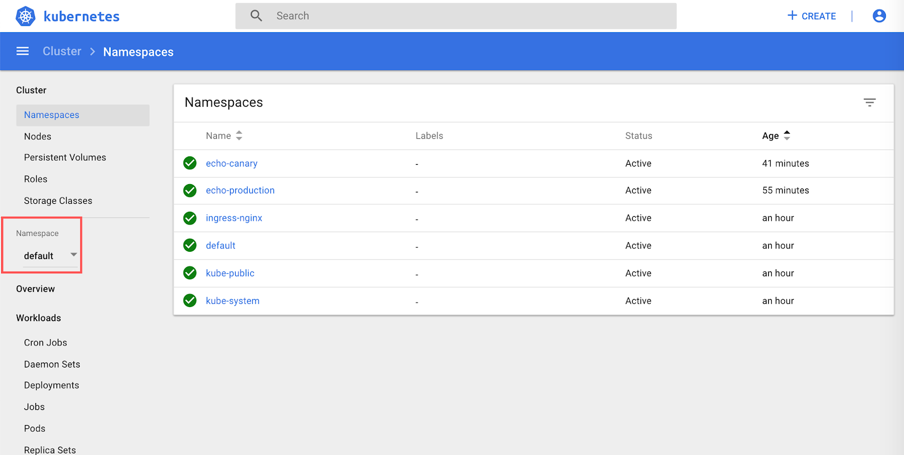
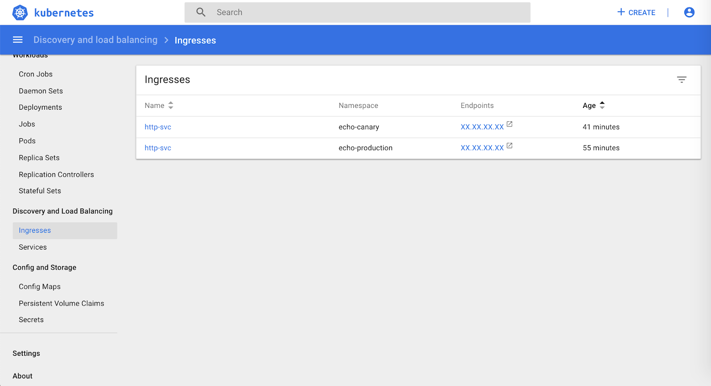

Эта статья поможет вам развернуть кластер Kubernetes и настроить на нем Canary Deployment при помощи Nginx Ingress Annotations

**Canary Deployment** — это способ развертывания сетевых приложений и онлайн-сервисов для некоторого множества пользователей или серверов. Его часто используют для постепенного развертывания новых версий приложений с целью раннего выявления ошибок. Canary Deployment особенно полезен при проведении A/B-тестирований или настройки Blue/Green-развертывания приложений

Рассмотрим пример с тестовым приложением. Выполним сценарий Canary Deployment для простого echo-сервера и убедимся, что трафик распределяется в соответствии с конфигурационным файлом

**Ingress** – это набор правил внутри вашего кластера. Эти правила предназначены для того, чтобы входящие подключения могли достичь сервисов (Services) ваших приложений

Ingress решает следующие основные задачи:

*   Организация для ваших приложений URL, доступных из-вне
*   Обеспечение балансировки трафика
*   Терминация SSL
*   Виртуальный хостинг на основе имен

Ingress Controller — это то, что позволяет набору правил Ingress работать. Если кратко, Ingress Controller представляет собой одну центральную точку в виде контейнера, который используется для проксирования всего трафика

В Nginx доступны следующие типы Canary-аннотаций:

*   nginx.ingress.kubernetes.io/canary-by-header — позволяет перенаправлять на Сanary-версию только запросы с определенным http-заголовком
    
*   nginx.ingress.kubernetes.io/canary-by-cookie — позволяет перенаправлять на Сanary-версию только запросы с определенным cookie
    
*   nginx.ingress.kubernetes.io/canary-weight — позволяет напрямую указать, сколько процентов запросов будет уходить на нашу Сanary-версию приложения. В нашем примере выполним балансировку по этому принципу
    

**Примечание**

Документацию по Canary Deployments на Kubernetes см. [тут](https://kubernetes.github.io/ingress-nginx/user-guide/nginx-configuration/annotations/#canary)

**Схема стенда**
----------------

****

Ingress — это ресурс (объект), который содержит инструкции маршрутизации трафика в кластере, обычно используя HTTP. В данном случае Current и Canary являются конфигурациями Ingress для версий приложений, для которых мы настраиваем Canary Deployment.

Ingress Controller отвечает за выполнение правил Ingress, как правило, с помощью балансировщика нагрузки, встроенного в K8S.

**Создание кластера Kubernetes в VK CS**
--------------------------------------

Чтобы создать кластер Kubernets:

1.  В боковом меню выберите раздел **Контейнеры**
2.  Нажмите кнопку **Подключить**
3.  В боковом меню выберите раздел **Кластеры Kubernetes**
4.  Нажмите кнопку **Добавить** и выберите подходящие настройки

****

5.  Нажмите кнопку **Следующий шаг** и выберите подходящую конфигурацию машин
    

****

6.  Нажмите кнопку **Создать кластер** и дождитесь завершения операции. Создание кластера может занять от 5 до 20 минут, в зависимости от его размеров
    
7.  По завершении создания кластера загрузится архив, содержащий файлы, необходимые для безопасного подключения к панели управления Kubernetes. Не закрывайте страницу с информацией о новом кластере, она понадобится для входа в Kubernetes Dashboard
    

****

8.  Чтобы можно было подключаться к кластеру по kubectl, распакуйте архив, найдите файл config, который требуется для работы утилиты kubectl, и задайте переменную окружения KUBECONFIG:

```
export KUBECONFIG=<путь до файла config>
```

**Создание приложения в production**
------------------------------------

Создадим приложение и покажем для этого приложения балансировку с помощью Nginx Canary. Для этого:

1.  Создайте production namespace для проекта:

```
kubectl create ns echo-production
< namespace "echo-production" created
```

2.  Разверните приложение. Мы используем пример из репозитория Kubernetes. Подключимся к кластеру и развернем тестовый echo-сервер в созданном namespace:

```
kubectl apply -f https://raw.githubusercontent.com/kubernetes/ingress-nginx/master/docs/examples/http-svc.yaml -n echo-production
< deployment.extensions "http-svc" created
< service "http-svc" created

```

3.  Создайте файл конфигурации Ingress и примените его к namespace echo-production:

```
http-svc.ingress
apiVersion: extensions/v1beta1
kind: Ingress
metadata:
  name: http-svc
  annotations:
    kubernetes.io/ingress.class: nginx
spec:
  rules:
  - host: echo.com
    http:
      paths:
      - backend:
          serviceName: http-svc
          servicePort: 80
```

В результате сервер будет реагировать на все запросы от хоста echo.com (serviceName — название сервиса, созданного на предыдущем шаге)

Примените файл Ingress к namespace echo-production, используя команду:

```
kubectl apply -f http-svc.ingress -n echo-production
< ingress.extensions "http-svc" created
```

**Создание тестовой копии приложения**
--------------------------------------

Создадим копию приложения, на которую будем направлять часть запросов. Для этого:

1.  Создайте Canary-версию namespace приложения:

```
kubectl create ns echo-canary
< namespace "echo-canary" created
```

2.  Разверните Canary-версию приложения:

```
kubectl apply -f https://raw.githubusercontent.com/kubernetes/ingress-nginx/master/docs/examples/http-svc.yaml -n echo-canary
< deployment.extensions "http-svc" created
< service "http-svc" created
```

**Примечание**

В реальных условиях Canary Deployment выполняется на разных версиях проекта, для упрощения мы используем одну и ту же версию

3.  Создайте Canary-версию файла конфигурации Ingress и примените его к namespace echo-canary:

```
**http-svc.ingress.canary**
apiVersion: extensions/v1beta1
kind: Ingress
metadata:
  name: http-svc
  annotations:
    kubernetes.io/ingress.class: nginx
    **nginx.ingress.kubernetes.io/canary: "true"
    nginx.ingress.kubernetes.io/canary-weight: "10"**
spec:
  rules:
  - host: echo.com
    http:
      paths:
      - backend:
          serviceName: http-svc
          servicePort: 80
```

**Примечание**

Мы реализуем вариант конфигурации canary-weight для указания распределения трафика в процентах. Обратите внимание на строки, выделенные жирным:

**

*   ```
    nginx.ingress.kubernetes.io/canary: "true"
    ```
    

Это означает, что Kubernetes не будет рассматривать этот Ingress как самостоятельный и пометит его как Canary, связав с основным Ingress

*   ```
    nginx.ingress.kubernetes.io/canary-weight: "10"
    ```
    

"10" означает, что на Canary будет приходиться примерно 10% всех запросов

**

4.  Примените изменения:

```
kubectl apply -f http-svc.ingress.canary -n echo-canary
< ingress.extensions "http-svc" created
```

**Проверка, что все работает**
------------------------------

Зайдите Kubernetes Dashboard, используя токен, полученный после создания кластера:

****

Чтобы просмотреть доступные Namespaces, в боковом меню нажмите соответствующую кнопку:

****

Чтобы просмотреть список активных Ingress и получить их внешний IP-адрес, переключите текущий Namespace на All namespaces:

****

Затем в нижней части бокового меню выберите Ingresses:

****

В результате на экране отобразится список всех доступных Ingresses. У Canary и Production должен быть один IP-адрес:

****

Проверим, что запросы распределяются в соответствии с  конфигурационным файлом. Для этого возьмем скрипт на Ruby:

```
**count.rb**
counts = Hash.new(0)
1000.times do
  output = \`curl -s -H "Host: echo.com" http://<внешний_ip_адрес> | grep 'pod namespace'\`
  counts[output.strip.split.last] += 1
end
puts counts
```

И выполним его:

```
ruby count.rb
```

Результат должен быть близок к следующему:

```
{"echo-production"=>896, "echo-canary"=>104}
```

**Внимание**

Параметр nginx.ingress.kubernetes.io/canary-weight не гарантирует точного распределения по процентам. Он работает скорее как вероятность того, что запрос попадет на Canary, а не на Production