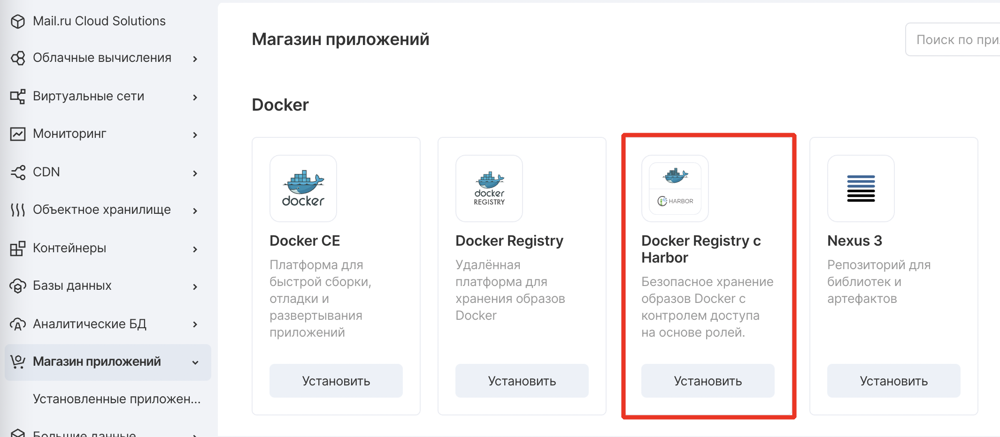
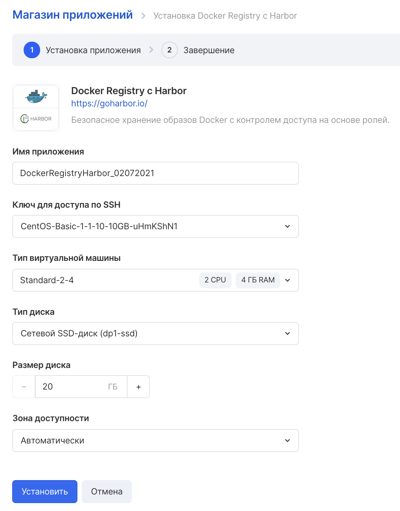
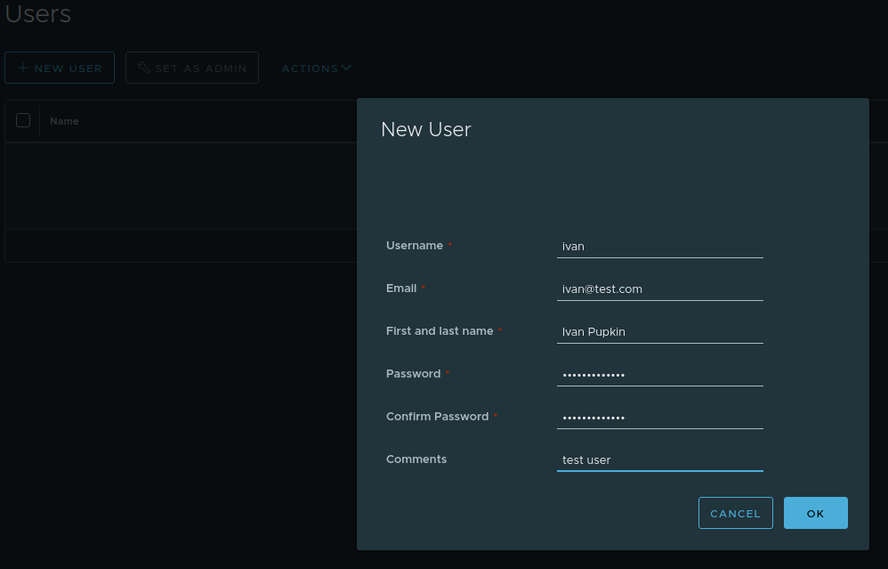
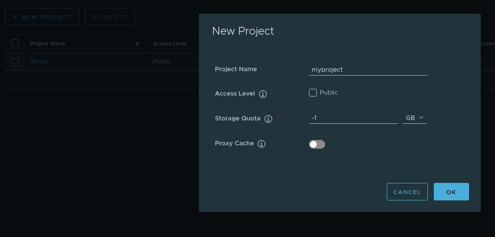
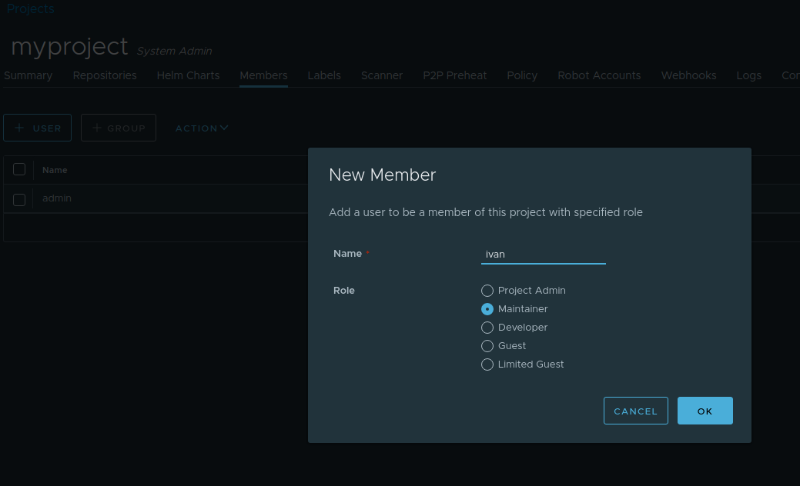
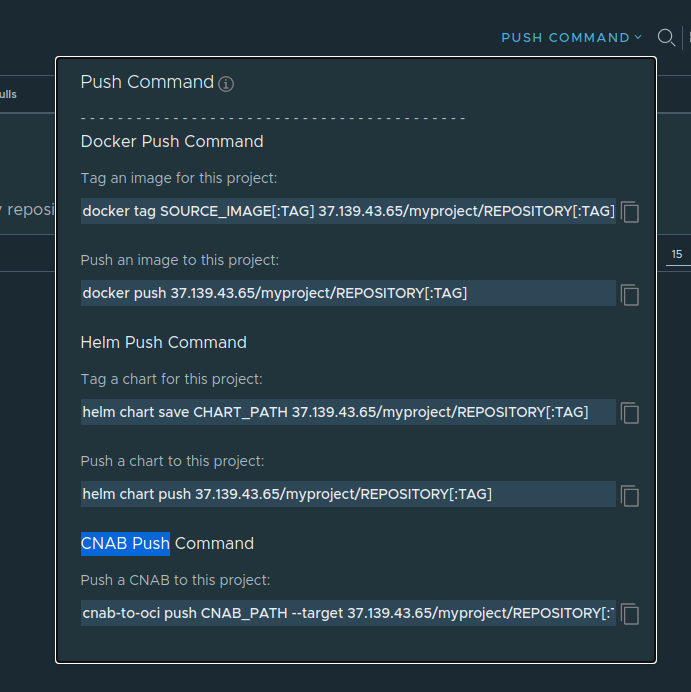
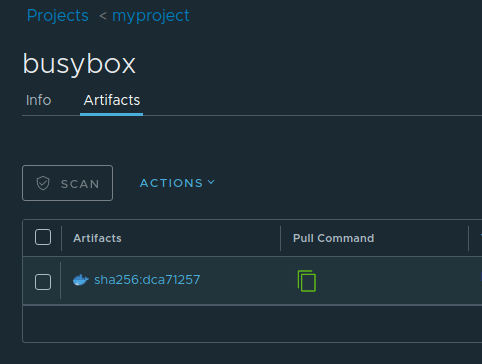

Что такое Harbor
----------------

Harbor - это реестр Docker и Helm c открытым исходным кодом, который обеспечивает доступ к артефактам с помощью политик и контроля доступа на основе ролей, с возможностью сканирования образов на наличие уязвимостей.

Быстрый запуск
--------------

Перейдите в личный кабинет в раздел "Магазин приложений" и нажмите "Установить":

Пройдите пошаговый мастер создания и запустите ВМ.

Использование
-------------

Создайте пользователя:

Создайте новый проект:

Назначьте пользователю привилегии в проекте:

Используйте подсказку “PUSH COMMAND” для выполнения команды добавления артефакта в проект:

\* для корректной работы клиента добавьте сертификат полученный на этапе установки в список доверенных для клиентской системы, затем перезапустите сервис Docker.

Используйте подсказку “Pull comand” для формирования команды получения артефакта:

Дополнительно
-------------

Официальная документация о приложении [находится на этом ресурсе](https://goharbor.io/docs/2.2.0/administration/).