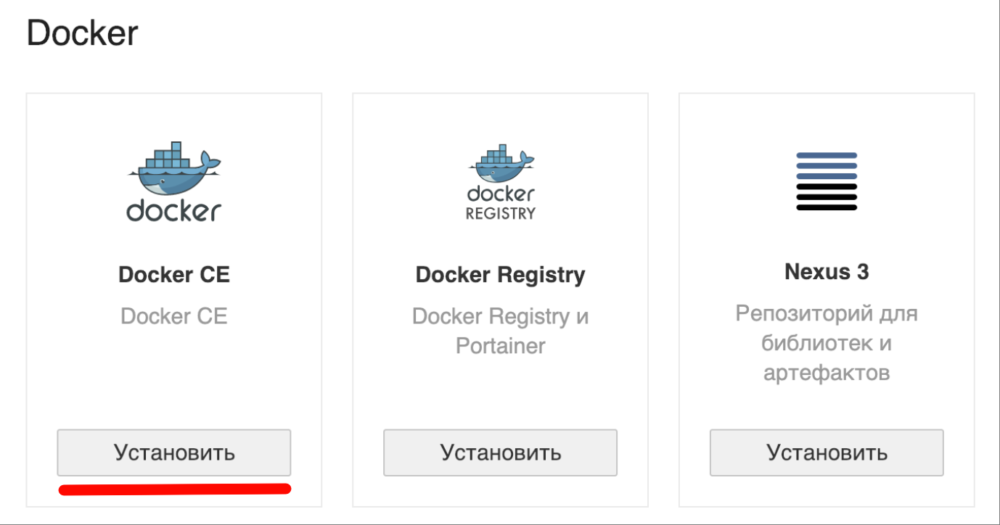
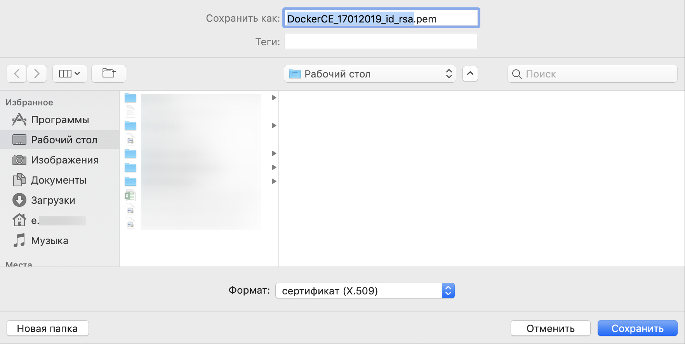
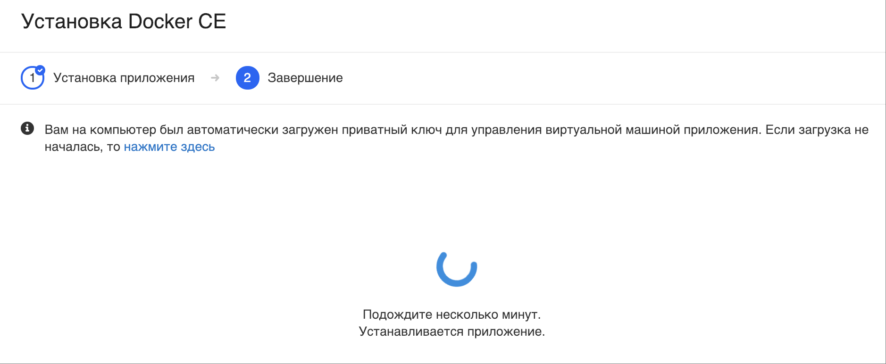
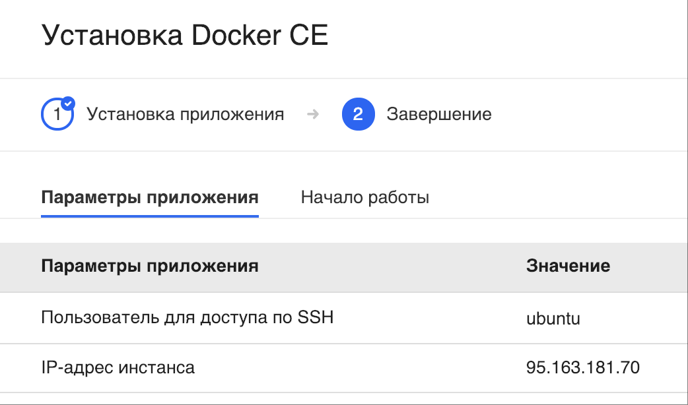

**Docker** — программное обеспечение для автоматизации развёртывания и управления приложениями в среде [виртуализации на уровне операционной системы](https://ru.wikipedia.org/wiki/%D0%9A%D0%BE%D0%BD%D1%82%D0%B5%D0%B9%D0%BD%D0%B5%D1%80%D0%B8%D0%B7%D0%B0%D1%86%D0%B8%D1%8F "Виртуализация на уровне операционной системы"). Позволяет «упаковать» приложение со всем его окружением и зависимостями в контейнер, который может быть перенесён на любую [Linux](https://ru.wikipedia.org/wiki/Linux "Linux")\-систему с поддержкой [cgroups](https://ru.wikipedia.org/wiki/Cgroups "Cgroups") в [ядре](https://ru.wikipedia.org/wiki/%D0%AF%D0%B4%D1%80%D0%BE_Linux "Ядро Linux"), а также предоставляет среду по управлению контейнерами.

* * *

Перейдите в [личный кабинет](https://mcs.mail.ru/app/services/marketplace/) в раздел "Магазин приложений" и нажмите "Установить":

В следующем окне выберите нужные параметры виртуальной машины - имя приложения, зона доступности и т.д.:

### Важно!

Убедитесь, что у вас есть ранее созданный и сохранённый на вашем компьютере ключ доступа по SSH. Если такого нет, то выберите "Создать новый ключ".

Если вы выбрали "Создать новый ключ", то вам на компьютер должен скачаться файл с расширением \*.pem:

Подождите несколько минут.

После установки откроется карточка приложения с параметрами подключения:

а на второй вкладке карточки приложения есть полезная информация и ссылка на дополнительные материалы:

### Обратите внимание

VK CS гарантирует только корректную работу стороннего ПО, предустановленного в виртуальные машины по умолчанию. По вопросам конфигурирования, доработки, документации предустановленного стороннего ПО из раздела "Магазин приложений" мы консультаций не оказываем.