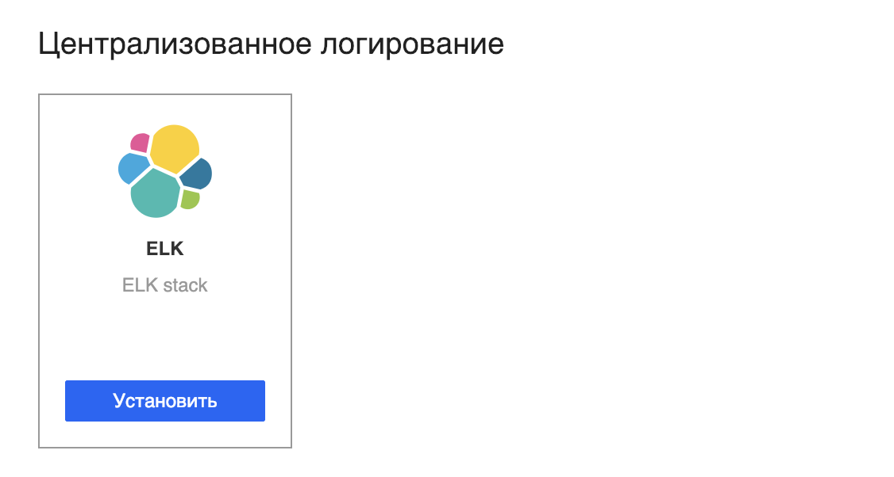
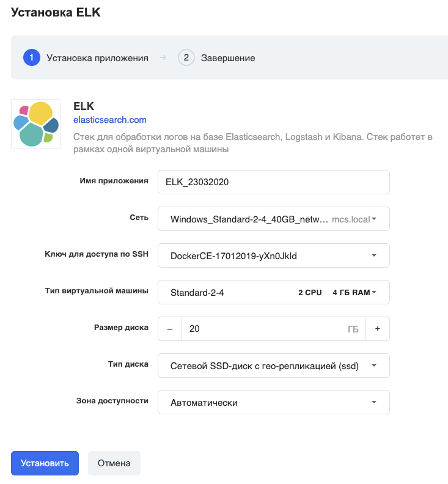
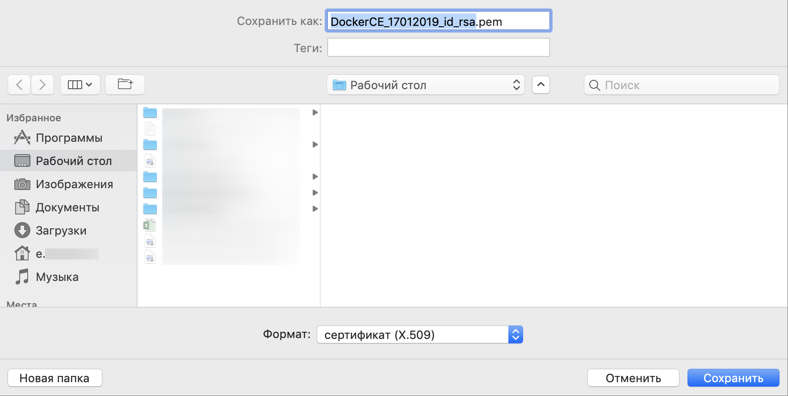
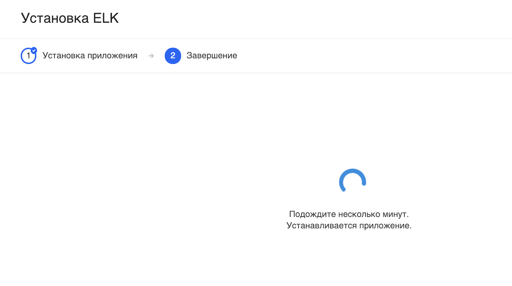
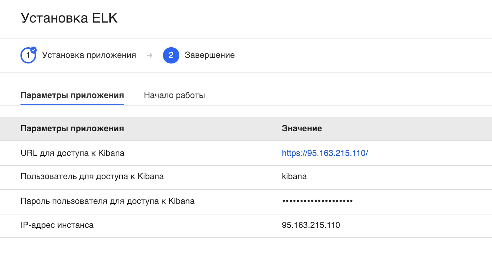
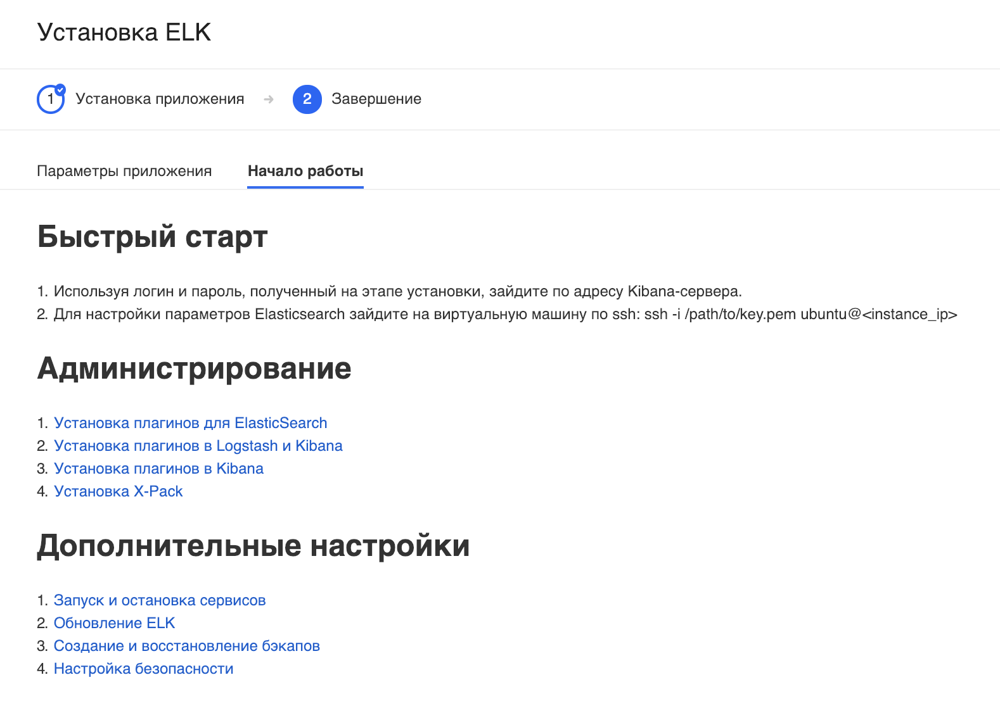

**Elasticsearch** — тиражируемая [свободная](https://ru.wikipedia.org/wiki/%D0%A1%D0%B2%D0%BE%D0%B1%D0%BE%D0%B4%D0%BD%D0%BE%D0%B5_%D0%BF%D1%80%D0%BE%D0%B3%D1%80%D0%B0%D0%BC%D0%BC%D0%BD%D0%BE%D0%B5_%D0%BE%D0%B1%D0%B5%D1%81%D0%BF%D0%B5%D1%87%D0%B5%D0%BD%D0%B8%D0%B5 "Свободное программное обеспечение") программная [поисковая система](https://ru.wikipedia.org/wiki/%D0%9F%D0%BE%D0%B8%D1%81%D0%BA%D0%BE%D0%B2%D0%B0%D1%8F_%D1%81%D0%B8%D1%81%D1%82%D0%B5%D0%BC%D0%B0 "Поисковая система"). Написана на [Java](https://ru.wikipedia.org/wiki/Java "Java"), распространяется по [лицензии Apache](https://ru.wikipedia.org/wiki/%D0%9B%D0%B8%D1%86%D0%B5%D0%BD%D0%B7%D0%B8%D1%8F_Apache "Лицензия Apache"), в основе использует библиотеку [Lucene](https://ru.wikipedia.org/wiki/Lucene "Lucene") (так же как и вторая по популярности поисковая система — [Solr](https://ru.wikipedia.org/wiki/Solr "Solr")), официальные [клиенты](https://ru.wikipedia.org/wiki/%D0%9A%D0%BB%D0%B8%D0%B5%D0%BD%D1%82_(%D0%B8%D0%BD%D1%84%D0%BE%D1%80%D0%BC%D0%B0%D1%82%D0%B8%D0%BA%D0%B0) "Клиент (информатика)") доступны на [Java](https://ru.wikipedia.org/wiki/Java "Java"), [.NET](https://ru.wikipedia.org/wiki/.NET ".NET") ([C#](https://ru.wikipedia.org/wiki/C_Sharp "C Sharp")), [Python](https://ru.wikipedia.org/wiki/Python "Python"), [Groovy](https://ru.wikipedia.org/wiki/Groovy "Groovy") и ряде других языков.

Kibana - это плагин для визуализации данных с открытым исходным кодом для Elasticsearch. Он предоставляет возможности визуализации поверх содержимого, проиндексированного в кластере Elasticsearch.

* * *

Перейдите в [личный кабинет](https://mcs.mail.ru/app/services/marketplace/) в раздел "Магазин приложений" и нажмите "Установить":

В следующем окне выберите нужные параметры виртуальной машины - имя приложения, зона доступности и т.д.:

### Важно!

Убедитесь, что у вас есть ранее созданный и сохранённый на вашем компьютере ключ доступа по SSH. Если такого нет, то выберите "Создать новый ключ".

Если вы выбрали "Создать новый ключ", то вам на компьютер должен скачаться файл с расширением \*.pem:

Подождите несколько минут.

После установки откроется карточка приложения с параметрами подключения:

а на второй вкладке карточки приложения есть полезная информация и дополнительные ссылки:

### Обратите внимание

VK CS гарантирует только корректную работу стороннего ПО, предустановленного в виртуальные машины по умолчанию. По вопросам конфигурирования, доработки, документации предустановленного стороннего ПО из раздела "Магазин приложений" вы можете обратиться к разработчикам этих приложений самостоятельно.

По урл-адресу, указанному на карточке "Параметры приложения", вы можете попасть в интерфейс Kibana:

