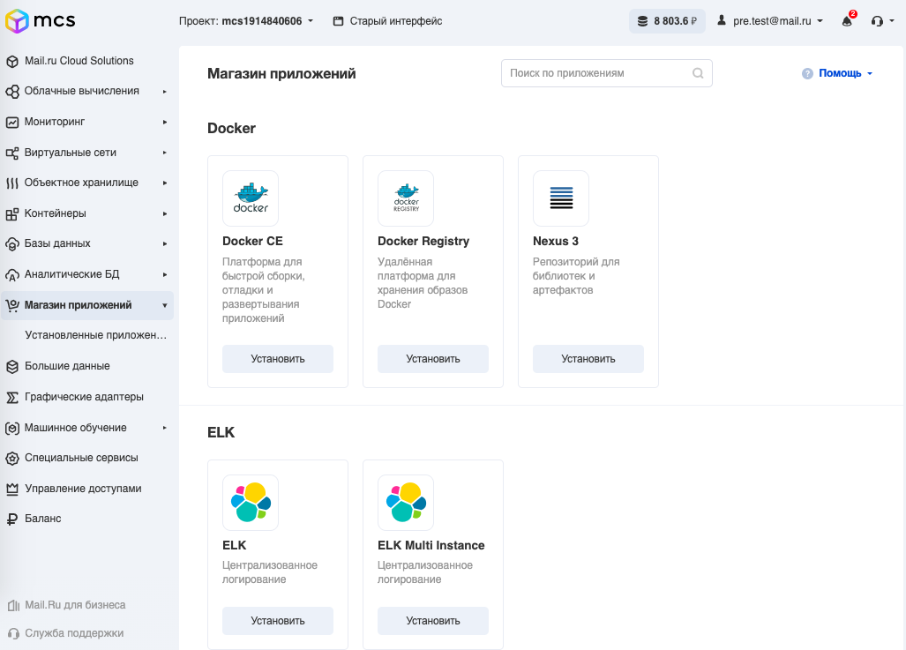

Магазин приложений - это сервис VK CS, предназначенный для быстрого развёртывания сред веб-разработки и администрирования на базе виртуальных машин. Виртуальные машины уже содержат предустановленное программное обеспечение.

В нашем магазине приложений можно развернуть следующие облачные сервисы для разработки:

*   Сервер хранения исходных кодов в облаке: GitLab CE.
*   Серверы сборки непрерывной интеграции: GitLab CE, Jenkins.
*   Сервер хранилищ артефактов: Nexus 2, Nexus 3.
*   Docker registry: Docker registry, Nexus 3, Gitlab. Поддерживается интеграция с S3-хранилищем.
*   Мониторинг: Prometheus Kit.
*   Система централизованного анализа логов и сбора журналов (ELK) с поддержкой кластеризации ElasticSearch.
*   Стеки для разработчиков: LAMP stack (Linux, Apache, MySQL и PHP), LEMP stack (Linux, Nginx, MySQL и PHP), MEAN stack (для разработки Node.JS-приложений).
*   и многое другое.

Сервис для бизнеса
------------------

IT-инфраструктура в надежном облаке. На приложениях Cloud Marketplace можно построить инфраструктуру в одном облаке, с понятной стоимостью и высокой надежностью. Приложения легко масштабируются вертикально и горизонтально.

Сервис для разработчиков
------------------------

Гибкая DevOps-среда в облаке. Компании-разработчики и IT-подразделения смогут сэкономить время на развертывании и конфигурации приложений. Сокращается время вывода продуктов на рынок (time to market).

Сервис для вендоров приложений
------------------------------

Канал дистрибуции. Вы можете стать нашим партнером и разместить свое приложение в Cloud Marketplace, чтобы оно стало доступно пользователям VK CS. Поддерживаем стандарт запаковки приложений AWS CloudFormation.

Как это работает
----------------

1.  Выберите в магазине нужный облачный сервис в каталоге.
2.  Задайте объем ресурсов, который нужно выделить для сервиса.
3.  Нажмите кнопку «Установить»

Приложение нужной топологии автоматически развернется в облаке. В дальнейшем конфигурацию узлов можно менять «на лету».

Подключение сервиса
-------------------

Сервис по умолчанию подключен к новому аккаунту, дополнительных действий делать не нужно. Просто зайдите в соответствующий раздел и создайте первую виртуальную машину:

Топология и масштабирование
---------------------------

Многие облачные провайдеры предоставляют только преднастроенные образы виртуальных машин, которые содержат сразу все компоненты приложения. Это может быть проблемой для высоконагруженных сервисов, поскольку невозможно масштабировать их горизонтально для обработки пиковых нагрузок.

В VK Cloud Solutions Marketplace доступны горизонтально масштабируемые облачные приложения (cloud services) со сложной топологией. В один клик создаются балансировщики нагрузки, виртуальные сети и кластерные решения.

Преимущества
------------

*   Развертывание решений в несколько кликов
*   Обновление по мере выхода новых версий приложений
*   Управление приложениями в личном кабинете
*   Единый счет для всех задействованных решений
*   Посекундная тарификация всех решений
*   Русскоязычная техническая поддержка 24/7
*   Мы создаём экосистему, чтобы клиенты могли перенести всю среду разработки в облако
*   Магазин приложений будет полезен для разработчиков как B2B, так и SME сегмента (small / medium / enterprise). Доступен большой спектр востребованных приложений. Все приложения масштабируемы, в том числе горизонтально
*   Позволяем разворачивать приложение из магазина на нескольких специализированных машинах в нужной конфигурации

Хотите добавить свое приложение в Cloud Marketplace?
----------------------------------------------------

Если вы - вендор и хотите добавить своё приложение/софт в наш магазин - просто [напишите нам об этом в форму обратной связи](https://mcs.mail.ru/help/contact-us) и мы обязательно свяжемся с вами для дальнейшего сотрудничества.