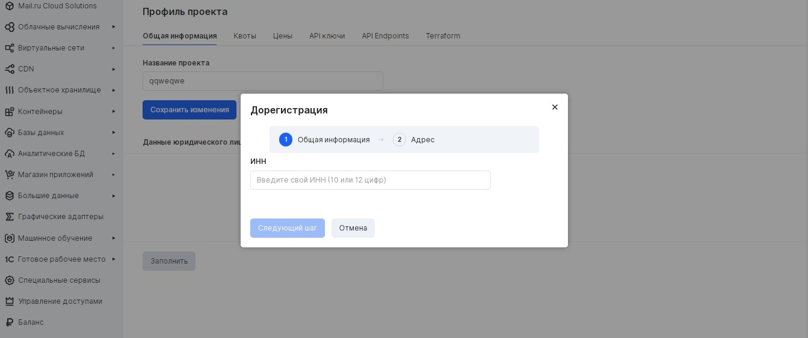
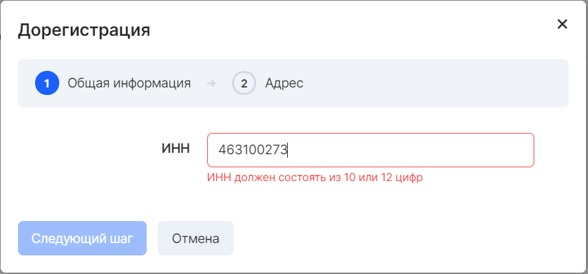
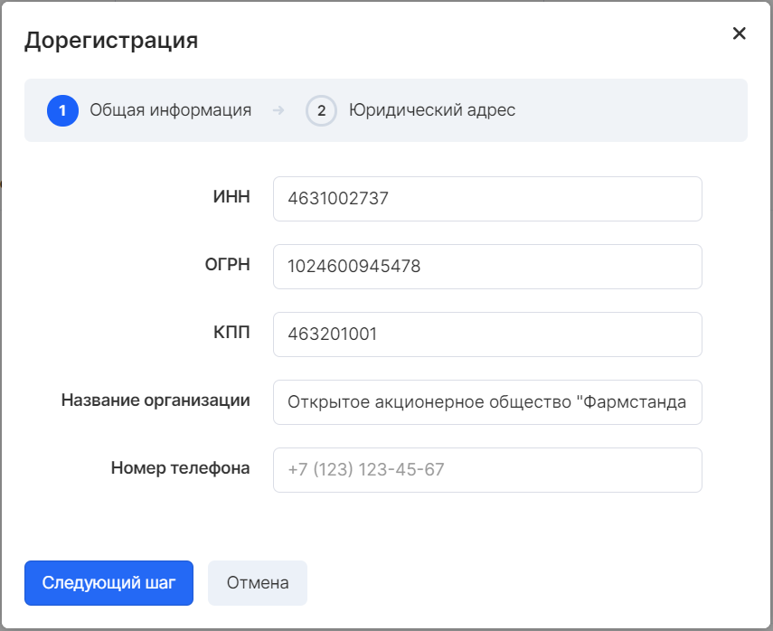
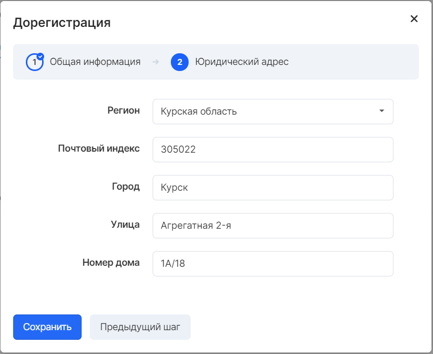
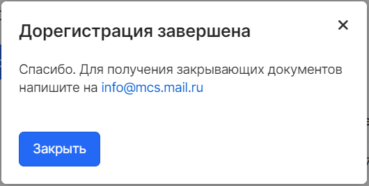

Платформа VK CS позволяет работать с юридическими лицами, являющимися резидентами РФ на основании [Публичной оферты](https://mcs.mail.ru/help/ru_RU/legal/legal-terms). Это адресованное неопределённому кругу лиц и содержащее все существенные условия договора предложение, из которого усматривается воля оферента заключить договор на указанных в предложении условиях с любым, кто отзовётся. Лицо, совершившее необходимые действия в целях акцепта публичной оферты (например, приславшее заявку на соответствующие услуги), вправе требовать от оферента исполнения договорных обязательств. .

В случае необходимости заключить индивиуальный Договор, следует обратиться в [поддержку VK CS](mailto:support@mcs.mail.ru).

Реквизиты организации
---------------------

После регистрации и активации сервисов в личном кабинете можно отредактировать информацию о проекте и его назначении.

В каждом проекте предусмотрен ввод данных юридического лица.

Заполнение этих данных позволит выгружать счет из личного кабинета, а также получать закрывающие документы.

Чтобы заполнить эти данные, перейдите [в настройки проекта](https://mcs.mail.ru/app/project/legal/) на вкладку "**Общая информация**" и нажмите кнопку "**Заполнить**" :

Введите ИНН организации, после чего реквизиты заполнятся автоматически из обновляемой базы контрагентов:

Для многих организаций реквизиты будут заполнены автоматически. Если этого не произошло, введите остальные реквизиты вручную. Заполните контактный номер телефона и нажмите "**Следующий шаг**":

 Убедитесь что все данные корректны и нажмите кнопку "**Сохранить**":

Закрывающие документы
---------------------

**Внимание**

Перед проведением оплаты по счету необходимо убедиться, что в платежном поручении в обязательном порядке указан номер проекта в назначении платежа.

По завершении регистрации предоставляется возможность получать закрывающие документы для каждого из созданных проектов VK CS. Отправка документов осуществляется через Электронный документооборот (ЭДО). В случае его отсутствия будут направлены документы Почтой России на юридический адрес, указанный в настройках проекта.

**Примечание**

Для организаций, не являющихся резидентами РФ, доступно заключение индивидуального Договора оказания услуг. По заключении Договора VK CS предоставляет счета и закрывающие документы.

Подробную информацию можно получить, [обратившись в нашу поддержку](mailto:sales@mcs.mail.ru).