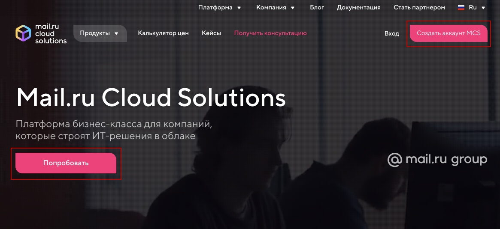
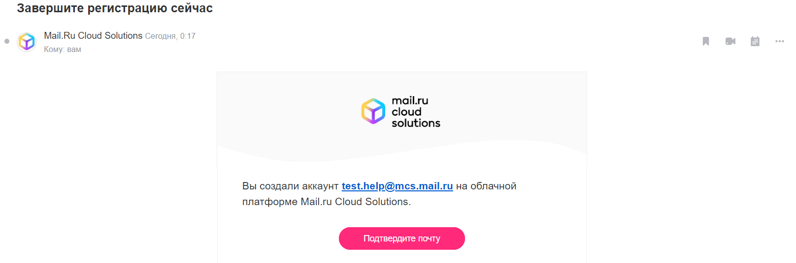
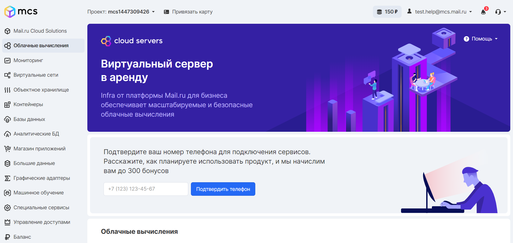
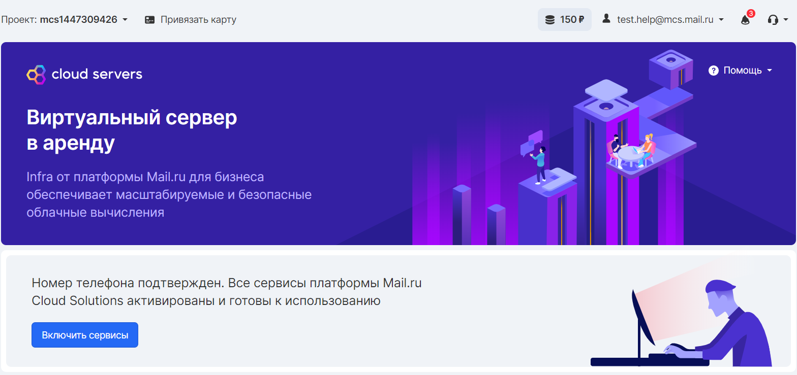
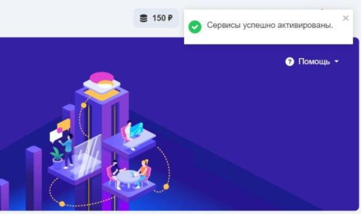

Для регистрации перейдите на [главную страницу](https://mcs.mail.ru) сервисов VK CS и нажмите на кнопку «Создать аккаунт VK CS или «Попробовать».

Введите логин (ваш действующий email), и придумайте пароль.

Подтверждение
-------------

После регистрации вы попадете на страницу подтверждения, где можно управлять настройками учетной записи. Для начала использования сервисов VK CS необходимо подтвердить email. Сообщение с подтверждением будет отправлено незамедлительно.

Примечание

Если сообщение с подтверждением не поступило, попробуйте выслать его через панель VK CS еще раз, или перейти в папку «Спам», возможно оно попало туда в соответствии с правилами фильтрации почтового сервиса.

Сообщение с подтверждением выглядит следующим образом:

При переходе по ссылке вы будете переадресованы в личный кабинет, учетная запись будет подтверждена. Вы сможете увидеть структуру сервисов личного кабинета. 

Активация сервисов
------------------

Для полноценной активации сервисов необходимо зарегистрировать и подтвердить номер телефона. Запрос будет сформирован автоматически после подтверждения почтового ящика.

После ввода номера будет запрошен код из СМС сообщения.

Внимание

Для одной учетной записи может быть зарегистрирован один номер телефона. Если указываемый номер уже привязан к другой учетной записи, повторная его привязка к новому аккаунту будет невозможна.

Если у вас не получится зарегистрировать номер телефона на этом этапе, регистрацию можно отложить кнопкой «Введу позже», затем вернуться к этому этапу при переходе в любой из сервисов VK CS личного кабинета:

После ввода номера на указанный телефон придет СМС, код подтверждения из которого следует ввести в поле подтверждения.

В случае успешного подтверждения номера телефона вы увидите сообщение об возможности активации сервисов.

Теперь можно полноценно использовать учетную запись, нажав кнопку **«**Включить сервисы».

Внимание

Активация номера телефона доступна только для сотовых операторов, действующих на территории РФ и имеющих префикс +7.

Если появилось данное сообщение, то все данные подтверждены и сервисы готовы к использованию.

