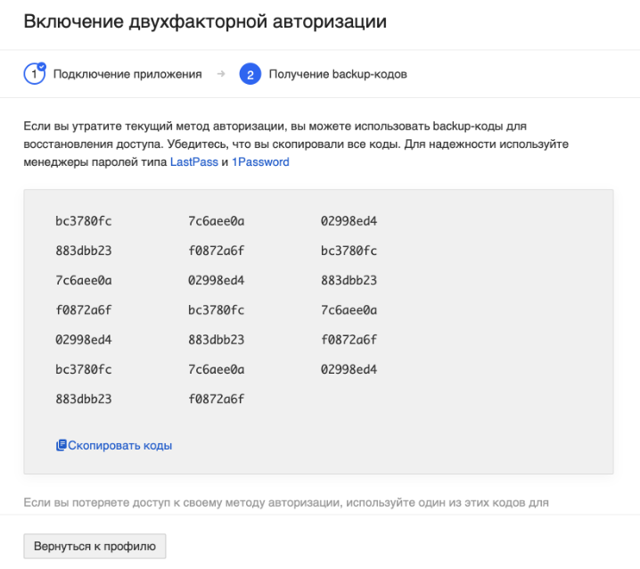
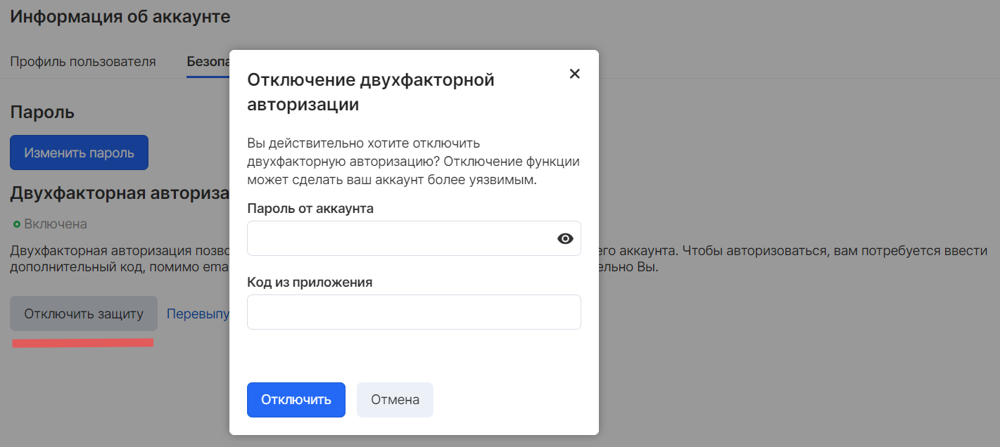

В [личном кабинете](https://mcs.mail.ru/app/account/profile) для усиленной безопасности аккаунта существует возможность включить двухфакторную аутентификацию.

Двухфакторная аутентификация, также известна как двухэтапная верификация (ДФА или 2FA), является типом многофакторной аутентификации. ДФА представляет собой технологию, обеспечивающую идентификацию пользователей с помощью комбинации двух различных компонентов. Компоненты могут быть разными, но чаще всего используются следующие комбинации:

*   пароль + код из СМС
*   пароль + код из токена (или приложения)
*   пароль + код из email сообщения

В сервисах VK CS используется связка "пароль + код из приложения". Информация по установке и ссылки на скачивание приложений для генерации одноразовых кодов ниже:

*   [Google Authenticator](https://support.google.com/accounts/answer/1066447)
*   [Duo](https://duo.com/product/trusted-users/two-factor-authentication/duo-mobile)

Включение 2FA
-------------

Включение двухфакторной аутентификации доступно в [настройке аккаунта](https://mcs.mail.ru/app/account/profile) на вкладке "Безопасность" по нажатии кнопки "Включить защиту":

Для успешной активации функции необходимо:

*   Загрузить мобильное приложение Google Authenticator ([Android](https://play.google.com/store/apps/details?id=com.google.android.apps.authenticator2) и [iOS](https://apps.apple.com/ru/app/google-authenticator/id388497605)) или Duo ([Android](https://play.google.com/store/apps/details?id=com.duosecurity.duomobile&hl=en) и [iOS](https://itunes.apple.com/us/app/duo-mobile/id422663827?mt=8))
*   Открыть приложение и добавить новый аккаунт
*   Отсканировать в приложении QR-код из личного кабинета
*   Ввести код подтверждения, сгенерированный приложением, и пароль от аккаунта VK CS в личном кабинете VK CS
*   Подтвердить ввод кнопкой "Включить".

**Примечание**

Если не удается считать QR-код, можно ввести код подключения приложения вручную, нажав на соответствующую ссылку под QR-кодом в окне.

В качестве подтверждения добавления ключа 2FA на следующем этапе в окне отобразятся резервные коды доступа.

**Внимание**

Сохраните резервные коды в надёжном месте.

При утрате резервных кодов и отсутствию доступа к почтовому ящику, на который зарегистрирована учетная запись, восстановить доступ к аккаунта VK CS будет невозможно.

Использование 2FA
-----------------

Вход в учетную запись при включенном 2FA осуществляется следующими действиями

*   Перейти на сайт [https://mcs.mail.ru](https://mcs.mail.ru) и нажать кнопку "Вход"
*   Ввести логин и пароль учетной записи
*   Ввести одноразовый 6-значный код, сгенерированный мобильным приложением и подтвердить ввод кнопкой "Войти"

**Примечание**

Одноразовый код действует в течение ~30 секунд с момента его генерации.

Количество попыток входа в систему не ограничено, однако если спустя некоторое количество попыток войти все еще не удастся, следует воспользоваться одним из неиспользованных резервных кодов для доступа к аккаунту, затем отключить 2FA и подключить его заново.

Отключение 2FA
--------------

Отключение 2FA производится а меню настройки аккаунта на вкладке "Безопасность". Для отключения функции введите пароль от текущего аккаунта VK CS и код из приложения, подтвердите свой ввод кнопкой "Отключить".

Менеджеры паролей
-----------------

Для удобства хранения и использования большого количества паролей учетных записей, резервных кодов и другой конфиденциальной информации в защищённом мастер-паролем виртуальном хранилище, заблокированном с использованием стандарта [PBKDF2](https://ru.wikipedia.org/wiki/PBKDF2 "PBKDF2"), можно воспользоваться программным обеспечением сторонних разработчиков, например:

*   [Lastpass](https://www.lastpass.com/)
*   [1password](https://1password.com/)

Базу паролей можно хранить как локально, так и синхронизировать между другими доверенными устройствами.