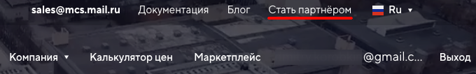
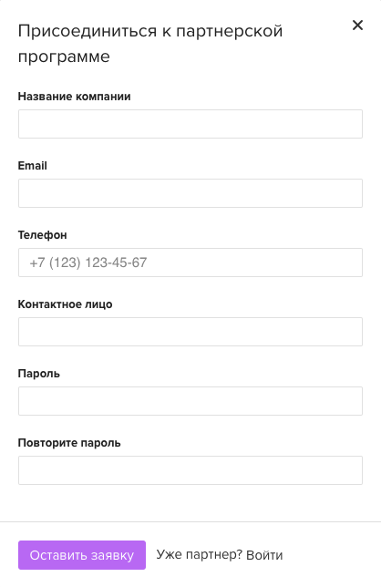
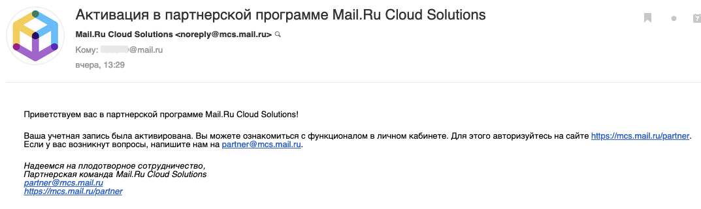
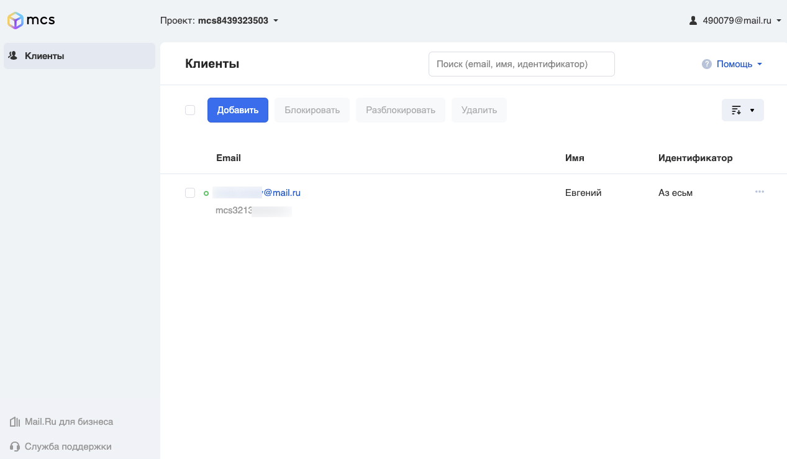
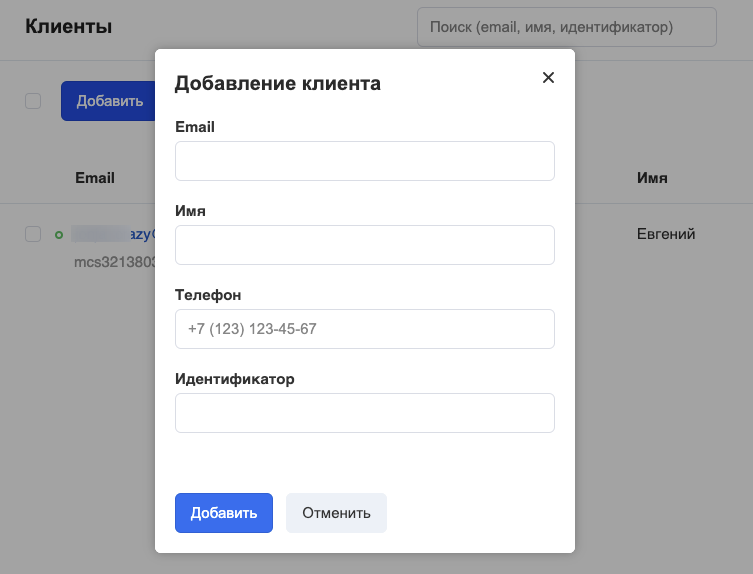
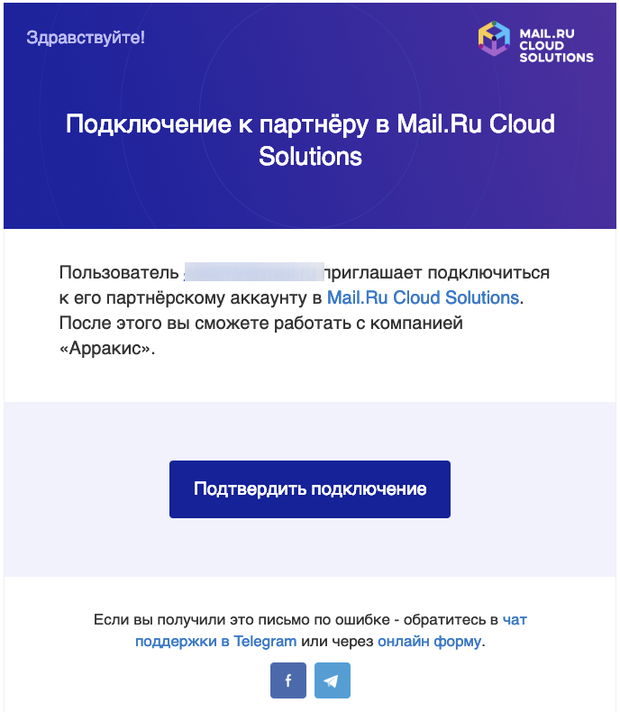
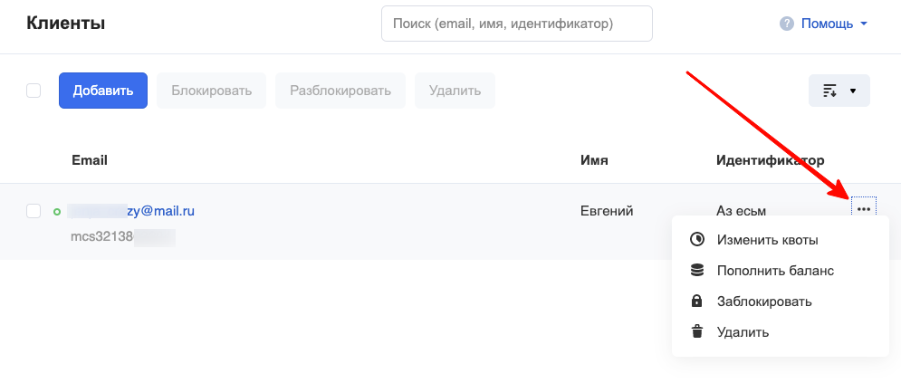
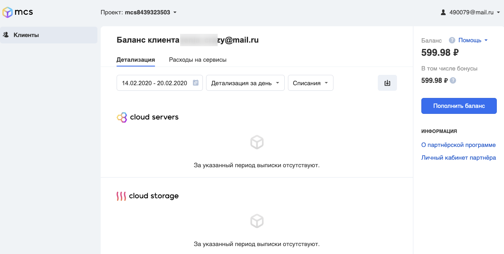
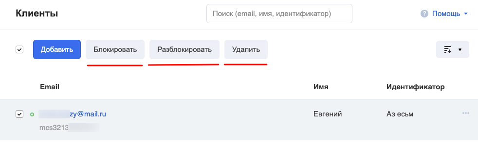

Как стать партнёром
-------------------

На [Главной странице](https://mcs.mail.ru/) нажмите ссылку "Стать партнёром":

В открывшемся окне заполните поля с данными вашей компании:

Мы рассматриваем заявки по возможности быстро. И в случае положительного решения на ваш почтовый ящик придёт письмо:

Теперь вы можете авторизоваться на сайте по ссылке [https://mcs.mail.ru/partner](https://mcs.mail.ru/partner) и управлять клиентами.

Управление
----------

Управление клиентами в личном кабинете партнёра находится по адресу [https://mcs.mail.ru/partner/app/clients/](https://mcs.mail.ru/partner/app/clients/) .

В нём есть возможность сначала пригласить, а затем управлять клиентом, которого вы приглашаете пользоваться сервисами под вашим управлением.

Для добавления клиента нажмите кнопку "Добавить". Укажите его email, имя (по желанию) и идентификатор (по желанию).

После этого на указанный вами email придёт письмо-приглашение, в котором надо подтвердить согласие присоединиться.

При подтверждении присоединения клиента в вашем личном кабинете появится возможность пополнять ему баланс, менять квоты и другие действия:

По клику на email вы перейдёте в урезанную версию личного кабинета клиента. Там вы можете отслеживать состояние баланса клиента и детализацию по сервисам:

Для того, чтобы заблокировать или удалить клиента, выберите галочкой одного или нескольких клиентов и вам будут доступны эти действия:

