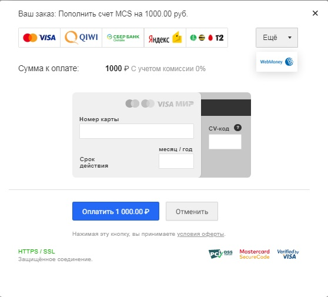
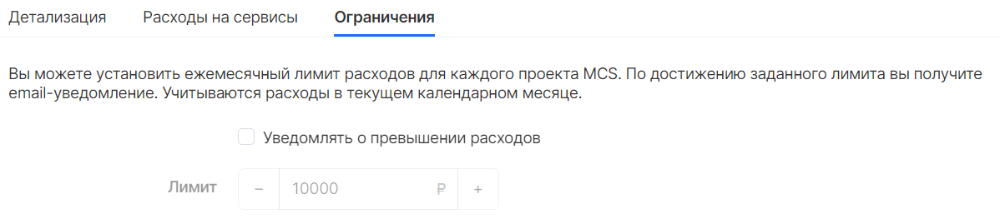

Биллинг - это набор инструментов для учета использования ресурсов, формирования отчетов, взаимодействия с платежными системами и получения финансовых документов на платформе VK CS.

Баланс
------

Баланс - это текущее состояние средств на счете проекта VK CS. Состояние баланса отражается в верхней части [Личного кабинета](https://mcs.mail.ru/app/main/), а также доступен в соответствующем разделе слева.

По клику на эти элементы откроется окно с детализацией баланса:

****

*   Уменьшение баланса происходит при потреблении ресурсов.
*   Баланс увеличивается при зачислении средств.

Детализация изменения баланса по транзакциям также содержит информацию о регионах оплачиваемых ресурсов. Страница **Баланс** содержит информацию по проектам всех регионов, где были созданы ресурсы. Подробнее о регионах вы можете узнать в статье [Регионы](https://mcs.mail.ru/docs/ru/additionals/start/user-account/regions).

**Фильтрация отображения баланса по проектам**

При нажатии кнопки фильтров появляется возможность выбрать проекты, баланс которых будет выведен на экран:

**Отключение сервисов**

По достижении нулевого баланса ресурсы проекта будут автоматически остановлены до момента пополнения баланса проекта.

После пополнения баланса инструменты биллинга позволят вновь использовать сервисы, однако потребуется ручной запуск каждого ресурса.

**Внимание**

Активация проекта после восстановления положительного баланса производится системой биллинга и может занимать до 4х часов.

**Удаление данных проекта**

При отсутствии восстановления положительного баланса, ресурсы проекта будут помещены в очередь на удаление в зависимости от наличия платежей за весь период существования проекта:

*   Если в проекте не было движений денежных средств, то через 3 дня все ресурсы будут удалены;
*   Если оплата производилась, то ресурсы будут помещены в очередь на удаление через 30 дней (или по достижении баланса равного -1000р.) после остановки сервисов.

Очередь удаления - механизм чистки ресурсов, при котором данные из проекта и платформы VK CS удаляются безвозвратно, без какой-либо возможности их восстановления.

Оплата
------

Зачисление средств можно производить как от физического, так и от юридического лица.

Пополнение осуществляется в разделе "Баланс" личного кабинета при нажатии на кнопку "Пополнить баланс". Следует указать сумму к зачислению и способ оплаты:

**Физические лица**

Пользователи могут пополнять свой счет с помощью множества популярных платежных систем, таких как: банковские карты, Сбербанк Онлайн, Qiwi, SMS, Webmoney, Яндекс.Деньги, WebMoney и др.

Операции оплаты производится при поддержке сервиса [Деньги.Мэйл.Ру](https://money.mail.ru/oferta/payfast).

Платеж происходит в режиме реального времени и зачисляется в течение 10 минут.

**Юридические лица**

Для юридических лиц, резидентов РФ, возможно создание и выгрузка платежного документа (счета) для последующей оплаты банковским переводом.

При выборе способа зачисления через "Банковский перевод" будет автоматически сформирован и загружен файл со счетом, в назначении платежа которого будут указаны необходимые данные:

*   Реквизиты организации получателя платежа
*   Номер счета
*   Назначение платежа
*   Сумма платежа

**Внимание**

Перед проведением платежа убедитесь в корректности информации о назначении платежа и реквизитов. Отсутствие в назначении платежа проекта VK CS, а также оплата с расчетного счета юридического лица, чьи реквизиты отличны от указанных в настройках проекта, может привести к отказу зачисления средств на баланс проекта.

Зачисление средств, отправленных банковским переводом, происходит автоматически. Следует учесть что срок обработки транзакции зависит от банка и может достигать до 3х банковских (рабочих) дней. 

Зачисление средств на баланс произойдет после проверки получения перевода на счет получателя платежа.

Деньги, введенные на счет, можно расходовать на оплату потребления ресурсов и сервисов VK CS. Все цены и тарифы доступны в разделе [Калькулятор цен](https://mcs.mail.ru/pricing/) на главной странице сайта, а также при создании каждого ресурса в личном кабинете:

Привязка карты
--------------

Облегчить процесс пополнения баланса с помощью банковской карты можно привязав ее к текущему проекту. Эта функция доступна в разделе Баланс и активируется кнопкой "Привязать карту":

В окне Настройки оплаты укажите номер карты, срок действия и CV-код, затем подтвердите ввод данных кнопкой "Добавить карту":

Для проверки карты будет списан 1 рубль и зачислен на счет проекта VK CS.

**Автопополнение**

Настроить автоматическое пополнение баланса можно на этапе привязки карты или позднее в разделе Баланс. Для активации следует выбрать сумму для автопополнения, которая будет зачисляться по достижении порога остатка средств на счету.

Отчетность
----------

Статистика потребления ресурсов и денежных средств доступна в основной части экрана раздела Биллинга:

Настраиваемый период, тип детализации и движения денежных средств формирует отчет, доступный к выгрузке в формате \*.xlsx. Загруженный файл может позволит построить индивидуальную отчетность.

Финансовые документы
--------------------

По всем совершенным платежам пользователи получают финансовые документы.

**Физические лица**

При совершении оплаты, физические лица получают чек об оплате в соответствии с [ФЗ-54](http://base.garant.ru/12130951/) "О применении контрольно-кассовой техники". Чек отправляется на электронную почту владельца проекта VK CS. Оригинал чека об оплате не предоставляется.

**Юридические лица**

По окончании отчетного периода, при условии зачисления денежных средств по счету от юридического лица и заполненных реквизитов организации в настройках проекта, могут быть доступны закрывающие финансовые документы.

**Внимание**

При совершении оплаты услуг банковскими картами и другими способами, отличными от оплаты счета от юридического лица, данные платежи не отражаются в Акте сверки и не предоставляются для формирования УПД. 

Форма УПД содержит все реквизиты счета-фактуры, установленные п.п. 5, 5.1, 5.2 ст.169 НК РФ. При наличии УПД отдельно не предоставляются счет-фактура или Акт выполненных работ.

УПД возможно получить одним из следующих способов:

**Документооборот (ЭДО)**

Электронный документооборот — это основной способ обмена электронными документами в VK CS, осуществляющийся по телекоммуникационным каналам связи (ТКС) оператора ЭДО.

Электронный документ — это файл, заверенный электронной подписью. Его не нужно распечатывать, так как юридически значимым оригиналом он является именно в электронном виде.

Электронный документооборот (ЭДО) происходит через систему оператора ЭДО, включенного в сеть доверия ФНС РФ.

Что дают электронные документы и зачем подключаться к ЭДО:

*   Мгновенно пересылать документы. 
*   Сократить финансовые затраты. 
*   Оптимизировать бизнес-процессы. 
*   Упростить взаимодействие с госорганами.
*   Повысить лояльность контрагентов. 
*   Перевести архив в электронный вид. 

Для ведения ЭДО VK CS использует систему [Контур.Диадок](https://www.diadoc.ru/) и [СБИС](https://sbis.ru/).

Подключиться к одной из этих систем ЭДО можно самостоятельно, направив приглашение из одной из указанных систем. В запросе необходимо указать наименование организации, полные реквизиты, включающие ФИО генерального директора, и систему, к которой организация будет подключена. 

При работе с другим оператором, необходимо самостоятельно настроить роуминг, указав следующие реквизиты:

Идентификатор участника ЭДО: 2BM-7743001840-2012052807514600749280000000000.

**Почта России**

Отправка бумажных оригиналов документов производится Почтой России после 15 числа, следующего за отчетным периодом месяца.

Документы отправляются после [запроса в техническую поддержку](mailto:support@mcs.mail.ru) и на адрес получателям, в чьих проектах указаны реквизиты юридического адреса.

Акт сверки предоставляется в индивидуальном порядке по запросу в техническую поддержку. В обращении следует указать реквизиты организации, проект, а также отчетный период требуемого акта.

**Примечание**

В случае, если по каким-то причинам не удалось получить документ через ЭДО или Почту России, можно запросить копию УПД в формате \*.pdf в [обращении к технической поддержке](mailto:support@mcs.mail.ru).

В запросе следует указать наименование и реквизиты организации, проект и отчетный период закрывающего документа.

**Учет налогов**

Для налоговых резидентов РФ в платежных и отчетных документах указывается сумма НДС.

Уведомления
-----------

С целью обеспечения стабильности работы ресурсов в проектах, инструменты Биллинга отправляют уведомления нескольких типов:

*   Превышение расходов;
*   Достижение пороговых значений баланса

Настроить лимит расходов для каждого проекта в текущем календарном месяце можно на вкладке "Ограничения" в разделе Биллинга. По достижении заданного лимита будет отправлено уведомление.

**Внимание**

Активировать эту опцию можно только от имени учетной записи владельца или совладельца проекта

Система Биллинга поможет также спрогнозировать срок израсходования баланса, отправляя уведомление за 14 дней до достижении нулевого баланса.

Промокоды и акции
-----------------

В рамках проводимых маркетинговых акций пользователи сервисов VK CS могут получить промокод, дающий право на использование дополнительных услуг платформы VK CS.

Промокод, полученный участником акции, может быть активирован сотрудниками технической поддержки. Для активации следует [направить обращение](mailto:support@mcs.mail.ru) с указанием учетной записи, проекта и промокода, который необходимо активировать. После верификации актуальности кода, он будет активирован. 

Возврат денежных средств
------------------------

В случае необходимости возврата денежных средств, следует [обратиться в техническую поддержку](mailto:support@mcs.mail.ru). Процедура для физических и юридических лиц отличается:

**Внимание**

При возврате осуществляется перевод денежных средств с основного счета, не включающего бонусный баланс. 

**Физические лица**

Возврат денежных средств происходит на банковскую карту и может быть осуществлен на основании предоставленного чека об уплате услуг. 

Сумма к возврату не может быть больше уплаченной суммы. Возможно формирование запроса на возврат по нескольким чекам, если сумма к возврату превышает объем денежным средств одного чека.

При обращении в поддержку необходимо указать следующие данные:

*   Имя учетной записи
*   Название проекта
*   Сумму к возврату
*   Причину возврата
*   Реквизиты для возврата: первые 6 цифр и последние 4 цифры банковской карты
*   Ссылку на полученный электронный чек или его скриншот 

Возврат денежных средств происходит в течение 30 дней.

**Юридические лица**

Возврат денежных средств может быть произведен на расчетный счет юридического лица при предоставлении следующей информации в запросе к технической поддержке:

*   Имя учетной записи
*   Название проекта
*   Сумму к возврату
*   Причину возврата
*   Банковские реквизиты юридического лица
*   Заявление на возврат, заверенное подписью и печатью Генерального директора или уполномоченного Доверенностью лица

Возврат денежных средств происходит в течение 30 дней.

Тарификация выключенных ВМ
--------------------------

### Важно

Денежные средства списываются поминутно с работающих сущностей (виртуальные машины, кластера). Если данные сущности остановлены, то списания продолжаются только за использование лицензий (Windows и RDS, если активированы) и арендованное дисковое пространство, а также за хранение имеющихся бэкапов.