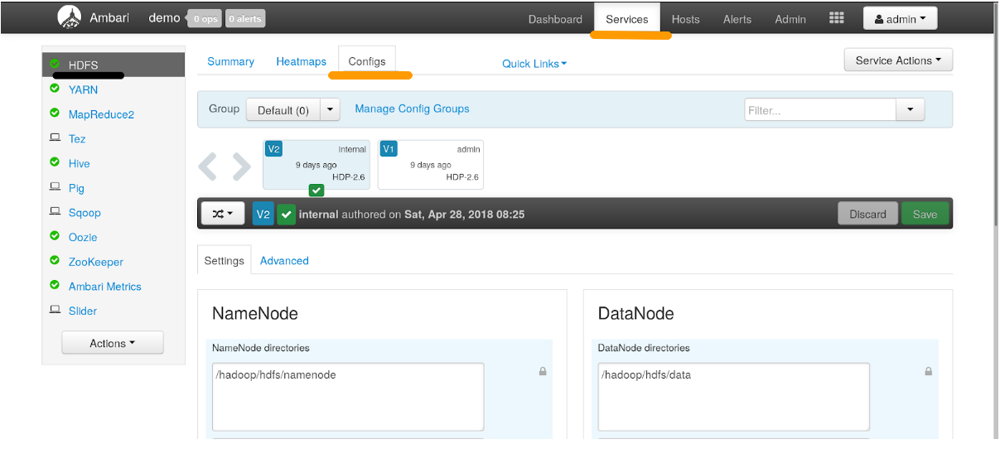
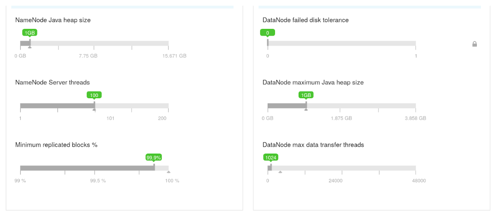

Оптимальные параметры виртуальной машины Java подбираются автоматически при установке и настройке кластера, в зависимости от типа виртуальной машины. Если вы получаете ошибки «Out of memory», то рекомендуем пересоздать кластер с конфигурацией большего размера, либо изменить параметры в интерфейсе Ambari.

Для изменения параметров войдите в интерфейс Ambari, 

1.  Откройте интересующий сервис (например, HDFS) и выберите вкладку «Configs».
    
    
    
2.  На вкладке Configs прокрутите в самый низ страницы до настроек Java-машины:
    
    
    
3.  После изменения настроек Ambari предложит перезапустить сервисы.