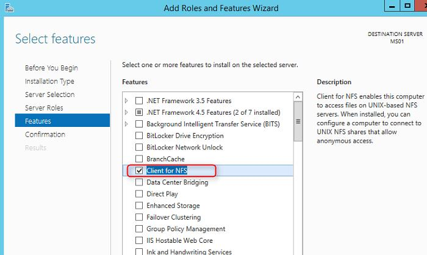
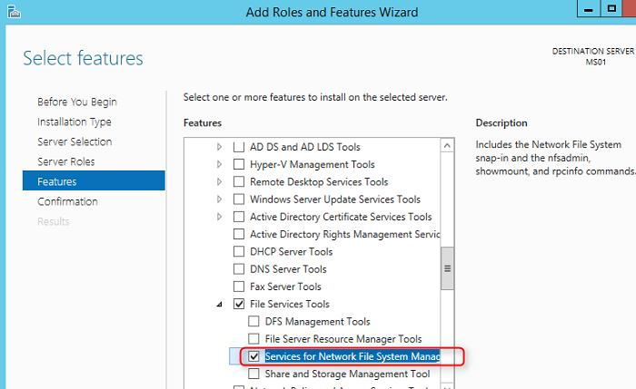
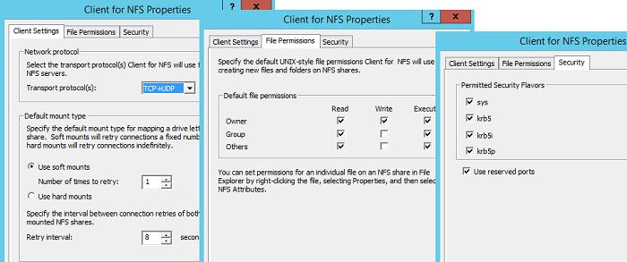
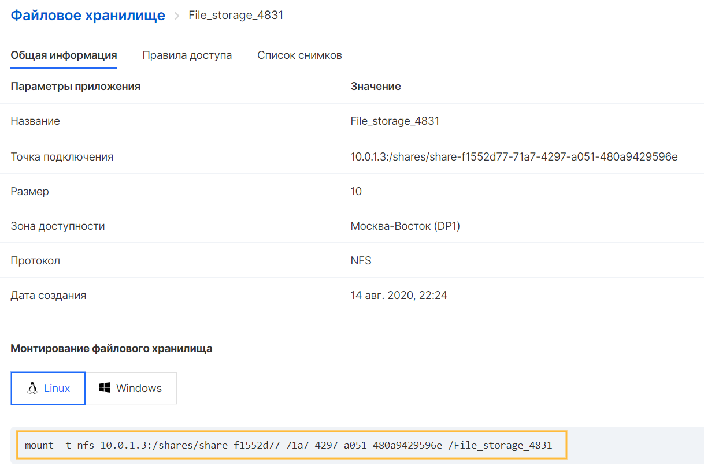

Способ подключения Файлового хранилища к инстансу зависит от операционной системы и протокола доступа к хранилищу, выбранного при его создании:

*   NFS - это «Сетевая файловая система», позволяющая прозрачно обмениваться файлами между серверами. Это клиент-серверное приложение, которое позволяет просматривать файлы на виртуальном сервере и обновлять их, как если бы они были локально. Используя NFS, можно смонтировать всю или часть файловой системы.
*   CIFS - «Общая файловая система Интернета», используемая операционными системами для обмена файлами. CIFS использует модель программирования клиент-сервер. Клиентская программа запрашивает у серверной программы доступ к файлу или передачу сообщения программе, работающей на сервере. Сервер выполняет запрошенное действие и возвращает ответ. CIFS - это общедоступный или открытый вариант протокола блока сообщений сервера (SMB), и в нем используется протокол TCP/IP .NFS и CIFS - это основные файловые системы, используемые в NAS.

Windows
-------

**NFS**

Подключение хранилища NFS в Windows производится с помощью клиента, который устанавливается дополнительно.

Клиент NFS можно установить через GUI или с помощью Powershell. Для установки в графическом режиме, следует открыть консоль Server Manager и выбрать компонент (Features) под названием Client for NFS.

По умолчанию, вместе с этим компонентом не устанавливается графическая консоль управления NFS. Чтобы исправить это, необходимо установить опцию Services for Network File System Management Tools в разделе Remote Server Administration Tools -> Role Administration Tools -> File Services Tools.



Все перечисленные выше компоненты системы можно установить всего одной командой Powershell:

```
Install-WindowsFeature NFS-Client, RSAT-NFS-Admin
```

После окончания установки запустить консоль Services for Network File System Managemen и открыть окно свойств NFS клиента (Client for NFS).

В настройках NFS клиента можно задать:

*   Используемый транспортный протокол (Transport protocols) – по умолчанию TCP+UDP
*   Тип монтирования NFS хранилища: Hard или Soft
*   На вкладке File Permissions указываются права по умолчанию для создаваемых папок и файлов на NFS ресурсе
*   На вкладке Security указываются протоколы аутентификации, с помощью которых можно аутентифицироваться на NFS сервере



После настройки и под учётной записью администратора можно смонтировать NFS каталог с помощью команды, описанной в свойствах созданного Файлового хранилища NFS:


**CIFS**

Поскольку протокол CIFS по умолчанию уже присутствует в ОС Windows, подключение можно выполнять без установки дополнительных компонентов.

Для подключения следует выполнить команду, указанную в свойствах созданного Файлового хранилища CIFS:


Linux
-----

**NFS**

Перед началом монтирования NFS ресурса следует убедиться в наличии установленного пакета nfs-common

```
sudo apt-get install nfs-common
```
После проверки или установки пакета достаточно использовать команду, указанную в свойствах созданного NFS хранилища:



**CIFS**

Для монтирования CIFS файлового хранилища необходимо установить набор утилит:

Ubuntu

```
sudo apt-get install cifs-utils
```

CentOS

```
yum install cifs-utils
```
По окончании установки пакетов необходимо создать папку для монтирования хранилища:
```
mkdir <your_File_storage>
```
Затем использовать команду для монтирования, доступную в свойствах созданного CIFS хранилища: