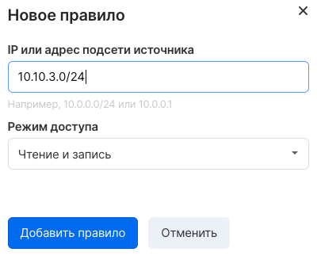

Сервис Файловых хранилищ представляет собой набор служб для управления файловыми хранилищами на платформе VK CS. С этой службы можно создать удаленную файловую систему, смонтировать файловую систему на виртуальных машинах, а затем читать и записывать данные из инстансов в файловую систему и из нее.

Файловые хранилища можно подключить к инстансам проекта по протоколам CIFS или NFS, с разделением доступа по IP адресу клиента.

**Примечание**

Доступ к файловым хранилищам осуществляется только из виртуальных машин внутри проекта VK CS. 

Панель управления VK CS
---------------------

Для создания хранилища [в личном кабинете VK CS](https://mcs.mail.ru/app/services/infra/shares/) следует:

1.  Перейти на страницу "Файловые хранилища" сервиса "Облачные вычисления".
2.  Нажать кнопку "Создать" в верхнем меню:
3.  Ввести название инстанса, размер, выбрать протокол доступа и сеть. Для доступа к хранилищу из ОС Windows рекомендуем выбрать протокол CIFS, из Linux - NFS:
4.  Перейти на следующий шаг, настроить правила доступа к хранилищу, указав IP адрес и права (возможно добавление нескольких правил):
5.  Выбрать "Добавить файловый сервер", после чего начнется процесс создания хранилища.

Для удаления файлового хранилища необходимо сначала отмонтировать его на виртуальных машинах, затем выбрать пункт "Удалить" в контекстном меню требуемого файлового хранилища.

OpenStack CLI
-------------

Для создания файлового хранилища в клиенте manila нужно выполнить команды:

Создать сеть для файлового хранилища, основанную на существующей приватной сети:

```
manila share-network-create --neutron-net-id <ID приватной сети> --neutron-subnet-id <ID подсети> --name <название сети хранилища>
```

Создать файловое хранилище:

```
manila create --share-network <ID сети файлового хранилища> <протокол> <размер>
```

Получить список файловых серверов:

```
manila list
```

Убедиться, что инстанс активен:

```
manila show <ID инстанса>
```

Добавить правило доступа:

```
manila access-allow <ID файлового хранилища> ip <адрес сети в формате CIDR>
```

Проверить правила доступа:

```
manila access-list <ID файлового хранилища>
```

Для удаления файлового хранилища необходимо отмонтировать его на инстансах и выполнить команду для удаления:

```
manila delete <ID хранилища>
```