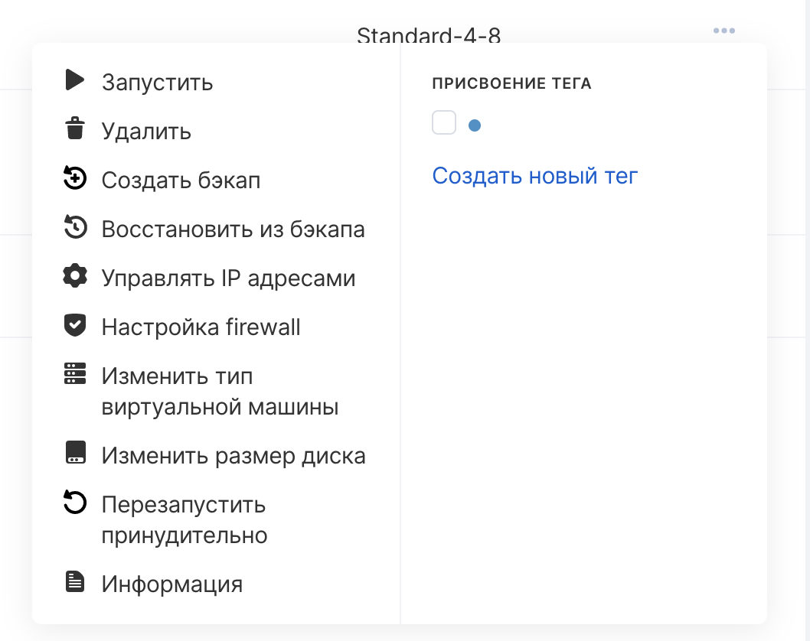
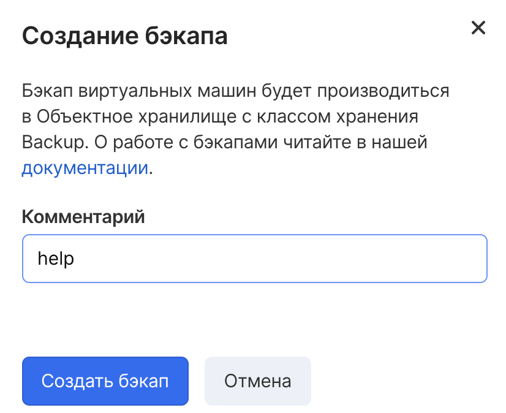

Создание ручной резервной копии может быть полезно при неотложном создании точки восстановления виртуальной машины.

### Внимание

Перед выполнением высокорисковых операций с настройками инстанса или его данными, рекомендуется выполнить полный бэкап, который позволит вернуть в исходное состояние виртуальную машину до наступления изменений.

Панель управления VK CS
---------------------

Для создания ручной резервной копии инстанса [в личном кабинете VK CS](https://mcs.mail.ru/app/services/infra/servers/) вручную следует:

1.  Перейти в раздел "Виртуальные машины" сервиса "Облачные вычисления".
2.  В контекстном меню инстанса выбрать "Создать бэкап":
3.   Ввести название создаваемой резервной копии:
4.  Нажать "Создать бэкап". В интерфейсе появится уведомление о начале создания бэкапа.