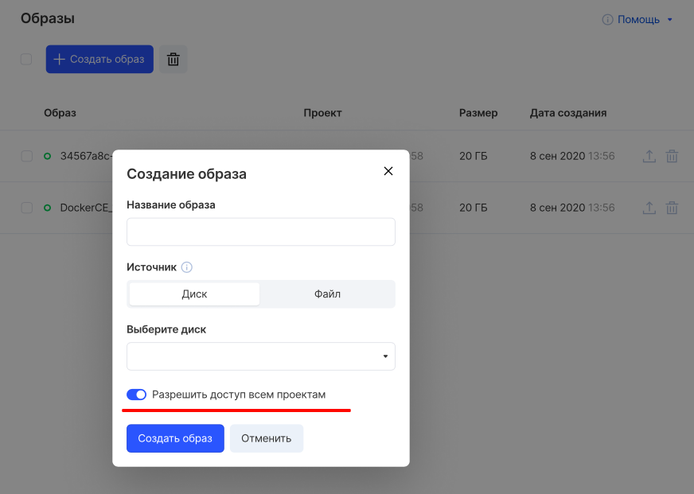
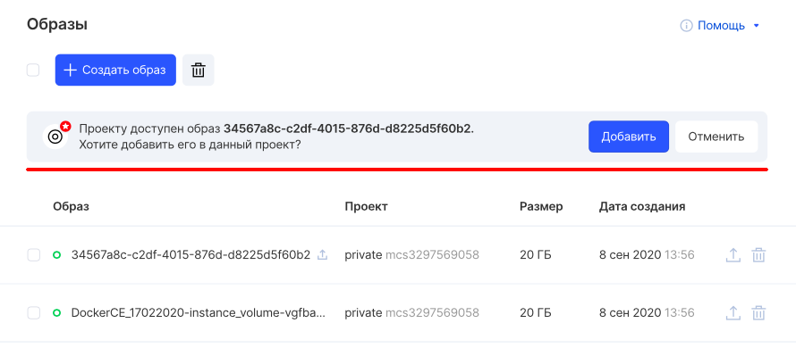

Совместный доступ к образу в нескольких проектах позволяет укорить разворачивание инстансов.

Панель VK CS
----------

При создании образа следует выбрать пункт "Разрешить доступ всем проектам":



При этом образ не появится в других проектах автоматически - а появится предложение добавить его в проект.



OpenStack CLI
-------------

Для настройки совместного использования образа в клиенте OpenStack следует:

Получить список образов:

```
openstack image list
```

Установить возможность совместного использования для образа:

```
openstack image set --shared <ID образа>
```

Добавить проект партнера для образа:

```
openstack image add project <ID образа> <ID проекта партнера>
```

Далее партнеру необходимо подтвердить добавление образа в проект:

```
openstack image set --accept <ID образа>
```

Для просмотра проектов, имеющих доступ к образу, выполнить:

```
openstack image member list <ID образа>
```

Для удаления образа из проекта владельцу следует выполнить:

```
openstack image remove project <ID образа> <ID проекта>
```

--