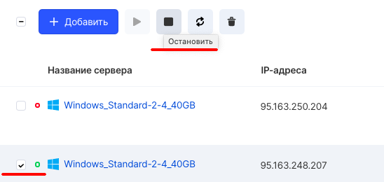
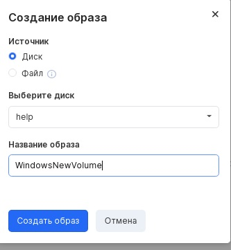
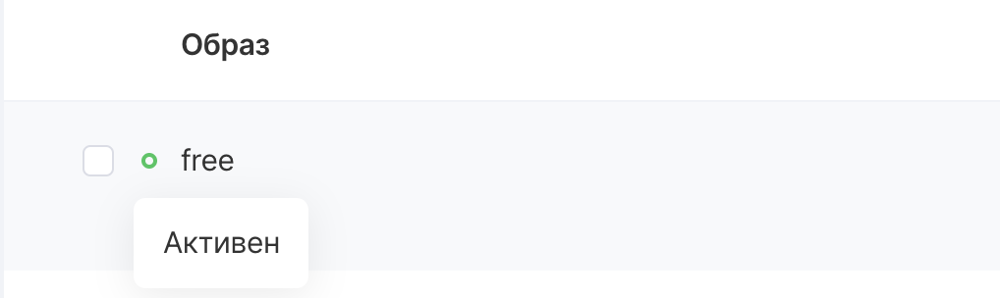
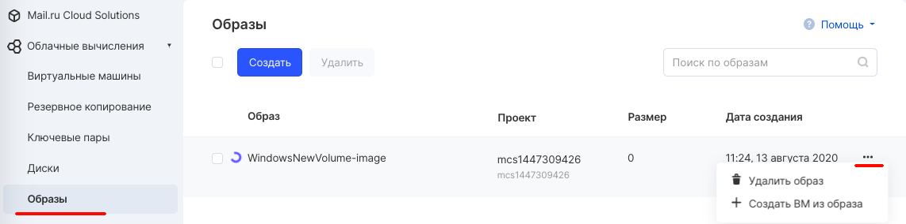

Образ представляет собой файл, в котором содержится виртуальный диск с уже установленной на нем операционной системой или другими данными. Образы используются для создания виртуальных инстансов в облаке.

Панель управления VK CS
---------------------

Для создания образа из существующего инстанса [в личном кабинете VK CS](https://mcs.mail.ru/app/services/infra/servers/) следует:

1.  Остановить нужный инстанс ВМ - из которого будем создавать образ. 
2.  Перейти в [раздел "Образы"](https://mcs.mail.ru/app/services/infra/images/) сервиса "Облачные вычисления".
3.  Нажать кнопку "Создать", в меню создания образа выбрать диск нужной виртуальной машины и ввести название образа (по которому его можно будет потом однозначно идентифицировать). При выборе элемента "Разрешить доступ всем проектам" образ будет доступен во всех проектах, где состоит пользователь.
4.  Нажать "Создать образ". Начнется процесс создания образа, а статус можно получить по наведению мыши на цветной индикатор.
5.  Созданный образ будет доступен в разделе "Образы" через некоторое время, а в контекстном меню образа будет доступно создание новой виртуальной машины из этого образа: 

OpenStack CLI
-------------

Для создания образа в клиенте OpenStack требуется:

Получить список дисков, выполнив команду:

```
openstack volume list
```

Или получить список дисков, присоединенных к серверу:

```
openstack server show -c volumes_attached <ID инстанса>
```

Создать образ, выполнив:

```
openstack image create --volume <ID диска> <название образа>
```

В результате выполнения команды будет выведено окно с данными создаваемого образа.