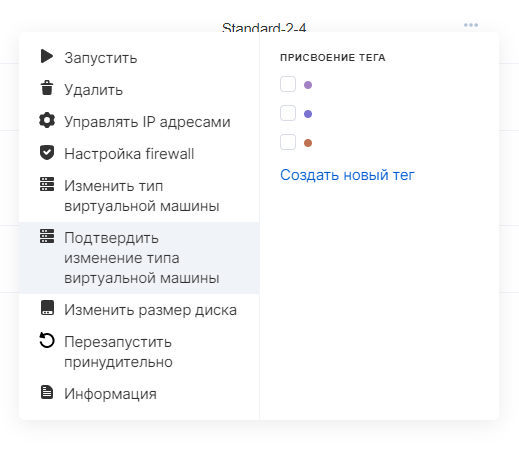

Тип виртуальной машины (кол-во/тип CPU и объем RAM) можно изменять в рамках доступных проекту конфигураций (флейворов). 

**Примечание**

Изменить тип существующего инстанса, как в меньшую, так и в большую сторону, можно в любое время, при этом потребуется только перезагрузка инстанса.

По запросу в техническую поддержку в проект могут быть добавлены конфигурации с высокопроизводительными процессорами.

Любое изменение конфигурации ВМ влияет на ее стоимость.

В панели VK CS
------------

Для изменения типа инстанса в [личном кабинете VK CS](https://mcs.mail.ru/app/services/infra/servers/) следует:

1.  Перейти на страницу "Виртуальные машины" раздела "Облачные вычисления".
2.  Открыть контекстное меню инстанса, выбрать пункт "Изменить тип виртуальной машины".
3.  В появившемся меню выбрать требуемый тип и нажать "Сохранить размер". ВМ будет перезагружена:
4.  В некоторых случаях после изменения типа необходимо подтвердить операцию, это можно сделать в контекстном меню инстанса:

Через Openstack CLI
-------------------

Для изменения типа в OpenStack CLI необходимо выполнить команду:

```
openstack server resize --flavor <ID конфигурации> <ID сервера>
```

Получить список доступных конфигураций возможно командой:

```
openstack flavor list --all
```

ID сервера есть на карточке инстанса в личном кабинете или в списке виртуальных машин:

```
openstack server list
```