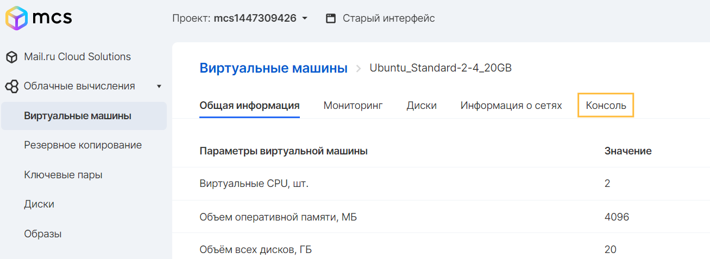
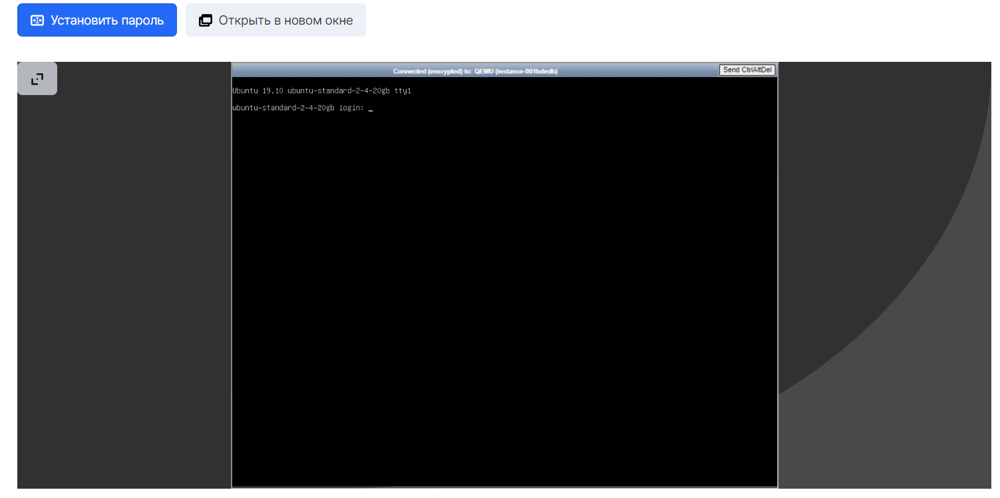

VNC используется для просмотра вывода консоли виртуальной машины, вне зависимости от того, есть ли вывод в журнале консоли. Это позволяет передавать активность клавиатуры и мыши в инстанс и обратно.

В VK CS используется два метода доступа к удаленной консоли:

Панель VK CS
----------

Для подключения к виртуальной машине под управлением Windows или Linux можно использовать веб-консоль, использующую HTML5 Canvas и веб-сокеты.

Для ее активации следует перейти на окно информации о виртуальной машине, выбрав желаемую в списке инстансов сервиса "Облачные вычисления".



При переходе на вкладку "Консоль" в окне браузера появится консоль виртуальной машины.



В окне консоли присутствует кнопка "Ctrl+Alt+Delete" выполняющая функцию в зависимости от операционной системы инстанса.

Также есть возможность установить пароль пользователя операционный системы с помощью кнопки "Установить пароль" и открыть Консоль в новом окне.

Openstack CLI
-------------

Для получения доступа к консоли можно воспользоваться командой в CLI:

```
openstack console url show <ID инстанса>
```

**Внимание**

Команда генерирует ссылку на консоль, доступную в течение небольшого промежутка времени.

При необходимости воспользоваться консолью снова через некоторое время, следует вновь воспользоваться предоставленной командой.

В результате будет получена ссылка на консоль, которую можно открыть в браузере:

```
+-------+-------------------------------------------------------------------------------------+
| Field | Value                                                                               |
+-------+-------------------------------------------------------------------------------------+
| type  | novnc                                                                               |
| url   | https://infra.mail.ru:6080/vnc_auto.html?token=20224980-43eb-4535-85c7-310a18e27941 |
+-------+-------------------------------------------------------------------------------------+
```