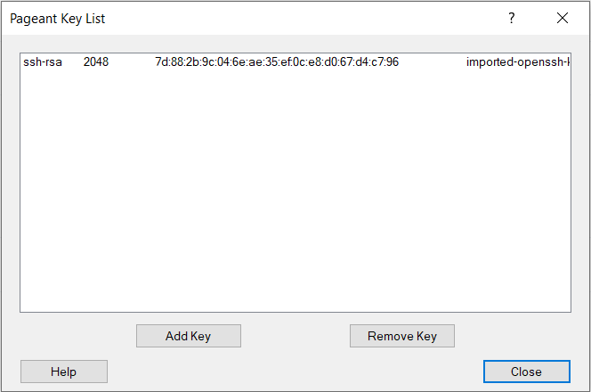
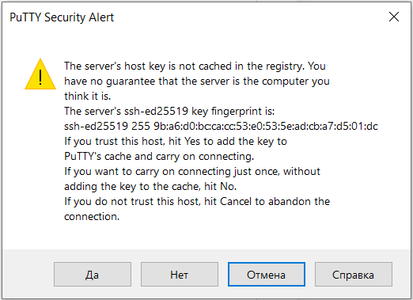

Виртуальные машины на базе ОС Linux создаются с включенным openssh клиентом, позволяющим осуществить удаленный доступ к инстансу по протоколу SSH.

Рекомендуемый способ подключения к виртуальной машине по SSH - использование ключевой пары: открытый ключ находится на виртуальной машине, в то время как закрытый ключ хранится у пользователя.

Для подключения должны быть выполнены следующие условия:

*   С создания ВМ прошло 15 минут и все скрипты завершили свою работу
*   Виртуальная машина включена
*   На виртуальной машине назначена группа безопасности с правилом, разрешающий удаленный доступ по протоколу SSH и TCP порту 22 
*   У инстанса должен быть внешний IP адрес, доступный для подключения

**Осторожно**

Виртуальные машины на базе ОС Linux, созданные из образов FreeBSD, Bitrix или других, имеющих дополнительные программные продукты или ориентированные на их использование, не настроены на работу с сетью ext-net.

В этом случае удаленное подключение с использованием SSH будет невозможно.

Удаленный доступ для таких инстансов возможен при создании его в приватной сети со включенной опцией DHCP, а также назначенном плавающем IP (Floating IP) адресе. 

Получение логина
----------------

Для каждой операционной системы существует учетная запись для входа. Стандартная учетная запись не используется в целях безопасности, однако ее всегда можно активировать, а также назначить пароль. Тем не менее, не рекомендуется использовать встроенные учетные записи для избежания возможности получения несанкционированного доступа третьих лиц к инстансу.

<table border="0" cellpadding="0" cellspacing="0" style="margin-right: calc(2%); width: 98%;" width="265"><tbody><tr><td style="background-color: rgb(239, 239, 239);">Операционная система</td><td style="background-color: rgb(239, 239, 239);">Логин</td></tr><tr><td height="19" width="48.679245283018865%">Bitrix*</td><td width="51.320754716981135%">root*</td></tr><tr><td height="19">CentOS</td><td>centos</td></tr><tr><td height="19">Debian</td><td>debian</td></tr><tr><td height="19">Fedora</td><td>fedora</td></tr><tr><td height="19">FreeBSD</td><td>freebsd</td></tr><tr><td height="19">Ubuntu</td><td>ubuntu</td></tr></tbody></table>

\*Bitrix: Сразу после входа система попросит установить новый пароль. Для этого система запросит текущий пароль (bitrix) и дважды запросит новый пароль для пользователя root.

Образ Bitrix-CentOS\* в данный момент не поддерживает работу в сети Ext-Net.

Получение ключа
---------------

На этапе создания инстанса был выбран ключ или создана новая ключевая пара. При создании нового ключа он был загружен на локальный компьютер. Этот ключ понадобится для подключения вне зависимости от используемой локальной операционной системы.

Настройка подключения к инстансу производится в зависимости от используемой локальной операционной системы.

Изменение прав на ключ .PEM в windows
-------------------------------------

Средство изменения прав на ключ .pem в windows:

1.  Откройте свойства файла key.pem
2.  Безопасность / дополнительно / отключить наследование
3.  Затем добавить / выберите субъект / В поле ввода напишите имя пользователя на данном ПК, от имени которого открывается консоль (powershell)
4.  Везде нажать ОК.

Windows
-------

**Windows 10**

В операционной системе Windows 10 по умолчанию уже установлен ssh клиент.

Достаточно выполнить команду

```
ssh -i <путь к ключу> логин@IP_адрес
```
Где:

*   Путь к ключу - полный путь к файлу ключа, ранее созданному или загруженному при создании инстанса
*   Логин - логин операционной системы инстанса
*   IP адрес - внешний IP адрес виртуальной машины, который можно увидеть в информации об инстансе на вкладке "Виртуальные машины" сервиса "Облачные вычисления"

Если выполнение команды будет успешным, можно увидеть запрос подтверждения подключения к неизвестному ранее хосту:

```
The authenticity of host '213.219.212.130 (213.219.212.130)' can't be established.
ECDSA key fingerprint is SHA256:aYZIWs9N6KRtfFOuic6eoWcluhSp6+jha/DSBgd9McI.
Are you sure you want to continue connecting (yes/no)?
```

После ввода "yes" и подтверждения ввода подключение будет осуществлено.

**Windows 7 / 8**

Оптимальным способом подключения к ОС Linux является использование приложения [PuTTY](https://www.putty.org/).

Прежде чем выполнять подключение, необходимо конвертировать имеющийся или полученный ключ в формат \*.ppk для использования в PuTTY.

Для этого необходимо:

1.  Найти и открыть PuTTYgen, установленный вместе с приложением PuTTY
2.   В меню "Conversions" выбрать "Import Key" и указать на имеющийся файл ключа \*.pem
3.  Нажать на кнопку "Save private key", выбрать директорию и указать желаемое имя файла

Далее необходимо импортировать ключ в приложение Pageant, также установленное вместе с PuTTY:

1.  Найти и запустить Pageant
2.  Открыть запущенную программу Pageant в системном трее возле часов двойным кликом
3.  Нажать "Add Key" и выбрать ранее сохраненный \*.ppk ключ 
4.  Окно с ключом можно закрыть кнопкой "Close"
5.  Приложение должно быть запущено и может находиться в свернутом состоянии (в трее)

Теперь можно переходить к самому подключению к инстансу.

Для подключения необходимо:

1.  Запустить приложение PuTTY
2.  В поле Host Name ввести IP адрес инстанса
3.  Убедиться что указан порт 22 для данного подключения
4.  Нажать "Open"


Если это первое подключение в инстансу, то необходимо подтвердить подключение в появившемся окне:



Если все настроено корректно, то появится окно-приглашение ко вводу логина:

Необходимо ввести логин, после чего будет осуществлен вход с использованием ранее импортированного в Pageant ключа.

**Примечание**

Логин зависит от образа операционной системы и может быть найден в общей информации об инстансе.

Linux / MacOS X
---------------

Перед подключением к инстансу необходимо предоставить доступ к ранее сохраненному или созданному ключу:

```
chmod 400 <путь к ключу>
```

Подключение к инстансу осуществляется с помощью команды

```
ssh -i <путь к ключу> логин@IP_адрес
```

Если выполнение команды будет успешным, можно увидеть запрос подтверждения подключения к неизвестному ранее хосту:

```
The authenticity of host '213.219.212.130 (213.219.212.130)' can't be established.
ECDSA key fingerprint is SHA256:aYZIWs9N6KRtfFOuic6eoWcluhSp6+jha/DSBgd9McI.
Are you sure you want to continue connecting (yes/no)?
```

После ввода "yes" и подтверждения ввода подключение будет осуществлено.

**Внимание**

После создания виртуальной машины под управлением Linux рекомендуем установить отдельный пароль для суперпользователя (root):

1.  Подключиться к инстансу
2.  Ввести команду:
    ```
    sudo passwd root
    ```
    
3.  Ввести новый пароль и подтвердить его еще раз

Чтобы получить права root-пользователя, следует выполнить команду:

```
sudo bash
```