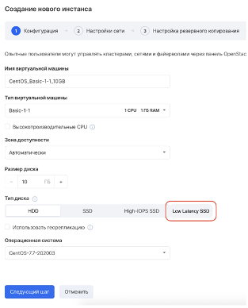

Панель управления VK CS
---------------------

Для создания диска [в личном кабинете VK CS](https://mcs.mail.ru/app/services/infra/servers/) следует:

1.  Перейти в раздел "Диски" сервиса "Облачные вычисления".
2.  В верхнем меню выбрать "Создать диск".
3.  Настроить параметры создаваемого диска:
    
    <table style="width: 100%;"><tbody><tr><td style="width: 31.2385%; background-color: rgb(239, 239, 239);">Название диска</td><td style="width: 68.6698%; background-color: rgb(239, 239, 239); text-align: left;">Отображаемое название создаваемого диска</td></tr><tr><td style="width: 31.2385%;">Описание</td><td style="width: 68.6698%;">Описание диска</td></tr><tr><td style="width: 31.2385%;">Тип диска</td><td style="width: 68.6698%;">Выбор типа и зоны доступности&nbsp;</td></tr><tr><td style="width: 31.2385%;">Источник</td><td style="width: 68.6698%;">Пустой диск, снимок диска (снапшот) или образ</td></tr><tr><td style="width: 31.2385%;">Размер</td><td style="width: 68.6698%;">Задает размер диска в ГБ</td></tr><tr><td style="width: 31.2385%;">Загрузочный диск</td><td style="width: 68.6698%;">При отметке элемента появится возможность создавать ВМ из диска&nbsp;</td></tr><tr><td style="width: 31.2385%;">Подключить диск к инстансу</td><td style="width: 68.6698%;">При отметке элемента диск будет подключен к ВМ после создания</td></tr><tr><td style="width: 31.2385%;">Выбрать инстанс</td><td style="width: 68.6698%;">Выбор виртуальной машины, к которой будет подключен диск</td></tr></tbody></table>
    
    4\. После установки параметров нажать "Создать диск".
    

**Примечание**

Создание дисков с типом LL NVME можно произвести при наличии доступа к высокопроизводительным шаблонам виртуальных машин. Получить доступ к high-freq конфигурациям можно с [помощью технической поддержки](mailto:support@mcs.mail.ru).

Для создания необходимо выбрать high-freq шаблон, после чего LL NVME диск появляется в мастере создания ВМ:



Данные, хранящиеся на данном типе диска не резервируются на уровне дисковой подсистемы. Крайне рекомендуется настроить регулярное резервное копирование на случай необходимости восстановления данных после сбоя

Для удаления диска необходимо в контекстном меню диска в разделе "Диски" сервиса "Облачные вычисления" выбрать пункт "Удалить диск". Это также удалит снапшоты диска.

OpenStack CLI
-------------

Для создания диска в клиенте OpenStack следует:

Получить доступные типы дисков:

```
openstack volume type list
```

Создать диск выбранного типа и указанного размера:

```
openstack volume create --type <ID типа диска> --size <размер> <название диска>
```

Также возможно использование следующих параметров:

*   \--image <ID образа> - указание образа, из которого будет создан диск
*   \--snapshot <ID снапшота> - указание снапшота, из которого будет создан диск
*   \--source <ID диска> - указание диска, на основе которого будет создан диск (клонирование диска)
*   \--description <описание> - произвольное описание диска
*   \--availability-zone <зона> - указание зоны доступности диска
*   \--property <ключ=значение> - указание произвольных свойств диска
*   \--bootable - создает загрузочный диск

Для удаления диска в клиенте OpenStack следует:

Получить список дисков в проекте:

```
openstack volume list --long
```

Получить информацию о диске:

```
openstack volume show <ID диска>
```

Удалить диск:

```
openstack volume delete <ID диска>
```