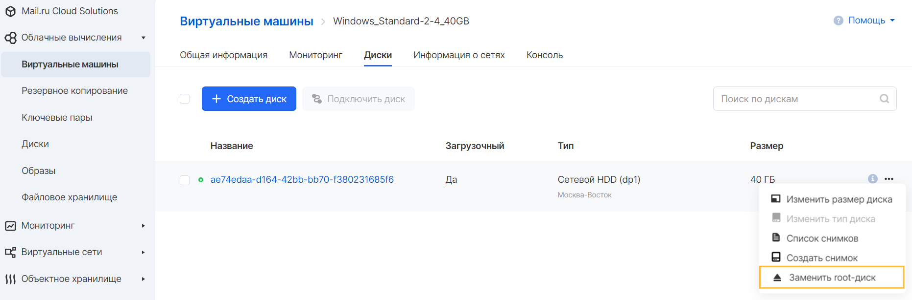
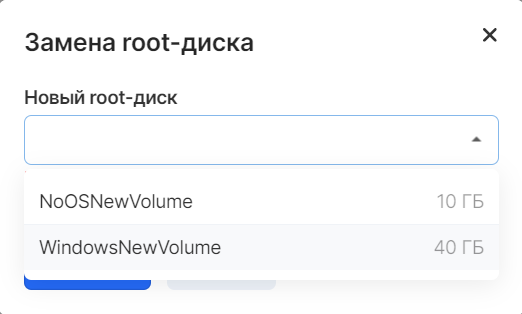

Root (или корневой) диск инстанса является основным или первым диском, с которым запущена виртуальная машина.

В случаях, когда требуется отсоединить root диск от инстанса, для смены его типа, ОС или пересоздания без изменения конфигурации инстанса, необходимо выполнить следующие условия:

1.  Инстанс должен быть остановлен
2.  Все процессы, связанные с конфигурированием инстанса, должны быть завершены
3.  В проект должен присутствовать диск, на который будет заменен существующий root диск
4.  Новый диск не должен быть присоединен к какому-либо инстансу
5.  Новый диск должен быть загрузочным

**Внимание**

Отсоединение root диска без его замены на другой невозможно.

Процесс замены root диска для виртуальных машин с ОС Windows и Linux идентичен. Для этого следует выбрать требуемый инстанс в списке Виртуальных машин сервиса "Облачные вычисления" и перейти на вкладку "Диски".

Через панель управления VK CS
===========================

Замена производится в свойствах подключенного к ВМ диска:



При выполнении всех условий в списке будет доступен новый диск:



После замены root диска инстанс можно запустить.

Через CLI
=========

Для замены диска необходимо выполнить в клиенте OpenStack следующую команду, подставив ваши значения (token, server uuid и volume uuid):

```
curl -g -i -X POST https://infra.mail.ru:8774/v2.1/servers/<**server-uuid**\>/action -H "Accept: application/json" -H "Content-Type: application/json" -H "User-Agent: python-cinderclient" -H "X-Auth-Token: <**token**\>" -d '{"replaceRoot": {"volume_id": "<**volume uuid to set**\>"}}'
```

После замены root диска инстанс можно запустить.

### Острожно

Для корректной работы инстанса минимум 1 присоединенный диск должен содержать операционную систему и быть загрузочным.