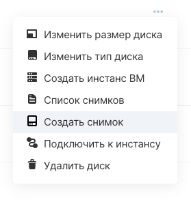
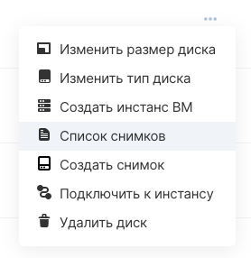
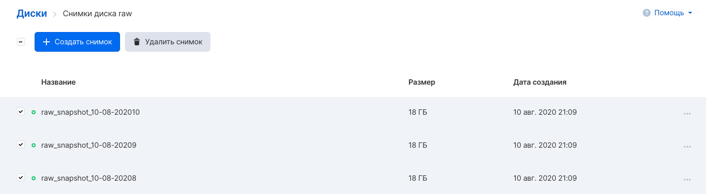

Снапшот (снимок) диска - состояние файловой системы на определенный момент времени.

Создание снимка диска останавливает запись гостевой ОС на короткое время, сохраняет состояние файлов системы и все последующие изменения записывает в отдельный файл. Таким образом, существует возможность откатить изменения файловой системы к определенному моменту или использовать снапшоты как инструмент для быстрого клонирования дисков.

**Внимание**

Снапшоты дисков с типом LL NVME удаляются при миграции виртуальной машины (это может произойти при балансировке нагрузки на гипервизоры). Для сохранения состояния диска на определенный момент рекомендуется создавать ручную резервную копию.

Панель управления VK CS
---------------------

Для создания снимка диска [в личном кабинете VK CS](https://mcs.mail.ru/app/services/infra/servers/) следует:

1.  Перейти на страницу "Диски" сервиса "Облачные вычисления".
2.  В контекстном меню диска выбрать "Создать снимок":
3.  В меню создания снимка указать название снимка и нажать "Создать снимок".

Для просмотра снимков диска необходимо на странице "Диски" в контекстном меню диска выбрать "Список снимков":

Для удаления снимков диска следует выделить требуемые снимки на странице просмотра снимков и нажать "Удалить снимок"

OpenStack CLI
-------------

Выполнить операции со снапшотами диска можно также в клиенте OpenStack

Получить список снимков указанного диска:

```
openstack volume snapshot list --volume <ID диска> 
```

Получить список снимков дисков проекта:

```
openstack volume snapshot list --project <ID проекта>
```

Создать снимок диска, если диск подключен к инстансу, следует добавить флаг --force:

```
openstack volume snapshot create --force --volume <ID диска>
```

Удалить снимок диска:

```
openstack volume snapshot delete <ID снапшота>
```

Изменить свойства снимка:

```
openstack volume snapshot set <свойство>  <ID снапшота>
```

Доступные свойства:

*   \--name - название
*   \--description - описание
*   \--property - данные в формате ключ=значение
*   \--no-property - снять все дополнительные значения