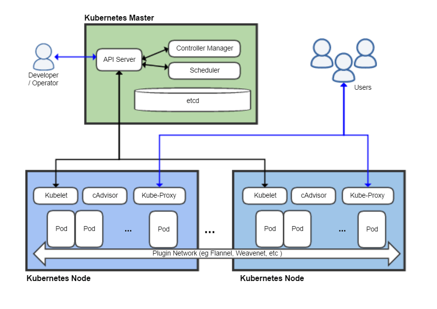

Описание
--------

**Узел** (node) - это отдельная физическая или виртуальная машина, на которой развёрнуты и выполняются контейнеры приложений. Каждый узел в кластере содержит сервисы для запуска приложений в контейнерах (например Docker), а также компоненты, предназначенные для централизованного управления узлом.

**Группа узлов** (Node Group)

Группа узлов это множество нод с общим шаблоном (размером) виртуальной машины. Существует возможность создать несколько нод-групп с разными шаблонами/размерами и специальными именами для решения разных задач. Например можно создать нод-группу на базе большого размера ВМ для ресурсоёмких контейнеров. 

Каждая группа узлов может масштабироваться независимо от другой. Также для каждой группы узлов в отдельности можно активировать собственные параметры авто-масштабирования.

**Под** (pod) - базовая единица для управления и запуска приложений, один или несколько контейнеров, которым гарантирован запуск на одном узле, обеспечивается разделение ресурсов, межпроцессное взаимодействие и предоставляется уникальный в пределах кластера IP-адрес. Последнее позволяет приложениям, развёрнутым на поде, использовать фиксированные и предопределённые номера портов без риска конфликта. Поды могут напрямую управляться с использованием API Kubernetes или управление ими может быть передано контроллеру.

Все объекты управления (узлы, поды, контейнеры) в Kubernetes помечаются **метками** (label), селекторы меток (label selector) - это запросы, которые позволяют получить ссылку на объекты, соответствующие какой-то из меток; метки и селекторы - это главный механизм Kubernetes, который позволяет выбрать, какой из объектов следует использовать для запрашиваемой операции.

**Сервисом** в Kubernetes называют совокупность логически связанных наборов подов и политик доступа к ним. Например, сервис может соответствовать одному из уровней программного обеспечения, разработанного в соответствии с принципами многоуровневой архитектуры программного обеспечения. Набор подов, соответствующий сервису, получается в результате выполнения селектора соответствующей метки.

Kubernetes обеспечивает функции обнаружения сервисов и маршрутизации по запросу, в частности, система умеет переназначать необходимые для обращения к сервису IP-адрес и доменное имя сервиса различным подам, входящим в его состав. При этом обеспечивается балансировка нагрузки между подами, чьи метки соответствуют сервису в стиле Round robin DNS, а также корректная работа в том случае, если один из узлов кластера вышел из строя и размещённые на нём поды автоматически переместились на другой. По умолчанию сервис доступен внутри управляемого Kubernetes кластера, например поды бэкенда группируются для обеспечения балансировки нагрузки и в таком виде предоставляются фронтенду, но он может быть настроен и для того, чтобы предоставлять доступ к входящим в его состав подам извне, как к единому фронтенду.

