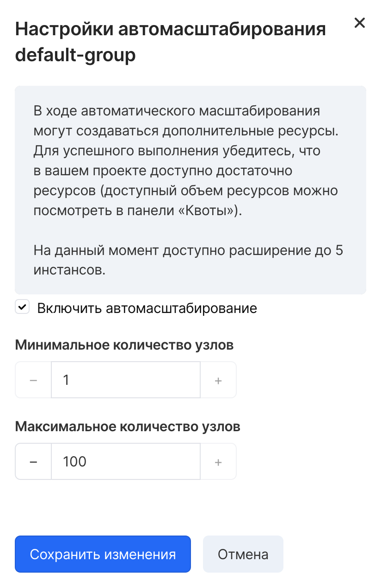
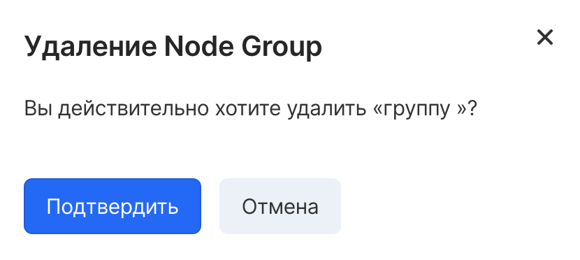

Для редактирования Node Group нужно открыть контекстное меню нод-группы.

Кнопка Изменить размер позволяет задать текущее количество нод в нод-группе. После нажатия на кнопку Сохранить изменения, запустится скалирование кластера до заданного количества.

Настроить автомасштабирование позволяет включить или выключить данную функцию для нод-группы, а также задать минимальное и максимальное количество нод в ней.

 

Кнопка Удалить нод-группу запустит удаление всех нод из этой группы, отменить эту операцию невозможно. Удаление node group вызовет удаление всех подов, находящихся на ее узлах и перераспределение их по другим нодам. Подключенные PVC будут также перемонтированы к другим нодам.