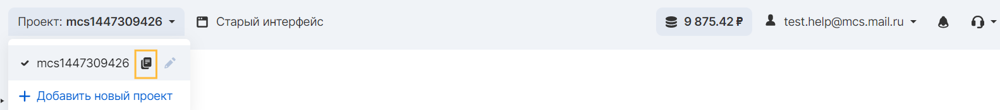

Общая информация
----------------

ACL (Access Control List) позволяет контроллировать, какие операции разрешены каким пользователям. ACL может стоять как и на уровне всего бакета, так и на уровне конкретного объекта. Установить и прочесть ACL можно через приведенные методы ниже. По умолчанию, создаваемый бакет или объект максимально ограничен в доступе -- только владелец бакета/объекта может работать с ним. У остальных пользователей - запрет доступа. ACL указывается в XML формате. Где в поле Owner ID нужно указать свой канонический идентификатор в системе VK CS. Получить его можно разными способами. Один из них:

```
aws s3api list-buckets --query Owner.ID --output text --endpoint-url https://hb.bizmrg.com
```

Пример ACL, который дает те же права, что и по умолчанию (только владелец имеет полный доступ, никто больше):

```xml
<?xml version="1.0" encoding="UTF-8"?>
<AccessControlPolicy xmlns="http://<имя_бакета>.hb.bizmrg.com/images/01.jpg/">
  <Owner>
    <ID>fcd68908-6c76-42d1-968b-82ae2a5a251d</ID>
    <DisplayName>owner-display-name</DisplayName>
  </Owner>
  <AccessControlList>
    <Grant>
      <Grantee xmlns:xsi="http://www.w3.org/2001/XMLSchema-instance"
               xsi:type="Canonical User">
        <ID>fcd68908-6c76-42d1-968b-82ae2a5a251d</ID>
        <DisplayName>display-name</DisplayName>
      </Grantee>
      <Permission>FULL_CONTROL</Permission>
    </Grant>
  </AccessControlList>
</AccessControlPolicy>
```

*   Элемент `<Owner>` производит идентификацию владельца по каноническому идентификатору пользователя учетной записи VK CS.
*   Элемент `<Grant>` определяет идентификатор получателя для предоставляет разрешение.
*   Элемент `<Permission>` внутри `<Grant>` определяет тип доступа для получателя.

Базовый ACL, показанный выше в качестве примера, имеет один элемент `<Grant>`. Чтобы описать несколько получателей, то для каждого надо добавить свой элемент `<Grant>`.

### Примечание

ACL может содержать не более 100 разрешений

При установку через HTTP заголовки, нужно использовать заголовки для выдачи специфичных для заголовка прав:

*   x-amz-grant-read — Список получателей прав для READ.
*   x-amz-grant-write — Список получателей прав для WRITE.
*   x-amz-grant-read-acp — Список получателей прав для READ_ACP.
*   x-amz-grant-write-acp — Список получателей прав для WRITE_ACP.
*   x-amz-grant-full-control — Список получателей прав для FULL_CONTROL.
*   x-amz-acl — Использование шаблонного ACL.

Ниже даны описания каждого из прав и что указывать в значениях заголовков.

Выдача прав
-----------

Идентификатор для выдачи прав может быть несколько типов:

*   Конкретный пользователь в VK CS. Для этого нужно знать его уникальный индентификатор.
*   Проект в VK CS. Для этого нужно знать уникальный идентификатор проекта.
*   Предварительно определенные группы. Списк указан ниже.
*   Весь мир. Включая анонимный доступ. Любой, знающий полный адрес до объекта, имеет доступ.

Выданное право для идентификатора выше может быть одним или составлено из нескольких типов:

*   READ — только чтение, какие-либо изменения не разрешены.
*   WRITE — только запись, какие-либо чтения не разрешены. Включая удаление.
*   READ_ACP — чтение ACL, какие-либо изменения не разрешены.
*   WRITE_ACP — запись ACL, какие-либо чтения не разрешены. Включая удаление.
*   FULL_CONTROL — все, что перечислено выше, сразу.

Выдача прав по идентификатору пользователя
------------------------------------------

Идентификатор пользователя (он же известен как канонический ID/Canonical ID) -- это уникальный идентификатор, состоящий из набора символов. Пример - `fcd68908-6c76-42d1-968b-82ae2a5a251d`. Формат не фиксирован, при работе с идентификатором пользователя какие-либо преобразования и привязки к формату индентификатора не рекомендуются.

*   Если используется установка через XML, то внутри `<Grantee>` надо указать тег `<ID>`.
    
    Пример: `<ID>fcd68908-6c76-42d1-968b-82ae2a5a251d</ID>`
*   Если используется установка через HTTP заголовок, то в значении заголовка надо использовать ключ `id`.
    
    Пример: `id="fcd68908-6c76-42d1-968b-82ae2a5a251d"`.

Канонический ID пользователя учетной записи VK CS можно получить, прочитав ACL бакета или объекта, к которому учетная запись VK CS имеет права доступа. Когда отдельная учетная запись VK CS получает разрешения по запросу на Grant, в ACL добавляется запись гранта с каноническим ID пользователя учетной записи VK CS.

### Примечание

Если сделать свой бакет общедоступным (не рекомендуется), любой неаутентифицированный пользователь может загружать объекты в бакет. У этих анонимных пользователей нет учетной записи VK CS. Когда анонимный пользователь загружает объект в бакет, VK CS S3 добавляет специальный канонический ID пользователя (65a011a29cdf8ec533ec3d1ccaae921c) в качестве владельца объекта в ACL.

Выдача прав по идентификатору проекта
-------------------------------------

Если идентификатор пользователя неизвестен, но известен идентификатор проекта, то можно указать проект. При обработке запроса на установку ACL, система ищет идентификатор пользователя и сохраняет его в ACL. В результате ACL всегда будут содержать канонический ID пользователя для проекта, а не идентификатор проекта.

*   Если используется установка через XML, то внутри `<Grantee>` надо указать тег `<EmailAddress>`.
    
    Пример: `<EmailAddress>mcs2400549523</EmailAddress>`
*   Если используется установка через HTTP заголовок, то в значении заголовка надо использовать ключ `id`.
    
    Пример: `emailAddress="mcs2400549523"`.

Получить свой идентификатор проекта можно в личном кабинете в области информации об учетной записи. Кнопка, расположенная рядом с идентификатором проекта позволяет скопировать параметр для удобства:



### Внимание

При предоставлении другим учетным записям VK CS доступ к своим ресурсам, следует учитывать, что учетные записи VK CS могут делегировать свои разрешения пользователям под своими учетными записями. Это известно как доступ к нескольким аккаунтам.

Выдача предварительно определенным метагруппам
----------------------------------------------

Hotbox имеет набор предопределенных групп. Указывая специальный идентификатор "пользователя", система автоматически подставляет права по правилам, указанным ниже. То, что идентификатор выглядит как ссылка на AWS, не означает, что используются ресурсы AWS S3. Эти идентификаторы обрабатываются только как набор символов и используются для обратной совместимости с программами, которые созданы для AWS S3.

*   **Authenticated Users** — **группа авторизованных пользователей.** Эта метагруппа содержит все существующие учетные записи в системе VK CS, включая те, которыми вы не можете управлять. Разрешение на доступ к этой группе позволяет любой учетной записи VK CS получить доступ к ресурсу. Однако все запросы должны быть подписаны (аутентифицированы). Нужно указывать `http://acs.amazonaws.com/groups/global/AuthenticatedUsers` в поле URI. Авторизированным пользователям надо подписывать свои запросы для доступа к ресурсу.
    

### Внимание

При предоставлении доступа группе пользователей Authenticated Users, любой авторизованный пользователь VK CS из Интернет может получить доступ к ресурсу.

*   **All Users** — г**руппа «Все пользователи».** Эта метагруппа снимает какие-либо ограничения на указанное право. Например, если сделать открытый доступ на READ, то любой пользователь может считывать содержимое, если он знает только имя бакета и имя объекта. А WRITE для всех позволяет любому пользователю все, что это право даёт. Нужно указывать `http://acs.amazonaws.com/groups/global/AllUsers` в поле URI.

### Осторожно!

Убедительно просим взвесить все аргументы в пользу использования метагрупп!

Открывая доступ неопределенному кругу лиц, Вы теряете контроль, кто сможет совершать операции с Вашими ресурсами. Оплата за их действия совершается владельцем бакета. Самый неблагоприятный сценарий - анонимный пользователь с WRITE-доступом удаляет нужные для хранения объекты и размещает терабайты нежелательных файлов другому владельцу бакета.

Анонимные неавторизированные пользователи, если им предоставлен доступ, совершают действия под каноническим ID пользователя `65a011a29cdf8ec533ec3d1ccaae921c`, так как у них нет учетной записи в VK CS.

*   Если используется установка через XML, то внутри `<Grantee>` надо указать тег `<URI>`.
    
    Пример: `<URI>http://acs.amazonaws.com/groups/global/AllUsers</URI>`
*   Если используется установка через HTTP заголовок, то в значении заголовка надо использовать ключ `id`.
    
    Пример: `uri="http://acs.amazonaws.com/groups/global/AllUsers"`

 

Виды разрешений
---------------

В таблице перечислены наборы разрешений, которые VK CS S3 поддерживает в ACL. Набор разрешений ACL одинаков для ACL объекта и ACL бакета. Эти ACL предоставляют разрешения для определенных бакетов или операций с объектами. В таблице перечислены разрешения и описано, что они означают в контексте объектов и бакетов.

<table border="0" cellpadding="0" cellspacing="0" style="margin-right: calc(1%); width: 99%;" width="426"><tbody><tr><td height="19" style="width: 23.1392%; background-color: rgb(239, 239, 239);" width="23.943661971830984%">Разрешение</td><td style="width: 36.8101%; background-color: rgb(239, 239, 239);" width="37.08920187793427%">Применение к бакету</td><td style="width: 39.7722%; background-color: rgb(239, 239, 239);" width="38.967136150234744%">Применение к объекту</td></tr><tr><td height="19" style="width: 23.1392%;">READ</td><td style="width: 36.8101%;"><ul><li>HeadBucket</li><li>GetBucketLifecycle</li><li>GetBucketNotification</li><li>ListObjects</li><li>ListParts</li><li>ListMultiparts</li></ul></td><td style="width: 39.7722%;"><p>Позволяет получить содержимое объекта и его метаданные:</p><ul><li>GetObject</li><li>HeadObject</li><li>GetObjectRange</li></ul><br></td></tr><tr><td height="19" style="width: 23.1392%;">WRITE</td><td style="width: 36.8101%;"><p>Позволяет создавать, удалять, перезаписывать любые объекты в бакете:</p><ul><li>DeleteBucketNotification</li><li>PutBucketNotification</li><li>PutBucketLifecycle</li><li>DeleteBucketLifecycle</li><li>DeleteObject</li><li>DeletMultipleObjects</li><li>AbortMultipart</li><li>InitMultipart</li><li>UploadPart</li><li>CompliteMultipart</li><li>PutObject</li><li>PutObjectCopy</li></ul></td><td style="width: 39.7722%;">Не применимо</td></tr><tr><td height="19" style="width: 23.1392%;">READ_ACP</td><td style="width: 36.8101%;"><p>Позволяет читать ACL бакета:&nbsp;</p><ul><li>GetBucketAcl</li><li>GetBucketCors</li></ul></td><td style="width: 39.7722%;"><p>Позволяет читать ACL объекта:&nbsp;</p><p>GetObjectAcl</p><br></td></tr><tr><td height="19" style="width: 23.1392%;">WRITE_ACP</td><td style="width: 36.8101%;"><p>Позволяет изменять ACL бакета:</p><ul><li>CreatePrefixKey</li><li>DeletePrefixKey</li><li>ListPrefixKeys</li><li>PutBucketCors</li><li>DeleteBucketCors</li><li>PutBucketAcl</li></ul></td><td style="width: 39.7722%;"><p>Позволяет изменять ACL объекта&nbsp;</p><p>PutObjectAcl</p><br></td></tr><tr><td height="19" style="width: 23.1392%;">FULL_CONTROL</td><td style="width: 36.8101%;">Комбинирует права READ, WRITE, READ_ACP, WRITE_ACP для бакета</td><td style="width: 39.7722%;">Комбинирует права READ, WRITE, READ_ACP, WRITE_ACP для объекта</td></tr></tbody></table>

Сопоставление разрешений ACL и разрешений политики доступа
----------------------------------------------------------

ACL допускает только конечный набор разрешений по сравнению с количеством разрешений, которые можно установить в политике доступа. Каждое из этих разрешений позволяет выполнять одну или несколько операций VK CS S3.

В следующей таблице показано, как каждое разрешение ACL сопоставляется с соответствующими разрешениями политики доступа. Как видно, политика доступа допускает больше разрешений, чем ACL. ACL используется в основном для предоставления базовых разрешений на чтение и запись, аналогично разрешениям файловой системы.

<table border="0" cellpadding="0" cellspacing="0" style="margin-right: calc(2%); width: 98%;" width="289"><tbody><tr><td height="19" style="width: 24.3411%; background-color: rgb(239, 239, 239);" width="38.062283737024224%">Разрешение ACL</td><td style="width: 37.1576%; background-color: rgb(239, 239, 239);" width="29.41176470588235%">Политика доступа для бакета</td><td style="width: 38.2946%; background-color: rgb(239, 239, 239);" width="32.52595155709343%">Политика доступа для объекта</td></tr><tr><td height="19" style="width: 24.3411%;">READ</td><td style="width: 37.1576%;">ListBucket,<br>ListBucketMultipartUploads</td><td style="width: 38.2946%;">GetObject</td></tr><tr><td height="19" style="width: 24.3411%;">WRITE</td><td style="width: 37.1576%;">PutObject,<br>DeleteObject</td><td style="width: 38.2946%;">Не применимо</td></tr><tr><td height="19" style="width: 24.3411%;">READ_ACP</td><td style="width: 37.1576%;">GetBucketAcl</td><td style="width: 38.2946%;">GetObjectAcl</td></tr><tr><td height="19" style="width: 24.3411%;">WRITE_ACP</td><td style="width: 37.1576%;">PutBucketAcl</td><td style="width: 38.2946%;">PutObjectAcl</td></tr><tr><td height="19" style="width: 24.3411%;">FULL_CONTROL</td><td style="width: 37.1576%;">Эквивалент предоставлению READ, WRITE,<br>READ_ACP, и WRITE_ACP ACL разрешений</td><td style="width: 38.2946%;">Эквивалент предоставлению READ, READ_ACP и WRITE_ACP ACL разрешений</td></tr></tbody></table>

Ключи состояния
---------------

При предоставлении разрешения политики доступа, можно использовать условные ключи, чтобы ограничить значение ACL для объекта с помощью политики бакета. Приведенные ниже контекстные ключи соответствуют спискам ACL. Эти контекстные ключи предназначены для указания использования определенного ACL в запросе:

*   s3:x-amz-grant-read - Доступ на чтение
*   s3:x-amz-grant-write - Права записи
*   s3:x-amz-grant-read-acp - Доступ на чтение ACL бакета
*   s3:x-amz-grant-write-acp - Права на запись ACL бакета
*   s3:x-amz-grant-full-control - Полный контроль
*   s3:x-amz-acl - Использование шаблонного ACL

Пример ACL
----------

```
<?xml version="1.0" encoding="UTF-8"?>
<AccessControlPolicy xmlns="http://<имя_бакета>.hb.bizmrg.com/images/01.jpg/">
  <Owner>
    <ID>Owner-canonical-user-ID</ID>
    <DisplayName>display-name</DisplayName>
  </Owner>
  <AccessControlList>
    <Grant>
      <Grantee xmlns:xsi="http://www.w3.org/2001/XMLSchema-instance" xsi:type="CanonicalUser">
        <ID>Owner-canonical-user-ID</ID>
        <DisplayName>display-name</DisplayName>
      </Grantee>
      <Permission>FULL_CONTROL</Permission>
    </Grant>
    
    <Grant>
      <Grantee xmlns:xsi="http://www.w3.org/2001/XMLSchema-instance" xsi:type="CanonicalUser">
        <ID>user1-canonical-user-ID</ID>
        <DisplayName>display-name</DisplayName>
      </Grantee>
      <Permission>WRITE</Permission>
    </Grant>

    <Grant>
      <Grantee xmlns:xsi="http://www.w3.org/2001/XMLSchema-instance" xsi:type="CanonicalUser">
        <ID>user2-canonical-user-ID</ID>
        <DisplayName>display-name</DisplayName>
      </Grantee>
      <Permission>READ</Permission>
    </Grant>

    <Grant>
      <Grantee xmlns:xsi="http://www.w3.org/2001/XMLSchema-instance" xsi:type="Group">
        <URI>http://acs.amazonaws.com/groups/global/AllUsers</URI> 
      </Grantee>
      <Permission>READ</Permission>
    </Grant>

    <Grant>
      <Grantee xmlns:xsi="http://www.w3.org/2001/XMLSchema-instance" xsi:type="Group">
        <EmailAddress>project-ID</EmailAddress>
      </Grantee>
      <Permission>READ</Permission>
    </Grant>

 </AccessControlList>
</AccessControlPolicy>
```

Фиксированный ACL
-----------------

VK CS S3 поддерживает набор предопределенных разрешений, известных как стандартные списки ACL. Каждый фиксированный ACL имеет предопределенный набор получателей и разрешений. В следующей таблице перечислены стандартные списки ACL и связанные с ними предопределенные разрешения.

<table border="0" cellpadding="0" cellspacing="0" style="margin-right: calc(0%); width: 100%;" width="289"><tbody><tr><td height="19" style="width: 25.6203%; background-color: rgb(239, 239, 239);" width="38.062283737024224%">Фиксированный ACL</td><td style="width: 23.8734%; background-color: rgb(239, 239, 239);" width="29.41176470588235%">Относится к</td><td style="width: 50.3038%; background-color: rgb(239, 239, 239);" width="32.52595155709343%">Разрешения добавлены в ACL</td></tr><tr><td height="19" style="width: 25.6203%;">private</td><td style="width: 23.8734%;">Бакет и объект</td><td style="width: 50.3038%;">Владелец получает&nbsp;FULL_CONTROL.&nbsp;Больше ни у кого нет прав доступа (по умолчанию).</td></tr><tr><td height="19" style="width: 25.6203%;">public-read</td><td style="width: 23.8734%;">Бакет и объект</td><td style="width: 50.3038%;">Владелец получает FULL_CONTROL. Группа AllUsers получает READ доступ.</td></tr><tr><td height="19" style="width: 25.6203%;">public-read-write</td><td style="width: 23.8734%;">Бакет и объект</td><td style="width: 50.3038%;">Владелец получает FULL_CONTROL. Группа AllUsers получает READ и WRITE доступ.</td></tr><tr><td height="19" style="width: 25.6203%;">aws-exec-read</td><td style="width: 23.8734%;">Бакет и объект</td><td style="width: 50.3038%;">Владелец получает FULL_CONTROL.</td></tr><tr><td height="19" style="width: 25.6203%;">authenticated-read</td><td style="width: 23.8734%;">Бакет и объект</td><td style="width: 50.3038%;">Владелец получает FULL_CONTROL. Группа AuthenticatedUsers получает READ доступ.</td></tr><tr><td height="19" style="width: 25.6203%;">bucket-owner-read</td><td style="width: 23.8734%;">Объект</td><td style="width: 50.3038%;">Владелец объекта получает FULL_CONTROL. Владелец бакета получает READ доступ. Если указать этот шаблонный ACL при создании бакета, VK CS S3 проигнорирует его.</td></tr><tr><td height="19" style="width: 25.6203%;">bucket-owner-full-control</td><td style="width: 23.8734%;">Объект</td><td style="width: 50.3038%;">И владелец объекта, и владелец бакета получают FULL_CONTROL над объектом. Если указать этот фиксированный ACL при создании бакета, VK CS S3 проигнорирует его.</td></tr></tbody></table>

**Примечание**

В запросе можно указать только один из этих фиксированных списков ACL.

В запросе указывается фиксированный ACL, используя заголовок запроса x-amz-acl. Когда VK CS S3 получает запрос со стандартным списком управления доступом в запросе, он добавляет предопределенные разрешения в список управления доступом ресурса.

* * *

Также см. полезную статью [https://help.icq.net/hotbox-help/advanced/api/acl?ShowDesktopLayout](https://help.icq.net/hotbox-help/advanced/api/acl?ShowDesktopLayout) 

Списки управления доступом (ACL) 
---------------------------------

Hotbox предоставляет возможность управлять доступом к контейнерам и объектам с помощью списка управления доступа - ACL. У каждого контейнера и объекта есть свой список доступа. Этот список определяет каким проектам или глобальным группам предоставляются права доступа и соответствующие права доступа.При получении запроса на ресурс сервис проверяет соответствующий ACL на наличие прав доступа у запрашивающего.

При создании контейнера или объекта сервис создает стандартный ACL, который предоставляет владельцу ресурса право полного контроля над этим ресурсом, и запрещает доступ остальным проектам и глобальным группам. Это показано в следующем примере ACL бакета (стандартный ACL объекта имеет ту же структуру).

<table border="0" cellpadding="5" cellspacing="3" style="position: relative; background: rgb(255, 255, 255); width: 860px; box-shadow: rgba(0, 0, 0, 0.04) 0px 2px 0px 0px; border: 1px solid rgba(0, 0, 0, 0.12); border-collapse: collapse; color: rgb(51, 51, 51); font-family: Arial, Tahoma, Verdana, sans-serif; font-size: 15px; font-style: normal; font-variant-ligatures: normal; font-variant-caps: normal; font-weight: 400; letter-spacing: normal; orphans: 2; text-align: start; text-transform: none; white-space: normal; widows: 2; word-spacing: 0px; -webkit-text-stroke-width: 0px; text-decoration-thickness: initial; text-decoration-style: initial; text-decoration-color: initial;"><tbody><tr style="background-color: rgb(234, 235, 234);"><td style="padding: 8px; border: 1px solid rgba(0, 0, 0, 0.08);"><p><span style="font-family: &quot;courier new&quot;, courier; color: rgb(51, 102, 255);">&lt;?xml version="1.0" encoding="UTF-8"?&gt;</span></p><p><span style="font-family: &quot;courier new&quot;, courier;"><strong>&lt;AccessControlPolicy</strong> xmlns="http://BucketName.hb.bizmrg.com/doc/2006-03-01/"&gt;</span></p><p><span style="font-family: &quot;courier new&quot;, courier;">&nbsp;<strong>&nbsp;&lt;Owner&gt;</strong></span></p><p><span style="font-family: &quot;courier new&quot;, courier;">&nbsp; &nbsp;<strong>&nbsp;&lt;ID&gt;</strong><span style="color: rgb(255, 0, 0);">*** Owner-Canonical-User-ID ***</span>&lt;/ID&gt;</span></p><p><span style="font-family: &quot;courier new&quot;, courier;">&nbsp; &nbsp;<strong>&nbsp;&lt;DisplayName&gt;</strong><span style="color: rgb(255, 0, 0);">owner-display-name</span>&lt;/DisplayName&gt;</span></p><p><span style="font-family: &quot;courier new&quot;, courier;">&nbsp;&nbsp;<strong>&lt;/Owner&gt;</strong></span></p><p><strong><span style="font-family: &quot;courier new&quot;, courier;">&nbsp; &lt;AccessControlList&gt;</span></strong></p><p><strong><span style="font-family: &quot;courier new&quot;, courier;">&nbsp; &nbsp; &lt;Grant&gt;</span></strong></p><p><span style="font-family: &quot;courier new&quot;, courier;"><strong>&nbsp; &nbsp; &nbsp; &lt;Grante</strong>e xmlns:xsi="http://www.w3.org/2001/XMLSchema-instance"</span></p><p><span style="font-family: &quot;courier new&quot;, courier;">xsi:type="Canonical User"&gt;</span></p><p><span style="font-family: &quot;courier new&quot;, courier;">&nbsp; &nbsp; &nbsp; &nbsp;<strong>&nbsp;&lt;ID&gt;</strong><span style="color: rgb(255, 0, 0);">*** Owner-Canonical-User-ID ***</span><strong>&lt;/ID&gt;</strong></span></p><p><span style="font-family: &quot;courier new&quot;, courier;">&nbsp; &nbsp; &nbsp; &nbsp;&nbsp;<strong>&lt;DisplayName</strong>&gt;<span style="color: rgb(255, 0, 0);">owner-display-name</span><strong>&lt;/DisplayName&gt;</strong></span></p><p><span style="font-family: &quot;courier new&quot;, courier;">&nbsp; &nbsp; &nbsp;&nbsp;<strong>&lt;/Grantee&gt;</strong></span></p><p><span style="font-family: &quot;courier new&quot;, courier;"><strong>&nbsp; &nbsp; &nbsp; &lt;Permission&gt;</strong>FULL_CONTROL<strong>&lt;/Permission&gt;</strong></span></p><p><span style="font-family: &quot;courier new&quot;, courier;">&nbsp; &nbsp;<strong>&nbsp;&lt;/Grant&gt;</strong></span></p><p><strong><span style="font-family: &quot;courier new&quot;, courier;">&nbsp; &lt;/AccessControlList&gt;</span></strong></p><p><strong><span style="font-family: &quot;courier new&quot;, courier;">&lt;/AccessControlPolicy&gt;</span></strong></p></td></tr></tbody></table>

*   Блок Owner определяет владельца по каноническому идентификатору пользователя проекта и по домену.
*   Блок Grant определяет получателя прав (проект сервиса или глобальную группу) и предоставляемое право доступа.

Базовый ACL содержит один элемент Grant для владельца. Вы можете предоставлять права с помощью добавления элементов Grant, где каждый из них определяет получателя прав и соответствующее право доступа.

### Получатель прав

Получателем прав может являться проект сервиса или одна из глобальных групп сервиса. Вы можете предоставлять права проекту сервиса при помощи адреса электронной почты (домена) или канонического идентификатора проекта. При этом если вы указываете адрес электронной почты (домен) в вашем запросе на права доступа, то сервис определяет канонический идентификатор пользователя для соответствующего проекта и добавляет его в ACL. В результате ACL всегда будут содержать канонический идентификатор пользователя для проекта сервиса, а не адрес электронной почты проекта (домен).

#### Глобальные группы сервиса

У сервиса существует набор предопределенных групп. При предоставлении группе прав доступа к проекту вы указываете один из наших URI вместо канонического идентификатора пользователя. Сервисом предоставляются нижеуказанные глобальные группы.

*   Группа Authenticated Users — группа авторизованных пользователей.

Данная группа представляет собой все проекты сервиса. Наличие права доступа к этой группе позволяет любому проекту сервиса получать доступ к ресурсу. Но в то же время все запросы должны быть подписаны (авторизованы).

*   Группа All Users — группа всех пользователей. 

Наличие права доступа к этой группе позволяет всем получать доступ к ресурсу. Запросы могут быть подписанными (авторизованными) или неподписанными (анонимными). В неподписанных запросах отсутствует заголовок аутентификации Authentication в запросе.

> При использовании ACL, получателем прав может являться проект сервиса или одна из предопределенных групп сервиса.

### Предоставляемые разрешения

Следующая таблица содержит набор разрешений, поддерживаемых сервисом в ACL. Необходимо отметить, что набор разрешений ACL один и тот же для объекта и контейнера (за исключением запрета права WRITE на объекте).Нижеследующие таблицы содержат разрешения и описывают их в контексте разрешений объекта и контейнера.

<table border="0" cellpadding="5" cellspacing="3" style="position: relative; background: rgb(255, 255, 255); width: 860px; box-shadow: rgba(0, 0, 0, 0.04) 0px 2px 0px 0px; border: 0px solid rgb(219, 219, 219); border-collapse: collapse; color: rgb(51, 51, 51); font-family: Arial, Tahoma, Verdana, sans-serif; font-size: 15px; font-style: normal; font-variant-ligatures: normal; font-variant-caps: normal; font-weight: 400; letter-spacing: normal; orphans: 2; text-align: start; text-transform: none; white-space: normal; widows: 2; word-spacing: 0px; -webkit-text-stroke-width: 0px; text-decoration-thickness: initial; text-decoration-style: initial; text-decoration-color: initial;"><tbody><tr style="background-color: rgb(224, 224, 224);"><td style="padding: 8px; border: 1px solid rgba(0, 0, 0, 0.08);"><strong>Разрешение</strong></td><td style="padding: 8px; border: 1px solid rgba(0, 0, 0, 0.08);"><strong>При предоставлении на контейнере</strong></td><td style="padding: 8px; border: 1px solid rgba(0, 0, 0, 0.08);"><strong>При предоставлении на объекте</strong></td></tr><tr><td style="padding: 8px; border: 1px solid rgba(0, 0, 0, 0.08);"><span style="font-family: &quot;courier new&quot;, courier;">READ</span></td><td style="padding: 8px; border: 1px solid rgba(0, 0, 0, 0.08);">Позволяет получателю прав получить список объектов в контейнере.</td><td style="padding: 8px; border: 1px solid rgba(0, 0, 0, 0.08);">Позволяет получателю прав прочитать данные объекта и его метаданные.</td></tr><tr><td style="padding: 8px; border: 1px solid rgba(0, 0, 0, 0.08);"><span style="font-family: &quot;courier new&quot;, courier;">WRITE</span></td><td style="padding: 8px; border: 1px solid rgba(0, 0, 0, 0.08);">Позволяет получателю прав создавать, переписывать и удалять любой объект в контейнере.</td><td style="padding: 8px; border: 1px solid rgba(0, 0, 0, 0.08);">Неприменимо.</td></tr><tr><td style="padding: 8px; border: 1px solid rgba(0, 0, 0, 0.08);"><span style="font-family: &quot;courier new&quot;, courier;">READ_ACP</span></td><td style="padding: 8px; border: 1px solid rgba(0, 0, 0, 0.08);">Позволяет получателю прав прочитать ACL контейнера.</td><td style="padding: 8px; border: 1px solid rgba(0, 0, 0, 0.08);">Позволяет получателю прав прочитать ACL объекта.</td></tr><tr><td style="padding: 8px; border: 1px solid rgba(0, 0, 0, 0.08);"><span style="font-family: &quot;courier new&quot;, courier;">WRITE_ACP</span></td><td style="padding: 8px; border: 1px solid rgba(0, 0, 0, 0.08);">Позволяет получателю прав записывать ACL для соответствующего контейнера.</td><td style="padding: 8px; border: 1px solid rgba(0, 0, 0, 0.08);">Позволяет получателю прав записывать ACL для соответствующего объекта.</td></tr><tr><td style="padding: 8px; border: 1px solid rgba(0, 0, 0, 0.08);"><span style="font-family: &quot;courier new&quot;, courier;">FULL_CONTROL</span></td><td style="padding: 8px; border: 1px solid rgba(0, 0, 0, 0.08);">Дает получателю прав следующие разрешения на контейнер:&nbsp;<span style="font-family: &quot;courier new&quot;, courier;">READ, WRITE, READ_ACP и WRITE_ACP.</span></td><td style="padding: 8px; border: 1px solid rgba(0, 0, 0, 0.08);">Дает получателю прав следующие разрешения на объект:&nbsp;<span style="font-family: &quot;courier new&quot;, courier;">READ, READ_ACP и WRITE_ACP.</span></td></tr></tbody></table>

#### Соответствие разрешений ACL и разрешений политики доступа

Каждое из прав доступа позволяет провести в сервисе одну или несколько операций. Следующая таблица показывает соответствие прав доступа и операций.

<table border="1" cellpadding="5" cellspacing="3" style="position: relative; background: rgb(255, 255, 255); width: 860px; box-shadow: rgba(0, 0, 0, 0.04) 0px 2px 0px 0px; border: 1px solid rgb(219, 219, 219); border-collapse: collapse; color: rgb(51, 51, 51); font-family: Arial, Tahoma, Verdana, sans-serif; font-size: 15px; font-style: normal; font-variant-ligatures: normal; font-variant-caps: normal; font-weight: 400; letter-spacing: normal; orphans: 2; text-align: start; text-transform: none; white-space: normal; widows: 2; word-spacing: 0px; -webkit-text-stroke-width: 0px; text-decoration-thickness: initial; text-decoration-style: initial; text-decoration-color: initial;"><tbody><tr style="background-color: rgb(224, 224, 224);"><td style="padding: 8px; border: 1px solid rgba(0, 0, 0, 0.08);"><strong>Разрешение ACL</strong></td><td style="padding: 8px; border: 1px solid rgba(0, 0, 0, 0.08);"><strong>Соответствующее разрешение политики доступа при предоставлении разрешения ACL на бакете</strong></td><td style="padding: 8px; border: 1px solid rgba(0, 0, 0, 0.08);"><strong>Соответствующее разрешение политики доступа при предоставлении разрешения ACL на объекте</strong></td></tr><tr><td style="padding: 8px; border: 1px solid rgba(0, 0, 0, 0.08);"><span style="font-family: &quot;courier new&quot;, courier;">READ</span></td><td style="padding: 8px; border: 1px solid rgba(0, 0, 0, 0.08);"><ul style="margin: 20px 0px;"><li style="margin-bottom: 12px;"><span style="font-family: &quot;courier new&quot;, courier;">HeadBucket</span></li><li style="margin-bottom: 12px;"><span style="font-family: &quot;courier new&quot;, courier;">ListMultiparts</span></li><li style="margin-bottom: 12px;"><span style="font-family: &quot;courier new&quot;, courier;">ListObjects</span></li><li style="margin-bottom: 12px;"><span style="font-family: &quot;courier new&quot;, courier;">ListParts</span></li></ul></td><td style="padding: 8px; border: 1px solid rgba(0, 0, 0, 0.08);"><ul style="margin: 20px 0px;"><li style="margin-bottom: 12px;"><span style="font-family: &quot;courier new&quot;, courier;">GetObject</span></li><li style="margin-bottom: 12px;"><span style="font-family: &quot;courier new&quot;, courier;">HeadObject</span></li></ul></td></tr><tr><td style="padding: 8px; border: 1px solid rgba(0, 0, 0, 0.08);"><p style="margin: 0px;"><span style="font-family: &quot;courier new&quot;, courier;">WRITE</span></p></td><td style="padding: 8px; border: 1px solid rgba(0, 0, 0, 0.08);"><ul style="margin: 20px 0px;"><li style="margin-bottom: 12px;"><span style="font-family: &quot;courier new&quot;, courier;">AbortMultipartUpload</span></li><li style="margin-bottom: 12px;"><span style="font-family: &quot;courier new&quot;, courier;">CompliteMultipartUpload</span></li><li style="margin-bottom: 12px;"><span style="font-family: &quot;courier new&quot;, courier;">InitiateMultipartUpload</span></li><li style="margin-bottom: 12px;"><span style="font-family: &quot;courier new&quot;, courier;">UploadPart</span></li><li style="margin-bottom: 12px;"><span style="font-family: &quot;courier new&quot;, courier;">PutObject</span></li><li style="margin-bottom: 12px;"><span style="font-family: &quot;courier new&quot;, courier;">DeleteObject</span></li></ul></td><td style="padding: 8px; border: 1px solid rgba(0, 0, 0, 0.08);">Неприменимо</td></tr><tr><td style="padding: 8px; border: 1px solid rgba(0, 0, 0, 0.08);"><span style="font-family: &quot;courier new&quot;, courier;">READ_ACP</span></td><td style="padding: 8px; border: 1px solid rgba(0, 0, 0, 0.08);"><ul style="margin: 20px 0px;"><li style="margin-bottom: 12px;"><span style="font-family: &quot;courier new&quot;, courier;">GetBucketAcl</span></li></ul></td><td style="padding: 8px; border: 1px solid rgba(0, 0, 0, 0.08);"><ul style="margin: 20px 0px;"><li style="margin-bottom: 12px;"><span style="font-family: &quot;courier new&quot;, courier;">GetObjectAcl</span></li></ul></td></tr><tr><td style="padding: 8px; border: 1px solid rgba(0, 0, 0, 0.08);"><span style="font-family: &quot;courier new&quot;, courier;">WRITE_ACP</span></td><td style="padding: 8px; border: 1px solid rgba(0, 0, 0, 0.08);"><ul style="margin: 20px 0px;"><li style="margin-bottom: 12px;"><span style="font-family: &quot;courier new&quot;, courier;">PutBucketAcl</span></li></ul></td><td style="padding: 8px; border: 1px solid rgba(0, 0, 0, 0.08);"><ul style="margin: 20px 0px;"><li style="margin-bottom: 12px;"><span style="font-family: &quot;courier new&quot;, courier;">PutObjectAcl</span></li></ul></td></tr><tr><td style="padding: 8px; border: 1px solid rgba(0, 0, 0, 0.08);"><span style="font-family: &quot;courier new&quot;, courier;">FULL_CONTROL</span></td><td style="padding: 8px; border: 1px solid rgba(0, 0, 0, 0.08);">Эквивалентно предоставлению следующих разрешений ACL: <span style="font-family: &quot;courier new&quot;, courier;">READ</span>, <span style="font-family: &quot;courier new&quot;, courier;">WRITE</span>,<span style="font-family: &quot;courier new&quot;, courier;">&nbsp;READ_ACP</span> и <span style="font-family: &quot;courier new&quot;, courier;">WRITE_ACP</span>.</td><td style="padding: 8px; border: 1px solid rgba(0, 0, 0, 0.08);">Эквивалентно предоставлению следующих разрешений ACL: <span style="font-family: &quot;courier new&quot;, courier;">READ</span>, <span style="font-family: &quot;courier new&quot;, courier;">READ_ACP</span> и <span style="font-family: &quot;courier new&quot;, courier;">WRITE_ACP</span>.</td></tr></tbody></table>

### **Связанный ACL**

Сервис поддерживает набор предопределенных предоставлений разрешений — так называемых «готовых ACL». Каждый готовый ACL содержит предопределенный набор получателей прав и разрешений. Следующая таблица содержит набор готовых ACL и связанных с ними предопределенных предоставлений разрешений.

<table border="0" cellpadding="5" cellspacing="3" style="position: relative; background: rgb(255, 255, 255); width: 860px; box-shadow: rgba(0, 0, 0, 0.04) 0px 2px 0px 0px; border: 0px solid rgb(219, 219, 219); border-collapse: collapse; color: rgb(51, 51, 51); font-family: Arial, Tahoma, Verdana, sans-serif; font-size: 15px; font-style: normal; font-variant-ligatures: normal; font-variant-caps: normal; font-weight: 400; letter-spacing: normal; orphans: 2; text-align: start; text-transform: none; white-space: normal; widows: 2; word-spacing: 0px; -webkit-text-stroke-width: 0px; text-decoration-thickness: initial; text-decoration-style: initial; text-decoration-color: initial;"><tbody><tr style="background-color: rgb(224, 224, 224);"><td style="padding: 8px; border: 1px solid rgba(0, 0, 0, 0.08);"><strong>Связанный ACL</strong></td><td style="padding: 8px; border: 1px solid rgba(0, 0, 0, 0.08);"><strong>Область применения</strong></td><td style="padding: 8px; border: 1px solid rgba(0, 0, 0, 0.08);"><strong>Добавленные в ACL разрешения</strong></td></tr><tr><td style="padding: 8px; border: 1px solid rgba(0, 0, 0, 0.08);"><span style="font-family: &quot;courier new&quot;, courier;">private</span></td><td style="padding: 8px; border: 1px solid rgba(0, 0, 0, 0.08);">Контейнер и объект</td><td style="padding: 8px; border: 1px solid rgba(0, 0, 0, 0.08);">Владелец получает полные права (<span style="font-family: &quot;courier new&quot;, courier;">FULL_CONTROL</span>). Остальные пользователи не получают прав доступа (по умолчанию).</td></tr><tr><td style="padding: 8px; border: 1px solid rgba(0, 0, 0, 0.08);"><span style="font-family: &quot;courier new&quot;, courier;">public-read</span></td><td style="padding: 8px; border: 1px solid rgba(0, 0, 0, 0.08);">Контейнер&nbsp;и объект</td><td style="padding: 8px; border: 1px solid rgba(0, 0, 0, 0.08);">Владелец получает полные права (<span style="font-family: &quot;courier new&quot;, courier;">FULL_CONTROL</span>). Группа всех пользователей Allusers&nbsp;получает право доступа на чтение (<span style="font-family: &quot;courier new&quot;, courier;">READ</span>).</td></tr><tr><td style="padding: 8px; border: 1px solid rgba(0, 0, 0, 0.08);"><span style="font-family: &quot;courier new&quot;, courier;">public-read-write</span></td><td style="padding: 8px; border: 1px solid rgba(0, 0, 0, 0.08);">Контейнер&nbsp;и объект</td><td style="padding: 8px; border: 1px solid rgba(0, 0, 0, 0.08);">Владелец получает полные права (<span style="font-family: &quot;courier new&quot;, courier;">FULL_CONTROL</span>). Группа всех пользователей AllUsers получает права доступа на чтение (<span style="font-family: &quot;courier new&quot;, courier;">READ</span>) и запись (<span style="font-family: &quot;courier new&quot;, courier;">WRITE</span>). Как правило, не рекомендуется предоставлять данные разрешений на контейнер.</td></tr><tr><td style="padding: 8px; border: 1px solid rgba(0, 0, 0, 0.08);"><span style="font-family: &quot;courier new&quot;, courier;">authenticated-read</span></td><td style="padding: 8px; border: 1px solid rgba(0, 0, 0, 0.08);">Контейнер&nbsp;и объект</td><td style="padding: 8px; border: 1px solid rgba(0, 0, 0, 0.08);">Владелец получает полные права (<span style="font-family: &quot;courier new&quot;, courier;">FULL_CONTROL</span>). Группа авторизованных пользователей (<span style="font-family: &quot;courier new&quot;, courier;">AuthenticatedUsers</span>) получает права доступа на чтение (<span style="font-family: &quot;courier new&quot;, courier;">READ</span>).</td></tr><tr><td style="padding: 8px; border: 1px solid rgba(0, 0, 0, 0.08);"><span style="font-family: &quot;courier new&quot;, courier;">bucket-owner-read</span></td><td style="padding: 8px; border: 1px solid rgba(0, 0, 0, 0.08);">Объект</td><td style="padding: 8px; border: 1px solid rgba(0, 0, 0, 0.08);">Владелец объекта получает полные права (<span style="font-family: &quot;courier new&quot;, courier;">FULL_CONTROL</span>). Владелец бакета получает права на чтение (<span style="font-family: &quot;courier new&quot;, courier;">READ</span>).&nbsp;</td></tr><tr><td style="padding: 8px; border: 1px solid rgba(0, 0, 0, 0.08);"><span style="font-family: &quot;courier new&quot;, courier;">bucket-owner-full-control</span></td><td style="padding: 8px; border: 1px solid rgba(0, 0, 0, 0.08);">Объект</td><td style="padding: 8px; border: 1px solid rgba(0, 0, 0, 0.08);">Владелец объекта и владелец бакета получают полные права (<span style="font-family: &quot;courier new&quot;, courier;">FULL_CONTROL</span>) на объект.</td></tr></tbody></table>

> Можно указывать только один из этих связанных ACL в своем запросе  — только при установлении ACL через заголовки

Установка ACL
-------------

API-сервис позволяет вам установить ACL при создании бакета или объекта. Сервис также предоставляет API для возможности установки ACL на существующем бакете или объекте. Эти API дают возможность устанавливать ACL с помощью нижеуказанных способов.

*   Установка ACL с помощью заголовков запроса — при отправке запроса по созданию ресурса (бакета или объекта) вы устанавливаете ACL при помощи заголовков запроса. Данные заголовки позволяют вам указать или готовый ACL, или установить предоставления разрешений явным образом (однозначно определить получателя прав и разрешения).
*   Установка ACL с помощью тела запроса — при отправке запроса по установке ACL на существующем ресурсе вы можете установить ACL или в заголовке запроса, или в теле.

### Обзор особых случаев при установке ACL

Будьте внимательны когда устанавливаете новое право доступа. Политика назначения прав  доступа такова, что установлении прав доступа в некоторых случаях может видоизменяться ваш  ACL.  Например при установлении прав любой глобальной группе будут потеряны все права доступа для отдельных проектов. Чтобы этого не происходило вам нужно устанавливать все права доступа одновременно - только в этом случае утери прав доступа отдельными проектами не происходит

Рассмотрим пример. Вы завели проект client@bizmrg.ru и создали контейнер bucketname. Изначально контейнер частный — только вы имеете к нему доступ.

<table border="0" cellpadding="5" cellspacing="3" style="position: relative; background: rgb(240, 240, 240); width: 860px; box-shadow: rgba(0, 0, 0, 0.04) 0px 2px 0px 0px; border: 1px solid rgba(0, 0, 0, 0.12); border-collapse: collapse; color: rgb(51, 51, 51); font-family: Arial, Tahoma, Verdana, sans-serif; font-size: 15px; font-style: normal; font-variant-ligatures: normal; font-variant-caps: normal; font-weight: 400; letter-spacing: normal; orphans: 2; text-align: start; text-transform: none; white-space: normal; widows: 2; word-spacing: 0px; -webkit-text-stroke-width: 0px; text-decoration-thickness: initial; text-decoration-style: initial; text-decoration-color: initial;"><tbody><tr><td style="padding: 8px; border: 1px solid rgba(0, 0, 0, 0.08);"><div dir="ltr"><span style="font-family: &quot;courier new&quot;, courier; color: rgb(51, 102, 255);">&lt;?xml version="1.0" encoding="UTF-8"?&gt;</span></div><div dir="ltr"><span style="font-family: &quot;courier new&quot;, courier;">&lt;AccessControlPolicy xmlns="http://s3.amazonaws.com/doc/2006-03-01/"&gt;</span></div><div dir="ltr" style="padding-left: 30px;"><span style="font-family: &quot;courier new&quot;, courier;">&lt;Owner&gt;</span></div><div dir="ltr" style="padding-left: 60px;"><span style="font-family: &quot;courier new&quot;, courier;">&lt;ID&gt;<span style="color: rgb(255, 0, 0);">client_canonical_id</span>&lt;/ID&gt;</span></div><div dir="ltr" style="padding-left: 60px;"><span style="font-family: &quot;courier new&quot;, courier;">&lt;DisplayName&gt;<a href="mailto:client@bizmrg.ru" style="color: rgb(0, 91, 209); text-decoration: none;">client@bizmrg.ru</a>&lt;/DisplayName&gt;</span></div><div dir="ltr" style="padding-left: 30px;"><span style="font-family: &quot;courier new&quot;, courier;">&lt;/Owner&gt;</span></div><div dir="ltr" style="padding-left: 30px;"><span style="font-family: &quot;courier new&quot;, courier;">&lt;AccessControlList&gt;</span></div><div dir="ltr" style="padding-left: 60px;"><span style="font-family: &quot;courier new&quot;, courier;">&lt;Grant&gt;</span></div><div dir="ltr" style="padding-left: 60px;"><span style="font-family: &quot;courier new&quot;, courier;">&lt;Grantee xmlns:xsi="http://www.w3.org/2001/XMLSchema-instance"</span></div><div dir="ltr"><span style="font-family: &quot;courier new&quot;, courier;">xsi:type="Canonical User"&gt;</span></div><div dir="ltr" style="padding-left: 90px;"><span style="font-family: &quot;courier new&quot;, courier;">&lt;ID&gt;<span style="color: rgb(255, 0, 0);">client_canonical_id</span>&lt;/ID&gt;</span></div><div dir="ltr" style="padding-left: 90px;"><span style="font-family: &quot;courier new&quot;, courier;">&lt;DisplayName&gt;<a href="mailto:client@bizmrg.ru" style="color: rgb(0, 91, 209); text-decoration: none;">client@bizmrg.ru</a>&lt;/DisplayName&gt;</span></div><div dir="ltr" style="padding-left: 60px;"><span style="font-family: &quot;courier new&quot;, courier;">&lt;/Grantee&gt;</span></div><div dir="ltr" style="padding-left: 60px;"><span style="font-family: &quot;courier new&quot;, courier;">&lt;Permission&gt;FULL_CONTROL&lt;/Permission&gt;</span></div><div dir="ltr" style="padding-left: 60px;"><span style="font-family: &quot;courier new&quot;, courier;">&lt;/Grant&gt;</span></div><div dir="ltr" style="padding-left: 30px;"><span style="font-family: &quot;courier new&quot;, courier;">&lt;/AccessControlList&gt;</span></div><div dir="ltr"><span style="font-family: &quot;courier new&quot;, courier;">&lt;/AccessControlPolicy&gt;</span></div></td></tr></tbody></table>

Допустим, вы захотели дать доступ на запись, удаление или перезапись объектов для вашего контейнера bucketname другому проекту friend_project@bizmrg.ru.

<table border="0" cellpadding="5" cellspacing="3" style="position: relative; background: rgb(240, 240, 240); width: 860px; box-shadow: rgba(0, 0, 0, 0.04) 0px 2px 0px 0px; border: 1px solid rgba(0, 0, 0, 0.12); border-collapse: collapse; color: rgb(51, 51, 51); font-family: Arial, Tahoma, Verdana, sans-serif; font-size: 15px; font-style: normal; font-variant-ligatures: normal; font-variant-caps: normal; font-weight: 400; letter-spacing: normal; orphans: 2; text-align: start; text-transform: none; white-space: normal; widows: 2; word-spacing: 0px; -webkit-text-stroke-width: 0px; text-decoration-thickness: initial; text-decoration-style: initial; text-decoration-color: initial;"><tbody><tr><td style="padding: 8px; border: 1px solid rgba(0, 0, 0, 0.08);"><div dir="ltr"><span style="font-family: &quot;courier new&quot;, courier; color: rgb(51, 102, 255);">&lt;?xml version="1.0" encoding="UTF-8"?&gt;</span></div><div dir="ltr"><span style="font-family: &quot;courier new&quot;, courier;">&lt;AccessControlPolicy xmlns="http://s3.amazonaws.com/doc/2006-03-01/"&gt;</span></div><div dir="ltr" style="padding-left: 30px;"><span style="font-family: &quot;courier new&quot;, courier;">&lt;Owner&gt;</span></div><div dir="ltr" style="padding-left: 60px;"><span style="font-family: &quot;courier new&quot;, courier;">&lt;ID&gt;<span style="color: rgb(255, 0, 0);">*** Owner-Canonical-User-ID ***</span>&lt;/ID&gt;</span></div><div dir="ltr" style="padding-left: 60px;"><span style="font-family: &quot;courier new&quot;, courier;">&lt;DisplayName&gt;<span style="color: rgb(255, 0, 0);">owner-display-name</span>&lt;/DisplayName&gt;</span></div><div dir="ltr" style="padding-left: 30px;"><span style="font-family: &quot;courier new&quot;, courier;">&lt;/Owner&gt;</span></div><div dir="ltr" style="padding-left: 30px;"><span style="font-family: &quot;courier new&quot;, courier;">&lt;AccessControlList&gt;</span></div><div dir="ltr" style="padding-left: 60px;"><span style="font-family: &quot;courier new&quot;, courier;">&lt;Grant&gt;</span></div><div dir="ltr" style="padding-left: 60px;"><span style="font-family: &quot;courier new&quot;, courier;">&lt;Grantee xmlns:xsi="http://www.w3.org/2001/XMLSchema-instance"</span></div><div dir="ltr"><span style="font-family: &quot;courier new&quot;, courier;">xsi:type="Canonical User"&gt;</span></div><div dir="ltr" style="padding-left: 90px;"><span style="font-family: &quot;courier new&quot;, courier;">&lt;ID&gt;<span style="color: rgb(255, 0, 0);">friend_project_canonical_id</span>&lt;/ID&gt;</span></div><div dir="ltr" style="padding-left: 90px;"><span style="font-family: &quot;courier new&quot;, courier;">&lt;DisplayName&gt;<a href="mailto:friend_project@bizmrg.ru" style="color: rgb(0, 91, 209); text-decoration: none;">friend_project@bizmrg.ru</a>&lt;/DisplayName&gt;</span></div><div dir="ltr" style="padding-left: 60px;"><span style="font-family: &quot;courier new&quot;, courier;">&lt;/Grantee&gt;</span></div><div dir="ltr" style="padding-left: 60px;"><span style="font-family: &quot;courier new&quot;, courier;">&lt;Permission&gt;WRITE&lt;/Permission&gt;</span></div><div dir="ltr" style="padding-left: 60px;"><span style="font-family: &quot;courier new&quot;, courier;">&lt;/Grant&gt;</span></div><div dir="ltr" style="padding-left: 30px;"><span style="font-family: &quot;courier new&quot;, courier;">&lt;/AccessControlList&gt;</span></div><div dir="ltr"><span style="font-family: &quot;courier new&quot;, courier;">&lt;/AccessControlPolicy&gt;</span></div></td></tr></tbody></table>

Как вы видите, блок, содержащий ваши данные и предоставляемое право FULL_CONTROL (AccessControlPolicy.AccessControlList.Grant.Grantee, пропал. Однако это не значит что вы как владелец больше не обладаете правом FULL_CONTROL. Вы всегда владеете  этим правом и вас невозможно его лишить.

Данное поведение объясняется лишь синтаксисом ответа ACL, который требует наличие секций (AccessControlPolicy.AccessControlList.Grant.Grantee). Как вы можете заметить, при частном доступе на объекте никаким проектам или глобальным группам права не предоставляются.

Теперь, допустим, вы захотели сделать ваш контейнер публичным для чтения. Для этого есть два пути:

#### 1\. Добавить public ACL через заголовки x-amz-acl или x-amz-grant-read или через тело запроса:

```
 **PUT /?acl HTTP/1.1**
 Authorization: authorization string
 Connection: close
 Date: Wed, 02 Aug 2017 09:53:13 GMT
 Host: bucketname.hb.bizmrg.com
 X-amz-content-sha256: UNSIGNED-PAYLOAD
 X-amz-acl: public-read
```

```
 **HTTP/1.1 200 OK**
 Server: nginx/1.12.1
 Date: Wed, 02 Aug 2017 09:53:14 GMT
 Content-Type: text/html; charset=utf-8
 Content-Length: 0
 Connection: close
 X-req-id: iySm3Cph

```

И тогда запросив ACL на вашем контейнере снова вы увидите:

<table border="0" cellpadding="5" cellspacing="3" style="position: relative; background: rgb(240, 240, 240); width: 860px; box-shadow: rgba(0, 0, 0, 0.04) 0px 2px 0px 0px; border: 1px solid rgba(0, 0, 0, 0.12); border-collapse: collapse; color: rgb(51, 51, 51); font-family: Arial, Tahoma, Verdana, sans-serif; font-size: 15px; font-style: normal; font-variant-ligatures: normal; font-variant-caps: normal; font-weight: 400; letter-spacing: normal; orphans: 2; text-align: start; text-transform: none; white-space: normal; widows: 2; word-spacing: 0px; -webkit-text-stroke-width: 0px; text-decoration-thickness: initial; text-decoration-style: initial; text-decoration-color: initial;"><tbody><tr><td style="padding: 8px; border: 1px solid rgba(0, 0, 0, 0.08);"><div dir="ltr"><span style="font-family: &quot;courier new&quot;, courier; color: rgb(51, 102, 255);">&lt;?xml version="1.0" encoding="utf-8"?&gt;</span></div><div dir="ltr"><span style="font-family: &quot;courier new&quot;, courier;">&lt;AccessControlPolicy xmlns="http://s3.amazonaws.com/doc/2006-03-01/"&gt;</span></div><div dir="ltr"><span style="font-family: &quot;courier new&quot;, courier;">&nbsp; &nbsp;&lt;Owner&gt;</span></div><div dir="ltr"><span style="font-family: &quot;courier new&quot;, courier;">&nbsp; &nbsp; &nbsp; &nbsp;&lt;ID&gt;<span style="color: rgb(255, 0, 0);">client_canonical_id</span>&lt;/ID&gt;</span></div><div dir="ltr"><span style="font-family: &quot;courier new&quot;, courier;">&nbsp; &nbsp; &nbsp; &nbsp;&lt;DisplayName&gt;client@bizmrg.ru&lt;/DisplayName&gt;</span></div><div dir="ltr"><span style="font-family: &quot;courier new&quot;, courier;">&nbsp; &nbsp;&lt;/Owner&gt;</span></div><div dir="ltr"><span style="font-family: &quot;courier new&quot;, courier;">&nbsp; &nbsp;&lt;AccessControlList&gt;</span></div><div dir="ltr"><span style="font-family: &quot;courier new&quot;, courier;">&nbsp; &nbsp; &nbsp; &nbsp;&lt;Grant&gt;</span></div><div dir="ltr"><span style="font-family: &quot;courier new&quot;, courier;">&nbsp; &nbsp; &nbsp; &nbsp; &nbsp; &nbsp;&lt;Permission&gt;FULL_CONTROL&lt;/Permission&gt;</span></div><div dir="ltr"><span style="font-family: &quot;courier new&quot;, courier;">&nbsp; &nbsp; &nbsp; &nbsp; &nbsp; &nbsp;&lt;Grantee xmlns:xsi="http://www.w3.org/2001/XMLSchema-instance" xsi:type="CanonicalUser"&gt;</span></div><div dir="ltr"><span style="font-family: &quot;courier new&quot;, courier;">&nbsp; &nbsp; &nbsp; &nbsp; &nbsp; &nbsp; &nbsp; &nbsp;&lt;ID&gt;<span style="color: rgb(255, 0, 0);">client_canonical_id</span>&lt;/ID&gt;</span></div><div dir="ltr"><span style="font-family: &quot;courier new&quot;, courier;">&nbsp; &nbsp; &nbsp; &nbsp; &nbsp; &nbsp; &nbsp; &nbsp;&lt;DisplayName&gt;client@bizmrg.ru&lt;/DisplayName&gt;</span></div><div dir="ltr"><span style="font-family: &quot;courier new&quot;, courier;">&nbsp; &nbsp; &nbsp; &nbsp; &nbsp; &nbsp;&lt;/Grantee&gt;</span></div><div dir="ltr"><span style="font-family: &quot;courier new&quot;, courier;">&nbsp; &nbsp; &nbsp; &nbsp;&lt;/Grant&gt;</span></div><div dir="ltr"><span style="font-family: &quot;courier new&quot;, courier;">&nbsp; &nbsp; &nbsp; &nbsp;&lt;Grant&gt;</span></div><div dir="ltr"><span style="font-family: &quot;courier new&quot;, courier;">&nbsp; &nbsp; &nbsp; &nbsp; &nbsp; &nbsp;&lt;Permission&gt;READ&lt;/Permission&gt;</span></div><div dir="ltr"><span style="font-family: &quot;courier new&quot;, courier;">&nbsp; &nbsp; &nbsp; &nbsp; &nbsp; &nbsp;&lt;Grantee xmlns:xsi="http://www.w3.org/2001/XMLSchema-instance" xsi:type="Group"&gt;</span></div><div dir="ltr"><span style="font-family: &quot;courier new&quot;, courier;">&nbsp; &nbsp; &nbsp; &nbsp; &nbsp; &nbsp; &nbsp; &nbsp;&lt;URI&gt;http://acs.amazonaws.com/groups/global/AllUsers&lt;/URI&gt;</span></div><div dir="ltr"><span style="font-family: &quot;courier new&quot;, courier;">&nbsp; &nbsp; &nbsp; &nbsp; &nbsp; &nbsp;&lt;/Grantee&gt;</span></div><div dir="ltr"><span style="font-family: &quot;courier new&quot;, courier;">&nbsp; &nbsp; &nbsp; &nbsp;&lt;/Grant&gt;</span></div><div dir="ltr"><span style="font-family: &quot;courier new&quot;, courier;">&nbsp; &nbsp;&lt;/AccessControlList&gt;</span></div><div dir="ltr"><span style="font-family: &quot;courier new&quot;, courier;">&lt;/AccessControlPolicy&gt;</span></div></td></tr></tbody></table>

Право WRITE для проекта friend_project@bizmrg.ru исчезло и теперь данный проект не может записывать, удалять, перезаписывать объекты в вашем контейнере. В блоках AccessControlPolicy.AccessControlList.Grant вы увидите информацию о пользователя который установил публичный ACL и сам публичный ACL.

#### 2\. Для сохранения прав доступа у проекта friend_project@bizmrg.ru  вам необходимо за один запрос установить права доступа и глобальной группе и вашему пользователю:

```
 **PUT /?acl HTTP/1.1** Authorization: authorization string
 Connection: close
 Content-Length: 417
 Date: Wed, 02 Aug 2017 09:53:13 GMT
 Host: bucketname.hb.bizmrg.com
 X-amz-content-sha256: UNSIGNED-PAYLOAD

```

<table border="0" cellpadding="5" cellspacing="3" style="position: relative; background: rgb(240, 240, 240); width: 860px; box-shadow: rgba(0, 0, 0, 0.04) 0px 2px 0px 0px; border: 1px solid rgba(0, 0, 0, 0.12); border-collapse: collapse; color: rgb(51, 51, 51); font-family: Arial, Tahoma, Verdana, sans-serif; font-size: 15px; font-style: normal; font-variant-ligatures: normal; font-variant-caps: normal; font-weight: 400; letter-spacing: normal; orphans: 2; text-align: start; text-transform: none; white-space: normal; widows: 2; word-spacing: 0px; -webkit-text-stroke-width: 0px; text-decoration-thickness: initial; text-decoration-style: initial; text-decoration-color: initial;"><tbody><tr><td style="padding: 8px; border: 1px solid rgba(0, 0, 0, 0.08);"><div dir="ltr"><span style="font-family: &quot;courier new&quot;, courier; color: rgb(51, 102, 255);">&lt;?xml version="1.0" encoding="utf-8"?&gt;</span></div><div dir="ltr"><span style="font-family: &quot;courier new&quot;, courier;">&lt;AccessControlPolicy&gt;</span></div><div dir="ltr"><span style="font-family: &quot;courier new&quot;, courier;">&nbsp; &nbsp;&lt;Owner&gt;</span></div><div dir="ltr"><span style="font-family: &quot;courier new&quot;, courier;">&nbsp; &nbsp; &nbsp; &nbsp;&lt;ID&gt;<span style="color: rgb(255, 0, 0);">client_canonical_id1</span>&lt;/ID&gt;</span></div><div dir="ltr"><span style="font-family: &quot;courier new&quot;, courier;">&nbsp; &nbsp; &nbsp; &nbsp;&lt;DisplayName&gt;client@bizmrg.ru&lt;/DisplayName&gt;</span></div><div dir="ltr"><span style="font-family: &quot;courier new&quot;, courier;">&nbsp; &nbsp;&lt;/Owner&gt;</span></div><div dir="ltr"><span style="font-family: &quot;courier new&quot;, courier;">&nbsp; &nbsp;&lt;AccessControlList&gt;</span></div><div dir="ltr"><span style="font-family: &quot;courier new&quot;, courier;">&nbsp; &nbsp; &nbsp; &nbsp;&lt;Grant&gt;</span></div><div dir="ltr"><span style="font-family: &quot;courier new&quot;, courier;">&nbsp; &nbsp; &nbsp; &nbsp; &nbsp; &nbsp;&lt;Permission&gt;READ&lt;/Permission&gt;</span></div><div dir="ltr"><span style="font-family: &quot;courier new&quot;, courier;">&nbsp; &nbsp; &nbsp; &nbsp; &nbsp; &nbsp;&lt;Grantee xmlns:xsi="http://www.w3.org/2001/XMLSchema-instance" xsi:type="Group"&gt;</span></div><div dir="ltr"><span style="font-family: &quot;courier new&quot;, courier;">&nbsp; &nbsp; &nbsp; &nbsp; &nbsp; &nbsp; &nbsp; &nbsp;&lt;URI&gt;http://acs.amazonaws.com/groups/global/AllUsers&lt;/URI&gt;</span></div><div dir="ltr"><span style="font-family: &quot;courier new&quot;, courier;">&nbsp; &nbsp; &nbsp; &nbsp; &nbsp; &nbsp;&lt;/Grantee&gt;</span></div><div dir="ltr"><span style="font-family: &quot;courier new&quot;, courier;">&nbsp; &nbsp; &nbsp; &nbsp;&lt;/Grant&gt;</span></div><div dir="ltr"><span style="font-family: &quot;courier new&quot;, courier;">&nbsp; &nbsp; &nbsp; &nbsp;&lt;Grant&gt;</span></div><div dir="ltr"><span style="font-family: &quot;courier new&quot;, courier;">&nbsp; &nbsp; &nbsp; &nbsp; &nbsp; &nbsp;&lt;Permission&gt;WRITE&lt;/Permission&gt;</span></div><div dir="ltr"><span style="font-family: &quot;courier new&quot;, courier;">&nbsp; &nbsp; &nbsp; &nbsp; &nbsp; &nbsp;&lt;Grantee xmlns:xsi="http://www.w3.org/2001/XMLSchema-instance" xsi:type="CanonicalUser"&gt;</span></div><div dir="ltr"><span style="font-family: &quot;courier new&quot;, courier;">&nbsp; &nbsp; &nbsp; &nbsp; &nbsp; &nbsp; &nbsp; &nbsp;&lt;ID&gt;<span style="color: rgb(255, 0, 0);">friend_project_canonical_id</span>&lt;/ID&gt;</span></div><div dir="ltr"><span style="font-family: &quot;courier new&quot;, courier;">&nbsp; &nbsp; &nbsp; &nbsp; &nbsp; &nbsp; &nbsp; &nbsp;&lt;DisplayName&gt;friend_project@bizmrg.ru&lt;/DisplayName&gt;</span></div><div dir="ltr"><span style="font-family: &quot;courier new&quot;, courier;">&nbsp; &nbsp; &nbsp; &nbsp; &nbsp; &nbsp;&lt;/Grantee&gt;</span></div><div dir="ltr"><span style="font-family: &quot;courier new&quot;, courier;">&nbsp; &nbsp; &nbsp; &nbsp;&lt;/Grant&gt;</span></div><div dir="ltr"><span style="font-family: &quot;courier new&quot;, courier;">&nbsp; &nbsp;&lt;/AccessControlList&gt;</span></div><div dir="ltr"><span style="font-family: &quot;courier new&quot;, courier;">&lt;/AccessControlPolicy&gt;</span></div></td></tr></tbody></table>