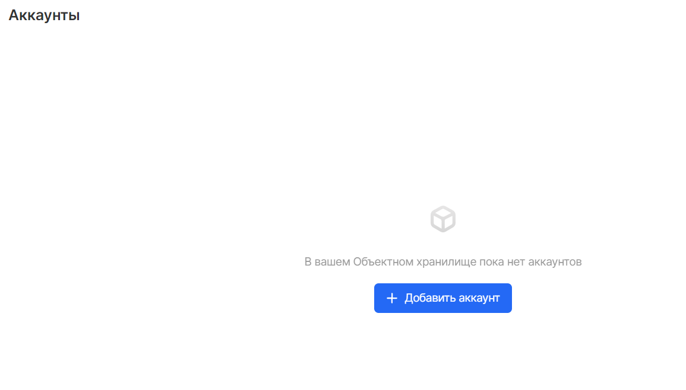

VK CS предоставляет RESTful XML API для программного управления хранимыми данными с помощью стандартных HTTP-запросов. API-интерфейс совместим с API-интерфейсом Amazon AWS S3, что позволяет взаимодействовать с сервисом, используя уже известные инструменты.

Основной протокол доступа к объектному хранилищу – это протокол, созданный Amazon Web Services для сервиса AWS S3 (Simple Storage Service). S3 API — набор команд, которые «понимает» хранилище и выполняет в ответ некие действия.

Вы можете передавать команды объектному хранилищу через клиент S3 CLI - как его установить, подробно [описано в этой статье](https://mcs.mail.ru/help/ru_RU/s3-tools/s3-cli). Также рекомендуем [ресурс официальной документации](https://docs.aws.amazon.com/cli/latest/reference/). 

Как создать/найти API ключи проекта, [описано здесь](https://mcs.mail.ru/help/ru_RU/s3-start/create-bucket#s3-cli).

**Примечание**

Поддержка SOAP через HTTP устарела, но по-прежнему доступна через HTTPS. Однако новые функции Amazon S3 не будут поддерживаться для SOAP. Рекомендуется использовать REST API или AWS SDK.

Совместимость с S3
------------------

API VK CS S3 предназначен для взаимодействия с API Amazon AWS S3. В большинстве случаев при использовании клиентской библиотеки установка "конечной точки" (endpoint) или "базового" (base) URL-адреса hb.bizmrg.com и создание ключевой пары VK CS S3 позволит использовать сервис Объектного хранилища VK CS.

VK CS S3 обеспечивает поддержку операций создания, чтения, обновления и удаления как для бакетов, так и для объектов, а также возможность определять списки управления доступом (ACL). Некоторые функции S3 не поддерживаются, как показано в таблице ниже:

<table border="0" cellpadding="0" cellspacing="0" style="margin-right: calc(1%); width: 99%;" width="289"><tbody><tr><td height="19" style="width: 32.962%; background-color: rgb(239, 239, 239);" width="38.062283737024224%">Функция</td><td style="width: 21.3418%; background-color: rgb(239, 239, 239);" width="29.41176470588235%">Поддержка</td><td style="width: 45.443%; background-color: rgb(239, 239, 239);" width="32.52595155709343%">Примечание</td></tr><tr><td height="19" style="width: 32.962%;">Bucket Create, Read, Update, Delete</td><td style="width: 21.3418%;">Да</td><td style="width: 45.443%;"><br></td></tr><tr><td height="19" style="width: 32.962%;">Object Create, Read, Update, Delete</td><td style="width: 21.3418%;">Да</td><td style="width: 45.443%;"><br></td></tr><tr><td height="19" style="width: 32.962%;">Multipart Uploads</td><td style="width: 21.3418%;">Да</td><td style="width: 45.443%;"><br></td></tr><tr><td height="19" style="width: 32.962%;">Pre-Signed URLs</td><td style="width: 21.3418%;">Да</td><td style="width: 45.443%;">Поддерживаются оба типа подписи v2 и v4</td></tr><tr><td height="19" style="width: 32.962%;">Bucket ACLs</td><td style="width: 21.3418%;">Да</td><td style="width: 45.443%;"><br></td></tr><tr><td height="19" style="width: 32.962%;">Object ACLs</td><td style="width: 21.3418%;">Да</td><td style="width: 45.443%;"><br></td></tr><tr><td height="19" style="width: 32.962%;">Identity and Access Management (IAM)</td><td style="width: 21.3418%;">Нет</td><td style="width: 45.443%;"><br></td></tr><tr><td height="19" style="width: 32.962%;">Security Token Service (STS)</td><td style="width: 21.3418%;">Нет</td><td style="width: 45.443%;"><br></td></tr><tr><td height="19" style="width: 32.962%;">Multi-factor Authentication</td><td style="width: 21.3418%;">Нет</td><td style="width: 45.443%;"><br></td></tr><tr><td height="19" style="width: 32.962%;">Public Access Block</td><td style="width: 21.3418%;">Нет</td><td style="width: 45.443%;"><br></td></tr><tr><td height="19" style="width: 32.962%;">Bucket Policies</td><td style="width: 21.3418%;">Нет</td><td style="width: 45.443%;"><br></td></tr><tr><td height="19" style="width: 32.962%;">Object Policies</td><td style="width: 21.3418%;">Нет</td><td style="width: 45.443%;"><br></td></tr><tr><td height="19" style="width: 32.962%;">Bucket Versioning</td><td style="width: 21.3418%;">Нет</td><td style="width: 45.443%;"><br></td></tr><tr><td height="19" style="width: 32.962%;">Bucket Replication</td><td style="width: 21.3418%;">Нет</td><td style="width: 45.443%;"><br></td></tr><tr><td height="19" style="width: 32.962%;">Bucket Notifications</td><td style="width: 21.3418%;">Нет</td><td style="width: 45.443%;"><br></td></tr><tr><td height="19" style="width: 32.962%;">Bucket Tagging</td><td style="width: 21.3418%;">Нет</td><td style="width: 45.443%;"><br></td></tr><tr><td height="19" style="width: 32.962%;">Object Tagging</td><td style="width: 21.3418%;">Да</td><td style="width: 45.443%;"><br></td></tr><tr><td height="19" style="width: 32.962%;">Request Payment</td><td style="width: 21.3418%;">Нет</td><td style="width: 45.443%;"><br></td></tr><tr><td height="19" style="width: 32.962%;">Bucket Lifecycle</td><td style="width: 21.3418%;">Да</td><td style="width: 45.443%;">Поддерживаются истечение срока действия объекта и удаление неполных составных загрузок. Политики жизненного цикла, основанные на маркировке объектов, не поддерживаются.</td></tr><tr><td height="19" style="width: 32.962%;">Bucket Inventory</td><td style="width: 21.3418%;">Нет</td><td style="width: 45.443%;"><br></td></tr><tr><td height="19" style="width: 32.962%;">Bucket Access Logging</td><td style="width: 21.3418%;">Нет</td><td style="width: 45.443%;"><br></td></tr><tr><td height="19" style="width: 32.962%;">Bucket Metrics</td><td style="width: 21.3418%;">Нет</td><td style="width: 45.443%;"><br></td></tr><tr><td height="19" style="width: 32.962%;">Bucket Analytics</td><td style="width: 21.3418%;">Нет</td><td style="width: 45.443%;"><br></td></tr><tr><td height="19" style="width: 32.962%;">Bucket Accelerate</td><td style="width: 21.3418%;">Нет</td><td style="width: 45.443%;"><br></td></tr><tr><td height="19" style="width: 32.962%;">Bucket Encryption Configuration</td><td style="width: 21.3418%;">Нет</td><td style="width: 45.443%;"><br></td></tr><tr><td height="19" style="width: 32.962%;">Bucket Websites</td><td style="width: 21.3418%;">Нет</td><td style="width: 45.443%;"><br></td></tr><tr><td height="19" style="width: 32.962%;">Object Torrent</td><td style="width: 21.3418%;">Нет</td><td style="width: 45.443%;"><br></td></tr><tr><td height="19" style="width: 32.962%;">Object Lock</td><td style="width: 21.3418%;">Нет</td><td style="width: 45.443%;"><br></td></tr></tbody></table>

Запросы API для функций S3, которые в настоящее время не поддерживаются VK CS, получат S3-совместимый ответ об ошибке NotImplemented в формате XML.

**Пример на Python**

Пример с указанием учетных данных в параметрах создания сессии:

```
\`\`\`
import boto3
session = boto3.session.Session()
s3_client = session.client(
    service_name = 's3',
    endpoint_url = 'https://hb.bizmrg.com',
    aws_access_key_id = 'YOUR_ACCESS_KEY',
    aws_secret_access_key = 'YOUR_SECRET_KEY'
)
\`\`\`
```

Вариант с хранением учетных данных в файле.

Необходимо создать файл ~/.aws/credentials в формате:

```
\`\`\`console
[default]
aws_access_key_id = YOUR_ACCESS_KEY_ID
aws_secret_access_key = YOUR_SECRET_ACCESS_KEY
\`\`\`
```

Создаем сессию с указанием учетных данных в файле ~/.aws/credentials:

```
\`\`\`
import boto3
session = boto3.session.Session()
s3_client = session.client(
    service_name='s3',
    endpoint_url='https://hb.bizmrg.com'
)
\`\`\`
```
```
#!/usr/bin/env python3
import boto3
from botocore.client import Config

# Инициализировать сессию к VK CS S3.
session = boto3.session.Session()
client = session.client('s3',
                        region_name='ru-msk',
                        endpoint_url='https://hb.bizmrg.com',
                        aws_access_key_id='urvt4LXPwoSL9s6ieGTLT5',
                        aws_secret_access_key='5JogfQUsWzzBE9xG1mbBkMkgW7pxY4TGyHgefSC9n2Xx')

# Создать новый бакет.
client.create_bucket(Bucket='my-test-bucket1')

# Просмотреть список бакетов в проекте.
response = client.list_buckets()
buckets = [bucket['Name'] for bucket in response['Buckets']]
print("Bucket List: %s" % buckets)
```

**Пример на Go**

```
package main

import (
    "context"
    "fmt"
    "log"
    "os"

    "github.com/minio/minio-go"
    "github.com/minio/minio-go/pkg/credentials"
)

func main() {
    accessKey := os.Getenv("VK CS_KEY")
    secKey := os.Getenv("VK CS_SECRET")
    endpoint := "hb.bizmrg.com"
    bucketName := "my-test-bucket1" // Названия бакетов должны быть уникальными для всех проектов VK CS
    ssl := true

    if accessKey == "" || secKey == "" {
        log.Fatal("Must provide VK CS_KEY and VK CS_SECRET environment variables!")
    }

    // Подключиться к VK CS S3.
    client, err := minio.New(endpoint, &minio.Options{
        Creds:  credentials.NewStaticV4(accessKey, secKey, ""),
        Secure: ssl,
    })
    if err != nil {
        log.Fatal(err)
    }

    // Создать новый бакет.
    err = client.MakeBucket(context.TODO(), bucketName, minio.MakeBucketOptions{Region: "ru-msk"})
    if err != nil {
        log.Fatal(err)
    }

    // Показать список всех бакетов.
    buckets, err := client.ListBuckets(context.TODO())
    if err != nil {
        log.Fatal(err)
    }

    fmt.Println("List of all buckets for this access key:")
    for _, bucket := range buckets {
        fmt.Println(bucket.Name)
    }
}
```

Аутентификация
--------------

Запросы к API VK CS S3 должны включать заголовок HTTP-Authorization. Поддерживается тип подписи AWS v4, а также тип подписи AWS v2 для совместимости со старыми клиентами. В приведенных ниже примерах используются подписи v4. При использовании клиентской библиотеки подписи будут созданы автоматически.

Создать необходимый ключ доступа и секретный ключ можно в меню "Аккаунты" сервиса "Объектное хранилище" графического интерфейса панели VK CS.

При создании аккаунта будет сгенерирован Access Key ID и Secret Key значения, которые необходимы для использования:


Подпись v4 состоит из нескольких частей. В таблице ниже описана каждая часть примера отдельно:

<table border="0" cellpadding="0" cellspacing="0" style="margin-right: calc(2%); width: 98%;" width="195"><tbody><tr><td height="19" style="background-color: rgb(239, 239, 239);" width="56.41025641025641%">Параметр</td><td style="background-color: rgb(239, 239, 239);" width="43.58974358974359%">Описание</td></tr><tr><td height="19">AWS4-HMAC-SHA256</td><td>Подпись AWS версии 4 (AWS4) и алгоритм подписи (HMAC-SHA256)</td></tr><tr><td height="19">Credential</td><td>Содержит ключ доступа и информацию о запросе в формате: ${ACESS_KEY}/${YYYMMDD}/${REGION_SLUG}/s3/aws4_request</td></tr><tr><td height="19">SignedHeaders</td><td>Список в нижнем регистре имен заголовков запроса, используемых при вычислении подписи, например: host;x-amz-acl;x-amz-content-sha256;x-amz-date</td></tr><tr><td height="19">Signature</td><td>Подписанный хэш, состоящий из хеша тела запроса, секретного ключа и информации о запросе (каноническом запросе). Для демонстрации того, как это вычисляется, предоставляется пример «псевдо-кода».</td></tr></tbody></table>

**Пример заголовка авторизации**

```
Authorization: AWS4-HMAC-SHA256
Credential=urvt4LXPwoSL9s6ieGTLT5/20200831/ru-msk/s3/aws4_request,
SignedHeaders=host;x-amz-acl;x-amz-content-sha256;x-amz-date,
Signature=6cab03bef74a80a0441ab7fd33c829a2cdb46bba07e82da518cdb78ac238fda5
```

**Пример подписи (псевдо-код)**

```
canonicalRequest = \`
${HTTPMethod}\n
${canonicalURI}\n
${canonicalQueryString}\n
${canonicalHeaders}\n
${signedHeaders}\n
${hashedPayload}
\`
stringToSign = "AWS4-HMAC-SHA256" + "\n" +
    date(format=ISO08601) + "\n" +
    date(format=YYYYMMDD) + "/" + "ru-msk" + "/" + "s3/aws4_request" + "\n" +
    Hex(SHA256Hash(canonicalRequest))
dateKey = HMAC-SHA256("AWS4" + ${SECRET_KEY}, date(format=YYYYMMDD))
dateRegionKey = HMAC-SHA256(dateKey, "ru-msk")
dateRegionServiceKey = HMAC-SHA256(dateRegionKey, "s3")
signingKey = HMAC-SHA256(dateRegionServiceKey, "aws4_request")
signature = Hex(HMAC-SHA256(signingKey, stringToSign))
```

Канонический запрос, включенный в подпись, состоит из:

*   Используемый метод HTTP-запроса.
*   Компонент пути URI запроса.
*   Параметры строки запроса, включенный в запрос.
*   Список заголовков запроса и их значений, разделенных новой строкой, в нижнем регистре и без пробелов.
*   Список имен заголовков без значений, отсортированных по алфавиту, в нижнем регистре и через точку с запятой.
*   Хэш SHA256 тела запроса.

Например, для следующего запроса:

```
GET /?acl HTTP/1.1
Host: my-test-bucket1.hb.bizmrg.com
x-amz-content-sha256: e3b0c44298fc1c149afbf4c8996fb92427ae41e4649b934ca495991b7852b855
x-amz-date: 20200831T221549Z
```

Таким будет канонический запрос:

```
GET
/
acl=
host:my-test-bucket1.hb.bizmrg.com
x-amz-content-sha256:e3b0c44298fc1c149afbf4c8996fb92427ae41e4649b934ca495991b7852b855
x-amz-date:20200831T221549Z
host;x-amz-content-sha256;x-amz-date
e3b0c44298fc1c149afbf4c8996fb92427ae41e4649b934ca495991b7852b855
```

Общие заголовки
---------------

Общие заголовки, которые можно использовать в большинстве запросов:

<table border="0" cellpadding="0" cellspacing="0" style="margin-right: calc(0%); width: 100%;" width="195"><tbody><tr><td height="19" style="width: 20%; background-color: rgb(239, 239, 239);" width="56.41025641025641%">Название</td><td style="width: 79.7468%; background-color: rgb(239, 239, 239);" width="43.58974358974359%">Описание</td></tr><tr><td height="19" style="width: 20%;">Authorization</td><td style="width: 79.7468%;">Детали авторизации для запроса в формате AWS Signature Version 4 или AWS Signature Version 2</td></tr><tr><td height="19" style="width: 20%;">Content-Length</td><td style="width: 79.7468%;">Длина тела запроса в байтах. Требуется для запросов PUT, содержащих тело XML.</td></tr><tr><td height="19" style="width: 20%;">Content-Type</td><td style="width: 79.7468%;">Тип MIME тела запроса (например text/plain)</td></tr><tr><td height="19" style="width: 20%;">Date</td><td style="width: 79.7468%;">Текущая дата и время в формате всемирного координированного времени (UTC) в формате RFC 2822. Пример: Mon, 10 Jul 2017 19:05:09 +0000</td></tr><tr><td height="19" style="width: 20%;">Host</td><td style="width: 79.7468%;">Целевой хост для запроса (например, my-test-bucket1.hb.bizmrg.com).</td></tr><tr><td height="19" style="width: 20%;">x-amz-content-sha256</td><td style="width: 79.7468%;">Хэш SHA256 полезной нагрузки запроса. Требуется при использовании AWS Signature Version 4 для аутентификации.</td></tr><tr><td height="19" style="width: 20%;">x-amz-date</td><td style="width: 79.7468%;">Текущая дата и время в формате всемирного координированного времени (UTC) с использованием формата ISO 8601: %Y%m%dT%H%M%SZ (например 20200831T172753Z). Если предоставляется, он имеет приоритет над заголовком «Дата».</td></tr></tbody></table>

Эти общие заголовки также могут быть получены в большинстве ответов:

<table border="0" cellpadding="0" cellspacing="0" style="margin-right: calc(0%); width: 100%;" width="195"><tbody><tr><td height="19" style="width: 25.7975%; background-color: rgb(239, 239, 239);" width="56.41025641025641%">Название</td><td style="width: 74.0759%; background-color: rgb(239, 239, 239);" width="43.58974358974359%">Описание</td></tr><tr><td height="19" style="width: 25.7975%;">Content-Length</td><td style="width: 74.0759%;">Длина тела ответа в байтах</td></tr><tr><td height="19" style="width: 25.7975%;">Content-Type</td><td style="width: 74.0759%;">Тип MIME тела запроса (например text/plain)</td></tr><tr><td height="19" style="width: 25.7975%;">Connection</td><td style="width: 74.0759%;">Индикатор того, открыто или закрыто соединение с сервером</td></tr><tr><td height="19" style="width: 25.7975%;">Date</td><td style="width: 74.0759%;">Дата и время ответа в формате всемирного координированного времени (UTC)</td></tr><tr><td height="19" style="width: 25.7975%;">Etag</td><td style="width: 74.0759%;">Тег объекта, содержащий хеш MD5 объекта</td></tr><tr><td height="19" style="width: 25.7975%;">x-amz-request-id</td><td style="width: 74.0759%;">Уникальный идентификатор запроса</td></tr></tbody></table>