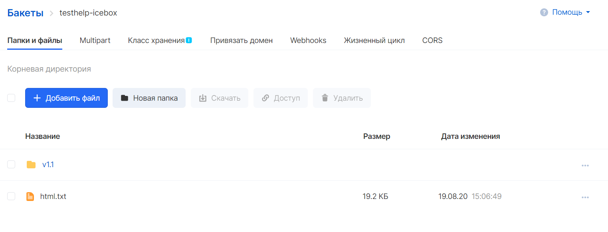
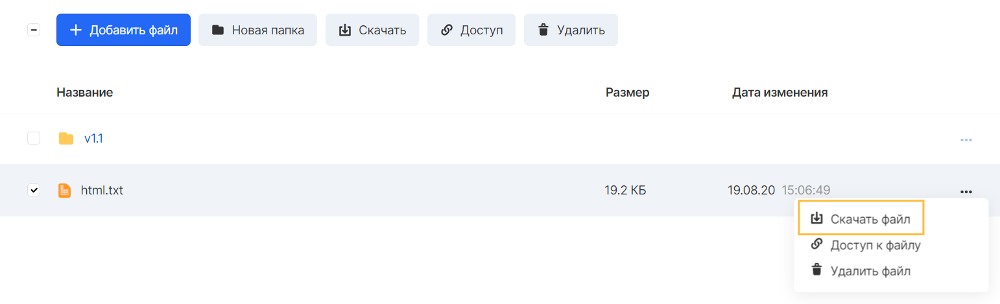
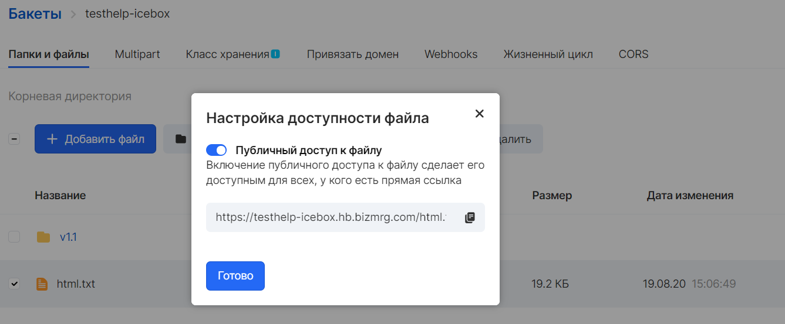

Информация об объектах
----------------------

Просмотреть информацию об объекте можно при выборе бакета на вкладке "Бакеты" сервиса "Объектное хранилище".

В окне "Папки и файлы" перечислены все объекты выбранного бакета, а также возможные операции с ними.

 

VK CS предоставляет несколько способов доступа к объектам:

*   Скачивание
*   Доступ по публичной ссылке

Скачивание
----------

Для скачивания объектов следует выбрать желаемый объект или отметить несколько объектов и нажать кнопку "Скачать":

Для скачивания единичного объекта можно воспользоваться меню опций выбранного объекта.

**Внимание**

Скачивание директорий в бакете возможно только через S3 CLI, S3 API или S3-совместимые графические файловые менеджеры.

Публичный доступ
----------------

Загруженные в бакет объекты по умолчанию имеют настройки частного доступа, закрывающий доступ пользователям к ним из сети Интернет. 

Включение публичного доступа к файлу сделает его доступным для всех, у кого есть прямая ссылка.

Включить публичный доступ можно в контекстном меню объекта или набора объектов бакета. 

Ссылка содержит в себе имя бакета, содержащего объект, endpoint сервиса "Объектное хранилище" и ключ объекта. Объект будет доступен из сети Интернет на чтение и копирование, однако удалить его будет невозможно.

**Примечание**

Ссылка на объект бакета, содержащая его ключ, не может быть изменена по желанию.