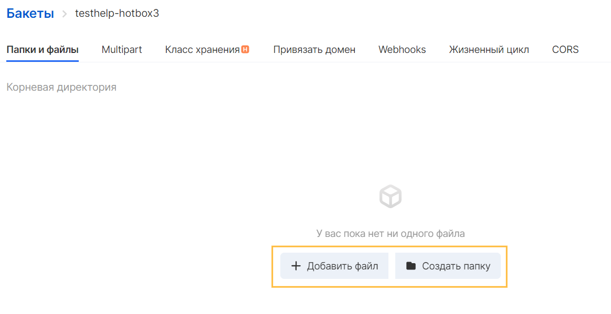

В созданный бакет можно загружать файлы, которые сохраняются как объект S3. Объекты состоят из данных файла и метаданных, описывающих объект. В бакете может быть неограниченное количество объектов.

Можно загружать файлы любого типа - изображения, резервные копии, данные, фильмы и т.д. - в бакет S3. Максимальный размер обычного файла, который можно загрузить в бакет составляет 32 ГБ. Для файлов, которые превышают этот размер, необходимо использовать метод мультипартовой загрузки и хранения. Для комфортной загрузки файла объемом свыше 1 ГБ рекомендуется использовать AWS S3 CLI или AWS S3 REST API.

Загрузка из Панели VK CS
----------------------

Для загрузки объектов следует перейти в созданный бакет в разделе "Бакеты" сервиса "Объектное хранилище":



**Примечание**

Чтобы загрузить папки через интерфейс Панели VK CS, их необходимо перетащить в окно загрузки, используя функцию Drag&Drop. Чтобы загрузить файлы, их можно перетащить или выбрать, используя кнопку "Выбрать файлы". Функциональность перетаскивания поддерживается только для браузеров Chrome и Firefox.

При загрузке папки, S3 загружает все файлы и подпапки из указанной папки в бакет. Затем он назначает ключевое имя объекта, которое представляет собой комбинацию имени загруженного файла и имени папки. Например, если загружается папка с именем /images, содержащую два файла, sample1.jpg и sample2.jpg, S3 загружает файлы, а затем назначает соответствующие имена ключей, images/sample1.jpg и images/sample2.jpg. Имена ключей включают в себя имя папки в качестве префикса. Панель VK CS отображает только ту часть имени ключа, которая следует за последним «/». Например, в папке изображений объекты images/sample1.jpg и images/sample2.jpg отображаются как sample1.jpg и sample2.jpg.

Если загружаетcя объект с ключевым именем, которое уже существует в бакете, S3 заменяет существующий объект.

Загрузка из S3 CLI
------------------

В S3 CLI доступны несколько вариантов загрузки объектов:

Следующая команда копирует файл в указанный бакет и задает ключ:

```
aws s3 cp test.txt s3://mybucket/test2.txt --endpoint-url https://hb.bizmrg.com
```

Для удобства загрузки файлов из локального каталога можно применить синхронизацию объектов, ключи которых будут автоматически созданы после завершения загрузки объектов в указанный бакет. 

В случае, если в бакете уже существуют объекты, то синхронизации подлежат файлы:

*   Размер которых отличается от размера объекта S3
*   Время последнего изменения локального файла новее, чем время последнего изменения объекта S3
*   Локальный файл не существует в указанном бакете

```
aws s3 sync <локальный_путь> s3://<имя_бакета> --endpoint-url https://hb.bizmrg.com
```

Полное описание операций копирования и перемещения объектов и файлов доступно в [официальной документации S3 CLI](https://awscli.amazonaws.com/v2/documentation/api/latest/reference/s3/index.html#synopsis).

--