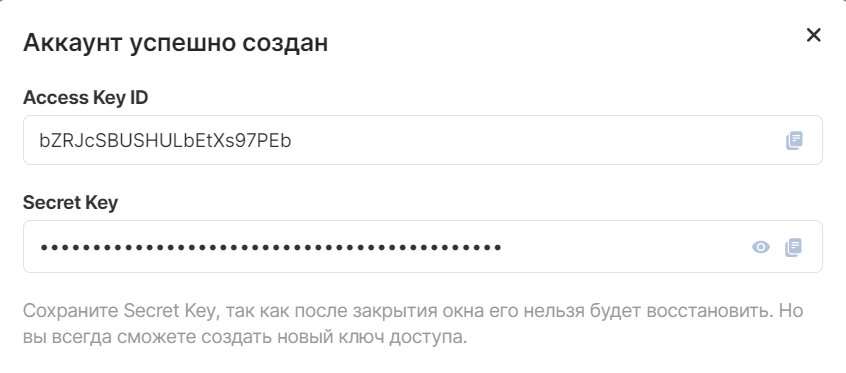

S3 CLI или интерфейс командной строки S3 – это единый инструмент для управления сервисами S3, основанный на пакете инструментов AWS S3. Загрузив всего одно средство, возможно контролировать множество сервисов VK CS S3 из командной строки и автоматизировать их с помощью скриптов.

В интерфейсе командной строки S3 представлен новый набор простых команд для эффективного получения и отправки файлов в VK CS S3.

При минимальной настройке интерфейс командной строки S3 позволяет запускать команды из командной строки в программе терминала:

*   Оболочки Linux - общие программы оболочки, такие как bash, zsh, и tcsh для выполнения команд в Linux или macOS.
*   Командная строка Windows - в Windows запускаются команды из командной строки Windows или в PowerShell.

S3 CLI доступен в двух версиях, и информация в этом руководстве применима к обеим версиям, если не указано иное.

*   Версия 2.x - текущая общедоступная версия интерфейса командной строки S3, предназначенная для использования в производственных средах.
*   Версия 1.x - предыдущая версия интерфейса командной строки AWS, доступная для обеспечения обратной совместимости.

Полная информация о наборе команд и дополнительных настройках CLI доступна на [сайте разработчика](https://docs.aws.amazon.com/cli/index.html).

Установка CLI
-------------

Для установки S3 CLI v2 в операционной системе необходимо установить соответствующий пакет:

**Linux**

Предварительные требования:

Возможность извлечь или «разархивировать» загруженный пакет. Если операционной системе нет встроенной unzip команды, следует использовать эквивалент.

В AWS CLI версии 2 использует glibc, groff и less. Они включены по умолчанию в большинство основных дистрибутивов Linux.

 Для Linux x86 (64-бит):
```
curl "https://awscli.amazonaws.com/awscli-exe-linux-x86_64.zip" -o "awscliv2.zip"
unzip awscliv2.zip
sudo ./aws/install
```

Для Linux ARM

```
curl "https://awscli.amazonaws.com/awscli-exe-linux-aarch64.zip" -o "awscliv2.zip"
unzip awscliv2.zip
sudo ./aws/install
```
Проверить корректность установки:
```
aws --version
```

**MacOS**

Установка для MacOS производится с использованием стандартного пользовательского интерфейса MacOS и браузера:

1.  Загрузить в браузере файл [macOS pkg](https://awscli.amazonaws.com/AWSCLIV2.pkg).
2.  Дважды щелкнуть загруженный файл, чтобы запустить установщик.
3.  Следовать инструкциям на экране. 

Проверить корректность установки можно в терминале:
```
aws --version
```

**Windows**

Прежде чем устанавливать AWS CLI версии 2 в Windows, необходимо убедиться в наличии следующего:

*   64-разрядная версия Windows XP или новее.
*   Права администратора на установку программного обеспечения

Для установки:

Загрузить [установщик MSI AWS CLI](https://awscli.amazonaws.com/AWSCLIV2.msi) для Windows (64-разрядная версия).

Запустить загруженный установщик MSI и следовать инструкциям на экране. По умолчанию интерфейс командной строки AWS устанавливается в C:\\Program Files\\Amazon\\AWSCLIV2.

Чтобы подтвердить установку, можно использовать интерфейс стандартной командной строки Windows (cmd):

```
aws --version
```

Получение доступа к CLI
-----------------------

Ключи доступа состоят из идентификатора ключа доступа и секретного ключа доступа, которые используются для подписи программных запросов, отправляемых в VK CS. Если отсутствуют ключи доступа, их можно создать в Панели управления VK CS.

Единственный раз, когда можно просмотреть или загрузить секретный ключ доступа, - это когда создаются ключи. Восстановить их позже будет невозможно. Однако можно создать новые ключи доступа в любое время.

В панели VK CS в меню "Аккаунты" сервиса "Объектное хранилище" необходимо добавить аккаунт, а полученные ключи сохранить для дальнейшего использования:



Настройка CLI
-------------

Самый быстрый способ настроить установку AWS CLI - с помощью команды:

```
aws configure
```

При вводе этой команды интерфейс командной строки AWS запрашивает четыре части информации:

*   Идентификатор ключа доступа - используются полученные данные идентификатора ключа при добавлении аккаунта.
*   Секретный ключ доступа - используются полученные данные секретного ключа при добавлении аккаунта.
*   AWS регион - регион размещения сервиса S3, по умолчанию это ru-msk.
*   Выходной формат - определяет как отформатировать вывод используемой команды. Если не будет указан выходной формат, будет использовать json по умолчанию. Доступные варианты: json, yaml, текст и таблица.

Интерфейс командной строки AWS хранит эту информацию в профиле (наборе настроек), названном default в credentials файле. По умолчанию информация в этом профиле используется, когда запускается команда интерфейса командной строки AWS, в которой явно не указывается используемый профиль.

Особенности
-----------

При использовании AWS CLI для работы с Объектным хранилищем следует учитывать некоторые особенности этого инструмента:

*   AWS CLI работает с VK CS S3 как с иерархической файловой системой и ключи объектов имеют вид пути к файлу.
*   При запуске команды aws для работы с VK CS S3 обязателен параметр --endpoint-url, поскольку по умолчанию клиент настроен на работу с серверами Amazon.
*   Создание бакета следует выполнять используя соответствующий --endpoint-url - [http://hb.bizmrg.com](http://hb.bizmrg.com) для бакета Hotbox и [http://ib.bizmrg.com](http://ib.bizmrg.com) для бакета Icebox.
*   Выполнение любых операций при использовании CLI с классом бакета Backup невозможно.
*   При использовании классов хранения --storage-class применяются значения STANDARD для Hotbox и STANDARD_IA для Icebox.
*   При работе в MacOS, в некоторых случаях требуется запуск вида:

```
export PYTHONPATH=/Library/Python/2.7/site-packages; aws s3 <команда> --endpoint-url=http://hb.bizmrg.com
```

Примеры использования
---------------------

Создание бакета hotbox:

```
aws s3 mb s3://<имя_бакета> --endpoint-url http://hb.bizmrg.com
```

Создание бакета icebox:

```
aws s3 mb s3://<имя_бакета> --endpoint-url http://ib.bizmrg.com
```

Изменение класса хранения бакета:

```
aws s3api create-bucket --bucket <имя_бакета> --endpoint-url <URL класса хранения назначения> --cli-input-json "{\"Bucket\": {\"storage-class\": \"<значение_класса_назначения>\"}}"
```

Загрузка файла

```
aws s3 cp <путь_к_локальному_файлу> s3://<имя_бакета> --endpoint-url http://hb.bizmrg.com
```

Скачивание объекта

```
aws s3 cp s3://<имя_бакета>/<название_ключа> <путь_к_локальному_файлу> --endpoint-url http://hb.bizmrg.com
```

Синхронизация локальной директории с бакетом

```
aws s3 sync <локальная_директория> s3://<имя_бакета> --endpoint-url http://hb.bizmrg.com
```

Перемещение объекта

```
aws s3 mv s3://<имя_бакета>/<название_ключа_источника> s3://<имя бакета>/<название_ключа_назначения> --endpoint-url http://hb.bizmrg.com
```

Получение списка объектов

```
aws s3 ls s3://<имя_бакета> --endpoint-url http://hb.bizmrg.com
```

Удаление объекта

```
aws s3 rm s3://<имя_бакета>/<название_ключа> --endpoint-url http://hb.bizmrg.com
```

Удаление многокомпонентного объекта

```
aws s3api abort-multipart-upload --bucket <имя_бакета> --endpoint-url http://hb.bizmrg.com --key large_test_file --upload-id <ID_объекта_многокомпонентной_загрузки>
```