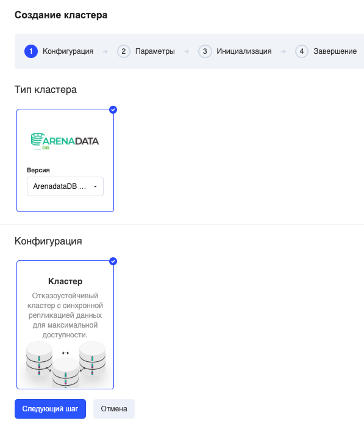

Для создания базы данных следует перейти в [раздел личного кабинета "Аналитические БД"](https://mcs.mail.ru/app/services/analytic-databases/), выбрать "Arenadata DB" и "Создать БД":

Кластер — кластер с синхронной репликацией данных. Используется при наличии повышенных требований к надежности и отказоустойчивости системы.

На следующих шагах следует выбрать необходимые параметры конфигурации:

<table><tbody><tr><td>Количество несжатых данных</td><td>Максимальный объём БД</td></tr><tr><td>Имя кластера</td><td>Оставьте имя по умолчанию или введите свое название латинскими символами.</td></tr><tr><td>Конфигурация узлов</td><td>Конфигурация мастера CPU / RAM / HDD (SSD). Реплика/slave будет создана с аналогичной конфигурацией автоматически.</td></tr><tr><td>Зона доступности</td><td>укажите зону доступности (рекомендуем DP1 или MS1).</td></tr><tr><td>Сеть</td><td>Оставьте по умолчанию или выберите свою приватную сеть.</td></tr><tr><td>Тип диска</td><td>Для лучшего быстродействия рекомендуем выбирать тип диска SSD или Hi-IOPS SSD.</td></tr></tbody></table>

На следующем шаге нужно задать параметры инициализации базы данных.

<table><tbody><tr><td>Имя базы данных для создания</td><td>Можно оставить по умолчанию или ввести свое.</td></tr><tr><td>Имя пользователя</td><td>Нужно указать имя администратора для удаленного доступа.</td></tr><tr><td>Пароль администратора</td><td>Следует задать пароль администратора для удаленного доступа.</td></tr></tbody></table>

Инстанс создастся в течение нескольких минут.

После этого появится информация об инстансе и способы подключения.