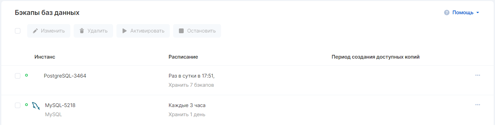
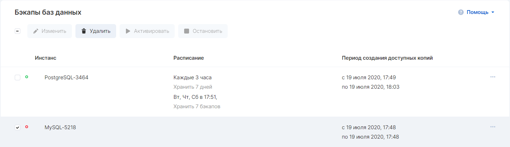

При создании базы данных в панели VK CS создается план резервного копирования, которым можно управлять в разделе ["Бэкапы"](https://mcs.mail.ru/app/services/databases/backups/) панели управления.

Текущий статус плана можно увидеть при наведении мыши на цветной индикатор статуса.

### Настройка плана

1.  Перейдите в раздел "Базы данных" →  "Бэкапы".
2.  Выберите нужный план и нажмите "Изменить".
3.  В появившемся окне можно настроить периодичность выполнения резервного копирования. Возможно комбинирование нескольких расписаний, например, раз в сутки по выбранным дням и каждые три часа с различным интервалом хранения копий.
4.  Для применения изменений нажмите кнопку "Сохранить".

### Остановка плана

Если по каким-то причинам требуется остановить создание резервных копий - выделите нужный план и нажмите на кнопку "Остановить".  Создание бэкапов будет приостановлено до активации плана вручную.

### Примечание

Изменение расписания резервного копирования активирует план

### Удаление плана

В случае, если оригинальный инстанс удален, возможно удалить и план резервного копирования для инстанса. Следует выделить необходимый план галочкой и нажать на кнопку "Удалить".

**Внимание**

При удалении плана резервного копирования будут удалены все точки восстановления