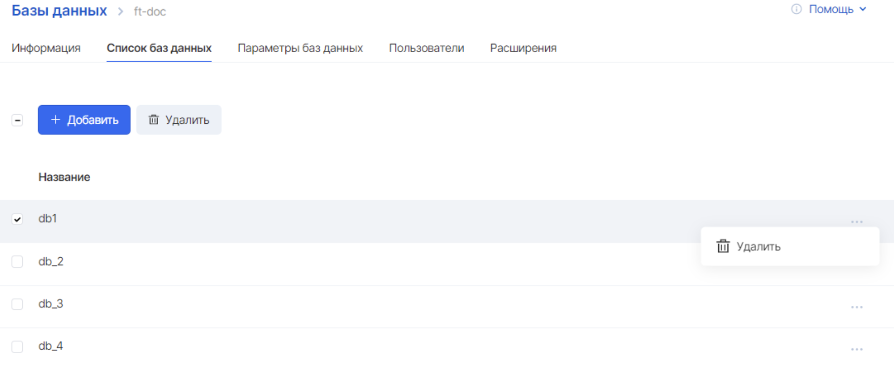
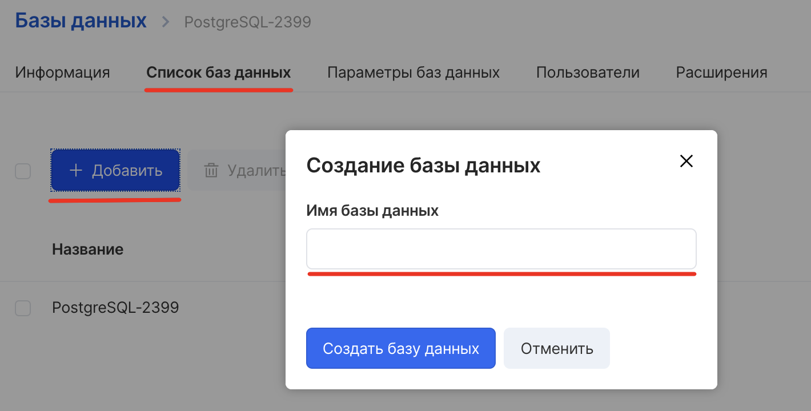
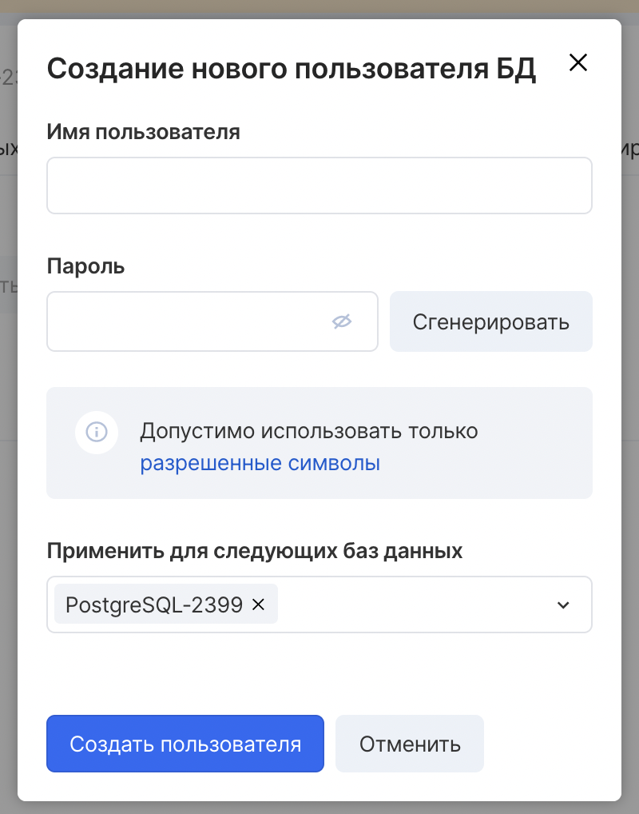

Управление базами данных
------------------------

Управление БД в панели управления производится на вкладке “Список баз данных” внутри нужной БД:

Для добавления новой БД достаточно нажать кнопку "Добавить" и указать наименование новой БД:

Управление пользователями
-------------------------

Управление пользователями БД и правами его доступа производится на вкладке “Пользователи”:

При добавлении нового пользователя необходимо указать его имя, а в поле “Применить для следующих баз данных” необходимо выбрать БД, которые должны быть доступны этому пользователю:

Изменить список БД, доступных пользователю, можно через редактирование пользователя.

### Важно

Существуют ограничения на использование имён пользователей (см. таблицу ниже).

Имена и префиксы служебных пользователей по типам СУБД, использование которых запрещено:

<table><tbody><tr><td style="background-color: rgb(239, 239, 239); width: 22.4941%;"><strong>Тип СУБД</strong></td><td style="background-color: rgb(239, 239, 239); width: 28.3461%;"><strong>Имя пользователя</strong></td><td style="background-color: rgb(239, 239, 239); width: 49.1472%;"><strong>Все имена пользователя с префиксом</strong></td></tr><tr><td style="width: 22.4941%;">PosgreSQL</td><td style="width: 28.3461%;">
os_admin

postgres

root

replicator
</td><td style="width: 49.1472%;">mcs_</td></tr><tr><td style="width: 22.4941%;">MySQL</td><td style="width: 28.3461%;">
os_admin

root

clusterrepuser
</td><td style="width: 49.1472%;">mcs_</td></tr><tr><td style="width: 22.4941%;">Clickhouse</td><td style="width: 28.3461%;">
os_admin

default

root

replicator
</td><td style="width: 49.1472%;">mcs_</td></tr><tr><td style="width: 22.4941%;">mongoDB</td><td style="width: 28.3461%;">
os_admin

root
</td><td style="width: 49.1472%;">mcs_</td></tr></tbody></table>