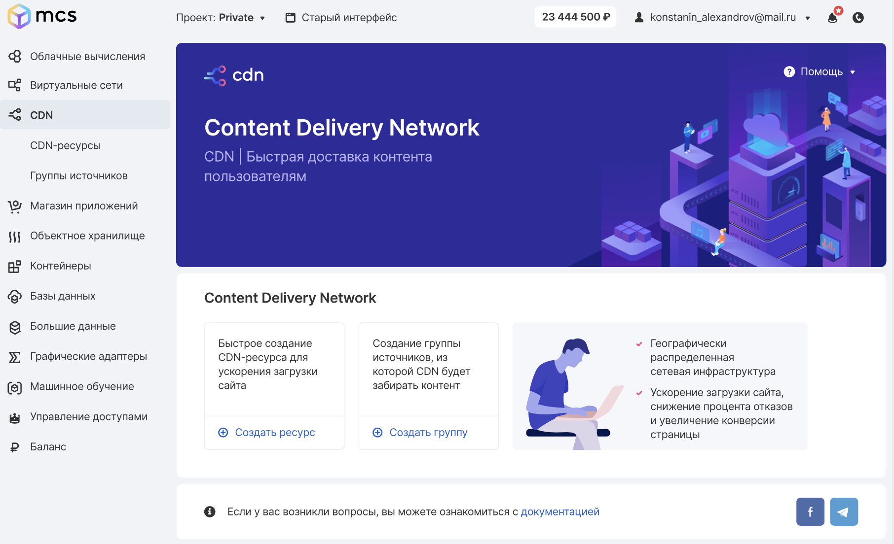

Описание
--------

CDN - это географически распределённая сетевая инфраструктура, позволяющая оптимизировать доставку и дистрибуцию содержимого конечным пользователям в сети Интернет. Использование контент-провайдерами CDN способствует увеличению скорости загрузки интернет-пользователями аудио-, видео-, программного, игрового и других видов цифрового содержимого в точках присутствия сети CDN.

В случае VK CS - это распределение загруженных пользователем данных в датацентрах по России и миру (по запросу) для ускоренной доставки вашего контента до пользователей.

На скорость загрузки веб-страницы и её содержимого сильно влияет то, насколько далеко пользователь находится от сервера. Это происходит из-за того, что при использовании технологии TCP/IP, применяемой для распространения информации в сети Интернет, задержки при передаче информации зависят от количества маршрутизаторов, находящихся на пути между источником и потребителем содержимого. Размещение содержимого на нескольких рассредоточенных серверах средствами CDN сокращает сетевой маршрут передачи данных и делает загрузку сайта быстрее с точки зрения пользователя.

Технология CDN способна предотвратить задержки при передаче данных, возможные прерывания связи и потери на перегруженных каналах и стыках между ними. Управление нагрузкой при передаче сетевого трафика позволяет разгрузить магистраль и узлы сети, распределив возникающую нагрузку между удалёнными серверами.

Тарификация сервиса CDN
-----------------------

Cервис предоставляется по модели Pay-as-you-go и его цена всего **₽0.60/Гб с НДС**.

Другими словами, Вы платите только за объем потребленной услуги.

Если же необходимо раздавать большие объемы данных и этот объем больше 10Тб в месяц, напишите нам: [support@mcs.mail.ru](mailto:support@mcs.mail.ru).