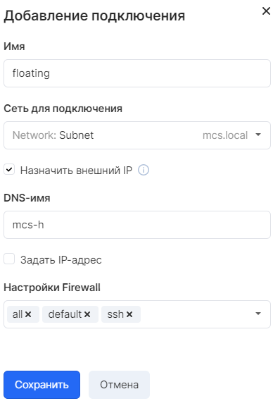

Описание
--------

В VK CS существует два способа организации доступа к инстансу из сети интернет: использование плавающих IP или добавление порта из сети ext-net. В обоих случаях инстанс будет доступен по маршрутизируемому адресу сети Интернет.

Плавающий IP - виртуальный адрес, работающий по технологии 1:1 NAT, назначающийся на порт приватной сети. Для его работы требуется сеть с доступом в интернет и настроенный на приватную сеть сетевой адаптер виртуальной машины.

Сеть ext-net - общая для всех проектов сеть с подсетями маршрутизируемого ("белого") сегмента, случайный адрес из которой можно назначить напрямую на порт виртуальной машины. В этой сети нет DHCP, поэтому статический адрес необходимо настроить в операционной системе инстанса. Маску и шлюз можно найти [на странице сети](https://mcs.mail.ru/app/services/server/network/edit/298117ae-3fa4-4109-9e08-8be5602be5a2/subnets/) в личном кабинете.

### Внимание

В данный момент предоставляется только ipv4 адресация. Поддержка ipv6 планируется в ближайшем будущем.

Применение
----------

В [личном кабинете VK CS](https://mcs.mail.ru/app/services/infra/routers/) при создании виртуальной машины на шаге "Настройки сети" возможно выбрать либо внешнюю сеть (ext-net), либо приватную сеть с выбором опции "Назначить внешний IP":

В образах операционных систем, предоставляемых VK CS, используется компонент cloud-init, который настраивает сетевой адаптер виртуальной машины при выборе опции "Использовать конфигурационный диск". Однако при использовании собственного образа может потребоваться ручная настройка сети в операционной системе.

Добавить еще одно сетевое подключение для существующего инстанса можно в разделе "Информация о сетях" на странице виртуальной машины, нажав кнопку "Добавить подключение":

Также, как и при создании ВМ, доступен выбор между приватными и внешней сетями.