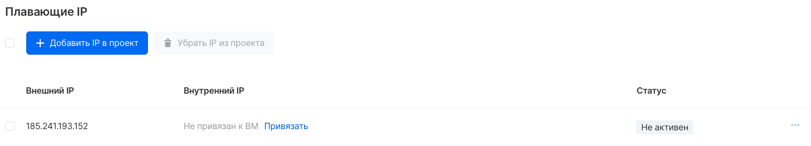
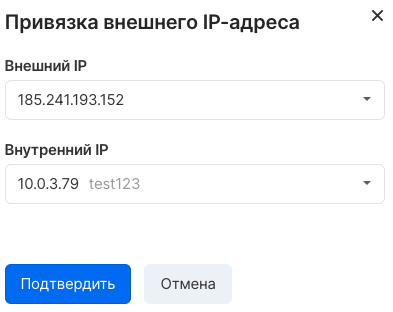
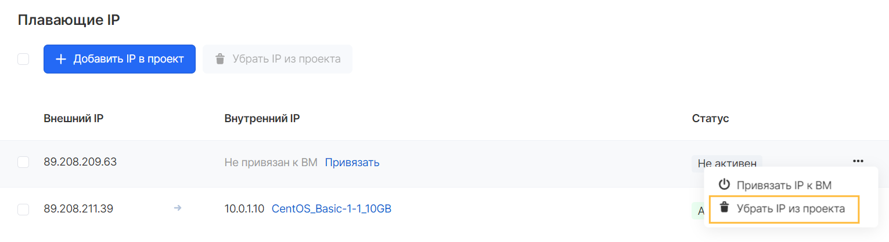

Инстансы в VK CS могут быть подключены к приватным сетям или напрямую в ext-net. Для доступа из интернета к ВМ, находящейся в приватной сети, рекомендуется воспользоваться функционалом плавающих IP адресов.

В отличие от ext-net, плавающие IP-адреса возможно привязывать к виртуальным машинам и менять назначение в любой момент времени. Также данный тип адресов привязывается к проекту и остается в нем до освобождения пользователем. 

Плавающий IP ассоциируется к "серому" адресу за счет механизма 1:1 NAT на маршрутизаторе, при этом на ВМ требуется настроить адрес приватной сети.

Управление плавающими адресами в [личном кабинете VK CS](https://mcs.mail.ru/app/services/infra/routers/) осуществляется на странице "Плавающие IP" сервиса "Виртуальные сети". На этой странице отображаются адресы, выделенные в проект:

Привязка адреса к инстансу
--------------------------

Для назначения плавающего адреса на порт приватной сети необходимо выбрать опцию "Привязать" в строке с IP, далее в выпадающем списке выбрать требуемый адрес:

**Примечание**

Выполнение привязки плавающего IP может быть выполнено только при наличии инстанса с подключенным портом в приватной сети.

Освобождение плавающего IP
--------------------------

Для удаления адреса из проекта в контекстном меню адреса следует выбрать "Убрать IP из проекта".



**Внимание**

При удалении плавающего IP адреса он высвобождается из проекта и может быть назначен автоматически другому проекту. 

OpenStack CLI
-------------

Управление плавающими адресами возможно в клиенте OpenStack:

Просмотр адресов в проекте:

```
openstack floating ip list
```

Назначение плавающего адреса на порт:

```
openstack floating ip set --port <ID порта> <адрес>
```

Назначение адреса на порт указанного инстанса:

```
openstack server add floating ip <ID сервера> <адрес>
```

Удаление адреса из проекта:

```
openstack floating ip delete <адрес>
```