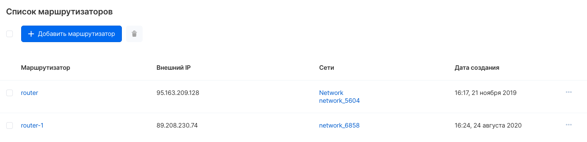
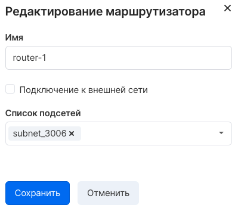

В VK CS маршрутизаторы управляют связностью приватных сетей с интернетом. За каждым роутером можно закрепить "белый" адрес во внешней (ext-net) сети и подсети, к которым этот роутер подключен.

Инстансы в приватных сетях выходят в интернет через IP адрес роутера, если на них не назначен плавающий IP.

В [личном кабинете VK CS](https://mcs.mail.ru/app/services/infra/routers/) доступно управление маршрутизаторами проекта.

Создание маршрутизатора
-----------------------

Для создания нового роутера нужно выбрать опцию "Добавить маршрутизатор" в верхнем меню страницы, далее в появившемся окне настроить подключения к приватным сетям.

Настройка статических маршрутов
-------------------------------

Возможно добавление статических маршрутов к роутеру. Для этого следует перейти на вкладку "Статические маршруты" страницы маршрутизатора и выбрать "Добавить статический маршрут", далее в меню указать сеть назначения и промежуточный узел:


Просмотр списка маршрутизаторов
-------------------------------

Для просмотра списка нужно перейти на страницу "Маршрутизаторы" сервиса "Виртуальные сети":

Редактирование параметров
-------------------------

Для редактирования параметров маршрутизатора следует выбрать "Редактировать маршрутизатор" в контекстном меню. Откроется окно редактирования параметров:



Доступно редактирование связности роутера с внешней сетью и подключение к подсетям приватных сетей.

OpenStack CLI
-------------

Маршрутизаторами возможно управлять через клиент OpenStack:

Получить список маршрутизаторов в проекте:

```
openstack router list --long
```

Просмотреть детальную информацию о роутере:

```
openstack router show <ID роутера>
```

Подключить(отключить) маршрутизатор к подсети:

```
openstack router add(remove) subnet <ID роутера> <ID подсети>
```

Подключить маршрутизатор к внешней сети:

```
openstack router set --external-gateway ext-net <ID роутера>
```

Создать маршрутизатор:

```
openstack router create <название>
```

Изменить название маршрутизатора:

```
openstack router set --name <название> <ID роутера>
```

Добавить статический маршрут:

```
openstack router set --route destination=<CIDR сети> gateway=<IP адрес промежуточного узла>
```

Отключить роутер:

```
openstack router set --disable <ID роутера>
```

### Если возникли проблемы, в том числе при удалении маршрутизатора

При возникновении проблем с VPN, в том числе при удалении маршрутизатора, вы можете управлять сущностями VPN в старом интерфейсе [https://infra.mail.ru/](https://infra.mail.ru/). Вкладка VPN > Сервисы VPN.

Для полного удаления маршрутизатора вначале нужно удалить все подсети в параметрах маршрутизатора (---> Редактировать маршрутизатор).