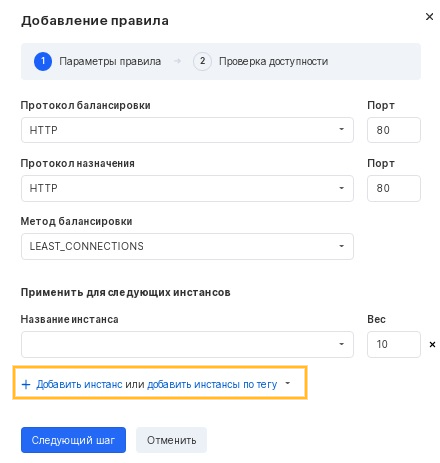
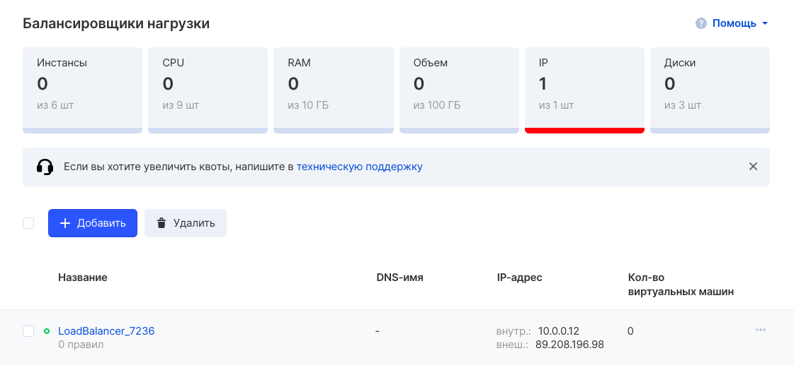
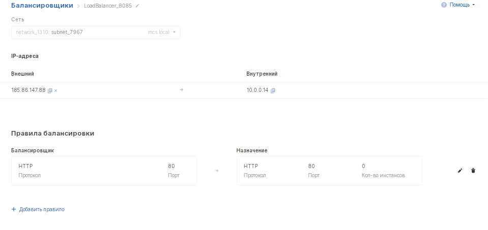

Создание балансировщика
-----------------------

Для добавления нового балансировщика следует нажать кнопку "Добавить балансировщик" в соответствующем разделе панели управления.

**Внимание**

При создании балансировщика будьте внимательны, указывая конкретную сеть. Изменить сеть после создания балансировщика невозможно, потребуется создавать балансировщик заново.

На этапе создания можно добавить одно или несколько правил. Для этого следует нажать кнопку "Добавить правило":

При выборе HTTPS в качестве протокола балансировки появляются дополнительные возможности выбора:

*   
*   сертификат или цепочка сертификатов
*   приватный ключ
*   пароль

На этапе создания следует указать один или несколько инстансов или IP адресов, для которых будет осуществляться балансировка, используя кнопку "Добавить инстанс" или "Добавить инстансы по тегу":

Вес
---

Вес конкретного инстанса означает долю трафика, который будет балансироваться на него. Все веса всех указанных в правиле инстансов складываются и пересчитываются пропорциями до общих 100%.

Например, если указать веса для двух инстансов 20 и 30, то трафик будет балансироваться на потоки 40% и 60%.

Если указать для четырёх инстансов одинаковые веса "5", то трафик будет делиться по 25% соответственно. Если для пяти инстансов указать значение "5", то трафик будет делиться по 20% на каждый инстанс.

Проверка доступности
--------------------

На следующем шаге необходимо настроить параметры интервалов проверки доступности:

Настроить можно следующие параметры проверки:

*   тип проверки TCP или HTTP;
*   интервал, с которым балансировщик отправляет проверяющие запросы серверам;
*   таймаут соединения - время, при котором ожидается ответ от адресата. Если не было ответа, соединение прерывается, как только это время истекло;
*   количество попыток до прерывания соединения;

Успешно добавленный балансировщик со списком правил выглядит следующим образом:

При нажатии на название созданного балансировщика откроется окно с возможностью просмотра, добавления и редактирования правил:

